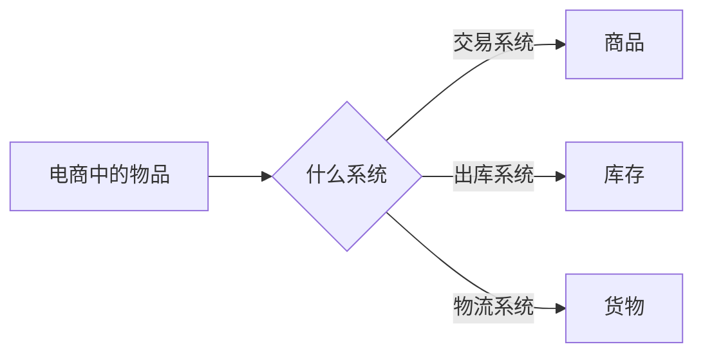

[toc]


> 关于DDD

# 问题

1. 微服务的拆分：DDD应用服务拆分的思路和原则是什么？

2. 如何根据领域模型搭建架构并分层，每个层次承载的职责和功能，以及如何落地成代码架构。

2. 如何进行模块化设计？

   

> 说明：《分布式架构原理与实践》  崔晧
>
> tag：ddd  领域模型
>
> 两种服务拆分的方法：
> 微服务的拆分：主要解决微服务的拆分，从分析-抽取-构建这三个步骤完成对业务需求的分析，产出拆分后的应用服务边界、技术分层架构
> 技术框架的拆分：极客时间


# DDD概念

2004年埃里克 · 埃文斯（Eric Evans）发表了《领域驱动设计》，书中定义和描述了领域驱动设计（Domain-Driven Design，简称DDD）的概念。核心思想：通过==领域驱动设计方法==定义==领域驱动模型==，从而确定==业务和应用的边界==，目的是保证==业务和代码==保持一致。也就是让==业务专家和技术团队==对同一事物能有同样的理解。

``` flow
st=>start: start
op=>operation: 通过：领域驱动设计方法定义领域驱动模型
op1=>operation: 确定：业务和应用边界
op2=>operation: 目的：业务和代码一致
e=>end: end
st(right)->op(right)->op1(right)->op2(right)->e
```

# 拆分思路

- 场景：

| 业务流程     | 命令     |  事件    |
| :--- | ---- | ---- |
| 浏览-下单-付款-收到付款通知 | 下单-付款 | 已经下单-已经付款-已经发送通知 |

- DDD（领域驱动设计）拆分思想和过程(==分析--抽取--构建==)：首先对业务需求进行==分析==，将其转化为==领域知识（对业务的一般性描述）==，然后通过对领域知识进行==抽取形成领域模型==。

  - 领域模型是一个==抽象的概念==，其具体形态是一个大的领域，其中包裹着各种不同的==子领域==。这些子领域通过==限界上下文==的方式进行分割，子领域中间又包含==领域对象==，例如：聚合、聚合根、实体、值对象；领域对象之间通过==领域事件==进行沟通。抽取完领域模型后，技术团队会根据这个领域模型==构建====软件架构==，并对架构分层，分别 是==用户接口层、应用层、领域层和基础层==，再实现每层代码。整个过程中领域专家和技术团队都会使用==通用语言==进行沟通，保证对业务的理解的一致性。

  


  


# 模型结构

## 通用语言

- 通用语言的使用是有==范围限制==的




``` flow
s=>start: start
o=>operation: xxxx
o1=>operation: xxxx
o2=>operation: xxxx
o3=>operation: xxxx33
c=>condition: xxx
e=>end: end
s(right)->o(right)->c
c(yes)->o1(right)
c(no)->o2
c(yes)->o3

```


- 通用语言可以定义实体、命令、事件。通用语言描述了业务流程和业务场景，可以直接反映在代码中。
  - 通用语言中的==名词==为领域对象命名：商品、库存、货物 
  - 通用语言中的==动词==为命令命名：下单、出库 
  - 通用语言中的==动词==还可以为事件命名：已下单、已出库
- 通用语言可以定义业务过程

## 领域、子域、限界上下文

- ==领域==：核心域（订单、商品）、支撑域（库存）、通用域（通知、日志）

- 领域驱动设计就是==为了确定范围==，这个范围可以是业务范围、系统范围、服务范围，只有确定了这些范围，才能很好的对分布式架构进行拆分，做到==高内聚、低耦合==。领域指的就是业务边界。

- 由于业务的==复杂度和包含性==，大的业务边界会包含小的业务边界，小的业务边界又叫子领域（子域），如果把==电商平台看作一个领域==，那么 其中会包含商品系统、订单系统、支付系统和库存系统，这些统称为电商平台的子域。

- 限界上下文：限界-限制边界，上下文-对话的语境，限制边界的方法来确定业务的上下文， 这是划分业务边界的一种方法。限界上下文就像一把刀，把业务领域分割成不同的子域。这里需要注意，领域是给领域专家和技术团队看的，因此一定要包含业务和技术两个层面的东西。可以把领域分为问题空间和解决方案空间。

  - ==问题空间==：领域在业务层的表现，从业务层面看到分割的所有的子域：核心域、支撑域、通用域
  - ==解决方案空间==：领域在技术层面的表现，这里领域被上下文分割。理论上，子域与限界上下文是一一对应的。

  


## 实体、值对象

- 实体：实际存在的物体，具体==业务属性、状态和行为==。比如商品、订单。在领域驱动设计的架构，实体是唯一存在的，持续变化的。
  - ==唯一性==：每个实体在限界上下文中都是唯一存在的。
  - ==可变性==：可变性指的实体的状态和行为是可变的。
    - 订单状态：未支付、已支付、已发货等
    - 订单行为：提交、支付、发货等。
- ==值对象==：唯一性、集合性、稳定性、可判别（地址信息）
- 关系：可相互转化。

## 聚合和聚合根

- 聚合将==领域对象==（实体和值对象）组合成整体，并且保证==聚合后内部数据的一致性==。如果说限界上下文对应一个==服务或应用==，是系统的物理边界。那么聚合就是==领域对象处在限界上下文内部==的逻辑边界。

- 同时一个聚合也是==数据存储的基本单元==，一个聚合对应一个仓库，对数据进行存储。

- 如果把聚合比作一个组织，那组织肯定需要一个领导者，==领导者==负责本组织与其他组织之间的沟通。这个领导者就是==聚合根==。它本质也是一个实体，具有实体的业务属性、状态和行为。

  例如：==订单聚合==可以进行添加、删除商品的操作，因此订单聚合根需要==定义添加、删除商品==的行为，还要保证这个行为在聚合内部的事务性和数据的一致性。

  
  
  
  
  

## 领域事件

如何说多个聚合都是独立，那么当多个聚合需要共同完成一个业务时，该如何处理？例如在支付成功后会修改订单状态，并且通过物流系统发货，由于支付、订单、物流分别属于不同的聚合，如何进行协同工作呢？这就需要==领域事件==。

聚合在执行==命令和操作==之后便会产生事件，这个事件会引领下一步的命令和操作。如果一次业务涉及多个聚合状态的修改，比如支付、修改订单、物流发货三个步骤需要放在同事务中处理，就需要通过领域事件保证数据的一致性。

领域事件是==解耦的工具==，在分布式拆分和微服务的场景下，会被频繁用到。


## 总结


  

分层架构图


- 分层架构拆分原则：高内聚、低耦合、可扩展、可复用   

- 用户接口层：包括用户界面、web服务及信息通信功能，作为系统的入口 。

- 应用层：这一层主要包含应用服务，但不包含具体的业务。只是负责对领域层的领域服务进行组合、编排和转发。

- 领域层：主要包含聚合实体、值对象等领域对象，负责完成系统的主要业务逻辑。领域服务负责对一个或多个领域对象进行操作，从而完成需要跨领域对象的业务逻辑。

- 基础层：提供基础服务，包括api网关、消息中间件、数据库、缓存等。

  


# 分层代码结构图


- 请求通过基础层的==api网关==，将信息传入到用户接口层。传入的信息先通过assembler转换成dto对象，再传给facade。
- facade负责把信息传递给应用层，信息以==命令的形式==传递给application service。application service==组合领域层中==的聚合和service。
- ==领域层中的实体和值对象==，配合聚合和service完成业务逻辑，并通过==repository==将实体和值对象存储到数据库中。领域层中的==event==会根据业务的发生，获取事件信息，通过应用层中的event里的订阅和发布，与其他服务进行通信。


# 什么是贫血模型和充血模型？

贫血模型：只包含数据不包含业务逻辑的类，就是贫血（anemic）模型。例如：userBo，UserEntity，UserVo，这种将数据与操作分离，破坏了 OOP 的封装特性，是一种典型的面向过程的编程风格。

充血模型：数据和对应的业务逻辑被封装到同一个类中，满足了面向对象的封装特性，是一种典型的面向对象的编程风格。

# 什么是领域驱动设计？

《实现领域驱动设计》

即 DDD（Domain Driven Design），主要用来指导如何解耦业务系统，划分业务模块，定义业务领域模型及其交互。

[https://time.geekbang.org/column/article/169600](https://time.geekbang.org/column/article/169600)

# 为什么基于贫血模型的开发更受欢迎


# 分布式事务//todo

Seata 分布式事务框架

https://zhuanlan.zhihu.com/p/78369570

