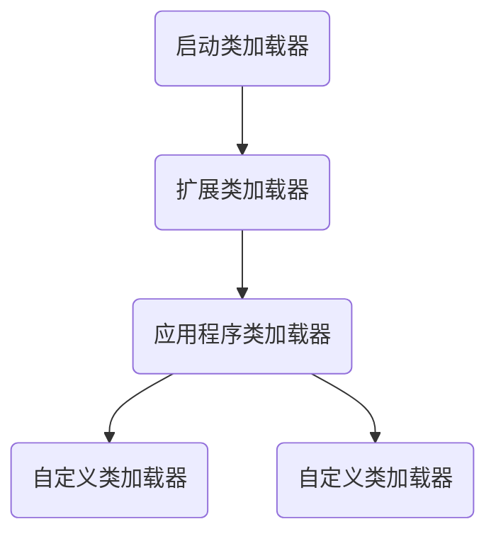

[toc]

> 说明：本文包含JVM待解决问题（todo）、JVM原理部分、JVM面试题、JVM案例、JVM书籍
>
> tag：jvm  
>
> 基础：JMM、jvm内存的划分、类加载过程、GC过程
> 原理部分，面试题部分


# 面试部分

## JVM垃圾收集器都有什么？CMS与G1有什么区别？


### ps（parallel scanvenge）

parallel scanvenge被称为“吞吐量优先”收集器，它的关注点与其他的收集器不同，CMS等收集器的关注点是尽可能地缩短垃圾收集时用户线程的停顿时间，而ps收集器的目标则是达到一个可控制的吞吐量。吞吐量=运行用户代码的时间Tuser/(Tuser+Tgc)。它提供了两个参数精确的控制吞吐量。-XX:MaxGCPauseMillis设置最大垃圾收集的停顿时间和直接设置吞吐量大小-XX：GCTimeRatio。-XX:+UseAdpativeSizePolicy`自适应调节策略`，会自动的调整新生代的大小、eden和survivor的比例，晋升老年代的大小（-XX:PretenuredSizeThreshold）等参数以提供最合适的停顿时间和最大的吞吐量。

### CMS

> https://docs.oracle.com/javase/8/docs/technotes/guides/vm/gctuning/cms.html

CMS（oncurrent mark sweep）收集器是一种以获取`最短停顿时间`为目标的垃圾收集器。


- **CMS过程：**
    基于“标记-清除”算法。整个过程分为4步：
    - 初始化标记(initial mark)
    - 并发标记(concurrent mark)
    - 重新标记(remark)
    - 并发清除(concurrent sweep)

    其中，初始标记、重新标记这两个步骤需要“stop-the-world”，初始化标记仅标记GC roots能直接关联到的对象，速度很快。并发标记阶段就是进行GC roots tracing的过程，此阶段与用户线程并行执行，因此会产生标记变动的对象。重新标记阶段就是为了修正这部分对象的标记记录。这个阶段一般比初始化标记时间长一些，但远比并发标记阶段的时间短。
- CMS优势：并发收集、低停顿
- CMS缺点：
    1. CMS收集器对CPU非常敏感。在并发阶段，它虽然不会导致应用程序的停顿，但会占用一部分线程而导致应用程序变慢，吞吐量下降。CMS默认启动的回收线程数是(cpu数量+3)/4，也就相当于cpu数量在4个以上时，并发时垃圾回收线程线程占用不少于25%的线程资源，并且随着cpu数量增加而下降。当cpu数量不足4个，cms对应用程序的影响就会变得很大。（虽然增加了用抢占式思想实现的i-cms增量并发收集器，但效果一般，已废弃）
    2. CMS无法处理浮动垃圾（floating garbage），可能出现“concurrent model failure”失败而导致另一次full GC的产生。
        - 浮动垃圾：在并发清理阶段因为应用程序还在运行，伴随着应用程序的运行还会有新的垃圾不断产生，这一部分垃圾出现在标记过程之后，cms无法在当次收集，只好留到下一次gc时再清理。这一部分称为“浮动垃圾”。
    3. CMS是基于“标记-清除”算法实现的收集器，这意味着收集结束时会产生大量的内存碎片。空间碎片过多，会给大对象的分配带来很大的麻烦，因为大对象的分配需要足够大的连续的内存空间。如果找不到，就会触发一次full gc。cms提供了参数(-XX:+UseCMSCompactAtFullCollection)开启内存碎片的合并整理，但停顿时间就不得不变长。

### G1

> G1的特点是什么？ G1内存布局有什么特点？G1为什么可以建立可预测的停顿模型？在可达性分析时为什么不用扫描整合堆？//todo G1收集器的运作分为几个步骤？
- G1是一款面向服务端应用垃圾收集器，java堆的`内存布局`与其他的收集器有很大的差别，它将整个java堆划分为多个独立大小的区域（Region），虽然还保留了新生代和老年代，但他们都是一部分Region的集合。与CMS相比，G1具备如下特点：
    - 并行与并发:G1充分利用了多cpu、多核环境下的硬件优势来缩短stw的时间，并通过并发的方式让应用程序并行执行。
    - 分代收集：保留分代收集的机制。
    - 空间整合：与CMS的“标记-清除“算法不同，G1从整体上看是基于”标记-整理”算法实现的收集器, 意味着G1运作期间不会产生内存碎片，解决了大对象的分配问题。
    - 可预测的停顿：这是G1相对于CMS的另一大优势，降低停顿时间是G1和CMS的共同关注点。但G1除了追求`低停顿`外，还能建立可预测的停顿时间模型。（能让使用者明确指定在一个长度为M毫秒的时间片内，消耗在垃圾收集的时间不能超过N毫秒，这几乎已经是实时Java(RTSJ)垃圾收集器的特征了）
    
- G1收集器的运作大致分为四个步骤
    - `初始标记`(initial marking): 仅仅是标记一下GC Roots的`直接关联`到的对象，并且修改`TAMS`(netx top at mark start)的值，让下一阶段的用户程序并发运行时，能在正确可用的region中创建新的对象。这个阶段需要停顿用户线程，但时间很短。
    - `并发标记`(concurrent marking)：这个阶段是从GC Root开始，对堆中的对象`进行可达性分析`，找出存活的对象，这个阶段耗时较长，但可与用户程序并发执行。
    - `最终标记`(final marking): 是为了`修正一部分标记记录`，这部分记录是在并发标记阶段因用户程序继续动作而产生标记变动的那部分。虚拟机将这段时间对象变化记录在线程Remembered set logs里面，最终标记阶段把这部分数据合并到Remember set中，这个阶段需要停顿用户线程。
    - `筛选回收`(live data counting and evacation): 首先根据各个region的回收价值和成本进行排序，根据用户所期望的GC停顿时间制定回收计划。因为只回收一部分region，时间是用户可控制的，所以停顿用户线程来大幅度提高收集效率。

### zgc
ZGC是一个为低延迟和高吞吐量设计的垃圾收集器，具有极短的暂停时间和优秀的性能，特别适用于大内存场景。
ZGC的布局：没有分代机制，按region划分

小型region：2m，用于存储 256k的对象
中型region：32m，用于存储大于2m小于4m的对象
大型region：动态空间，为2的倍数。

### ZGC特点
``` md
- 低延迟特性：ZGC的主要设计目标之一是提供极低的GC暂停时间，通常不超过10毫秒，并且在JDK 16中进一步缩短到1毫秒以内。这对于需要高响应性和低延迟的应用场景来说是非常有吸引力的。相比之下，G1虽然也可以通过调整参数来控制GC暂停时间，但通常难以达到ZGC这样的低延迟水平。
- 可扩展性和大内存支持：ZGC适用于从几百兆字节到16TB的堆大小，这意味着它可以很好地支持大规模应用和高内存环境。相比之下，G1虽然也支持较大的堆大小，但在处理TB级堆时可能不如ZGC高效。
- 自适应性和动态调整：ZGC被设计为自适应的，能够根据工作负载动态调整代大小、GC线程数量和老年对象阈值等参数。这种动态调整的能力使得ZGC能够适应不同类型的应用程序和不同的负载模式。而G1虽然也支持一些动态调整的功能，但可能不如ZGC灵活。
- 并发执行：ZGC可以在不超过一毫秒的情况下并发执行所有昂贵的工作，而不会停止应用程序线程的执行。这种并发执行的能力使得ZGC能够在不影响应用程序性能的情况下进行垃圾回收。相比之下，G1虽然也可以通过并行和并发的方式执行垃圾回收，但通常不能完全避免Stop-The-World的停顿。
```
### zgc回收过程 

ZGC（Z Garbage Collector）的回收过程是一个高效且设计精良的并发垃圾收集过程，特别适用于对低延迟和高吞吐量有严格要求的大型应用。以下是ZGC回收过程的主要步骤，按照发生的顺序进行分点表示和归纳：

- 初始标记（Initial Mark）
ZGC会暂停所有应用程序线程（Stop-The-World, STW），进行初始的根对象标记。

- 并发标记/对象重定位（Concurrent Marking/Relocation）
在此阶段，ZGC会并发地遍历堆中的对象，并标记出这些对象的存活状态。
同时，ZGC会将存活对象从旧的内存区域重定位到新的内存区域，以便为后续的对象分配提供更大的连续空间。

- 再标记（Remark）
在并发标记阶段期间，应用程序可能会继续产生新的对象，这些新对象也需要被标记为存活。
因此，ZGC会再`次暂停所有应用程序线程`，进行再标记阶段，以标记并更新在并发标记期间产生的新对象。
再标记阶段的**STW时间很短**，最多1ms，超过1ms则再次进入并发标记阶段。

- 并发转移准备（Concurrent Transfer Preparation）
在这个阶段，ZGC会准备进行并发的对象转移。
这包括处理与并发标记阶段重叠的一些操作，例如更新引用和处理根对象。

- 初始转移（Initial Evacuation）
  ZGC会**暂停所有应用程序线程**，完成从根集合出发到堆内转移集合对象的转移。

  这个阶段会处理那些必须位于转移页面的对象。

- 并发转移（Concurrent Evacuation）
在这个阶段，ZGC会在后台并发地处理剩余的存活对象，并将它们从旧的内存区域转移到新的内存区域。

总结来说，ZGC的回收过程是一个**高度并发**的过程，大部分工作都是与应用程序线程并发执行的。通过这种设计，ZGC能够在保证低延迟的同时，实现高吞吐量的垃圾回收。同时，ZGC的回收过程也充分考虑了**内存碎片化和内存利用率**的问题，通过**对象重定位和内存整理等技术**，有效地解决了这些问题。

### zgc缺点
``` md
- 浮动垃圾（Floating Garbage）
由于ZGC的并发特性，垃圾回收的整个过程需要一定时间来完成。在这个过程中，新分配的对象可能无法被及时回收，这就造成了浮动垃圾的产生。
这些浮动垃圾会在下一次垃圾回收时被清理，从而增加了垃圾回收的时间和资源消耗。
- 复杂性
ZGC的设计和实现相对复杂，采用了读屏障（Read Barrier）和染色指针（Colored Pointer）等高级技术来实现其低延迟和高吞吐量的目标。
这种复杂性可能使得ZGC的调试和维护更加困难，对于不熟悉这些技术的开发人员来说，可能会增加学习和使用的难度。
- 资源消耗
虽然ZGC旨在减少应用程序的停顿时间，但其并发执行和对象重定位等操作可能会消耗更多的CPU和内存资源。
在资源受限的环境中，这可能会成为ZGC的一个缺点，因为它可能会增加额外的资源消耗，从而影响应用程序的整体性能。

- 对特定应用的适应性
ZGC主要针对的是需要低延迟和高吞吐量的应用场景，例如大数据处理、云计算等。
对于一些对内存管理要求不那么严格或者对停顿时间容忍度较高的应用来说，使用ZGC可能并不是最佳选择。
在这些场景下，其他垃圾回收器（如G1）可能具有更好的性能和适应性。

- 兼容性
由于ZGC是一个相对较新的垃圾回收器，它可能在某些版本的Java或某些特定的JVM实现上不完全兼容。
这可能会限制ZGC的使用范围，并需要用户在使用前进行充分的测试和验证。

- 配置和优化
ZGC提供了丰富的配置选项和优化参数，以便用户可以根据具体的应用场景进行调优。
然而，这也增加了配置和优化的复杂性，需要用户具备深厚的JVM和垃圾回收知识。
不当的配置和优化可能会导致ZGC的性能下降甚至引发其他问题。

综上所述，虽然ZGC具有显著的性能优势，但也存在一些缺点，如浮动垃圾、复杂性、资源消耗、对特定应用的适应性、兼容性和配置优化等。在选择使用ZGC时，用户需要充分了解其优缺点，并结合具体的应用场景和需求进行权衡和选择。
```
## JVM垃圾收集算法都有什么？
- 标记-清除算法：算法发为标记和清除两个阶段：首先标记出需要回收的对象，在标记完成后统一回收所标记的对象。主要的不足：一是效率问题，标记和清除两个阶段的效率都不高。二是空间问题，标记-清除后会产生大量不连续内存碎片。这样在大对象分配时会因找不到连续的内存空间而提前触发一次垃圾收集动作。
- 复制算法：将可用内存按容量划分为大小相等的两块，每次只使用其中的一块。当其中一块内存用完，就把存活的对象复制到另外一块，然后把使用过的内存空间一次清理掉。这样每次都对整个半区进行内存回收。实现简单、运行高效，代价 是将内存缩小到原来的一半。（新生代采用复制算法，因为新生代的对象98%都是朝生夕灭。所以并不需要按1：1划分内存空间，而是将内存分为一块较大的Eden和两块survivor，每次使用eden和其中一块survivor）
- 标记-整理算法：首先标记出所有的存活对象，然后让所有的存活对象都向一端移动，然后清理掉端以外的内存。
- 分代收集算法  //todo


## 内存是如何分配的？ 回收策略是什么样的？

- 对象优先在eden区分配 
- 大对象直接进入老年代
- 长期存活的对象直接进入老年代
- 动态判定对象的年龄
- 空间分配担保


1. 介绍一下jvm内存区域？  *****


堆 ：堆是内存中最大的一块内存空间，该内存空间被所有的线程共享，几乎所有的对象和数组都被分配到堆内存中。堆被分为新生代和老年代，新生代又进一步分为eden和survior区，survior又分为from suvivor和to survivor。

* java6中永久代在非堆内存
* java7中，永久代的常量池和静态变量被合并到堆中。
* java8中，永久代被元空间取代了。


**程序计数器**：程序计数器是一块很小的内存空间，主要用来记录各个线程执行的字节码地址，如分支、循环、跳转、异常和线程恢复等。

**方法区**：共享内存区，主要用来存储已被虚拟机加载的类的信息，包括类信息，运行时常量池、字符串常量池。在hotspot中，设计人员用永久代实现了jvm规范中的方法区。运行时常量池是全局共享的。

**虚拟机栈**：为线程的私有空间，与java线程一起创建。当创建一个线程时，会在虚拟机栈中申请一个线程栈，用来存放方法的局部变量、操作数、动态链接方法和返回的地址信息。

本地方法栈：用于管理本地方法的调用。本地方法并不是java实现的，而是由C语言实现的。


3. JVM整个处理过程 ？（变量初始化赋值过程，需详细整理）
 [https://time.geekbang.org/column/article/106203](https://time.geekbang.org/column/article/106203)


## G1什么时候会触发FGC？
堆空间占用超过阈值：
当G1垃圾回收器管理的堆空间中的老年代（Old Generation）区域占用的内存达到或超过某个阈值时，会触发FGC。这个阈值可以通过JVM参数-XX:InitiatingHeapOccupancyPercent进行设置，默认值是45%。也就是说，当老年代的使用量达到整个堆的45%时，G1会开始准备并执行一次Mixed GC（混合垃圾回收），如果Mixed GC后仍然没有足够的空间，则会触发FGC。


## 类的初始化过程


### 垃圾回收机制：回收发生在哪里？对象什么时候被回收？如何回收对象？GC性能衡量指标？

[https://time.geekbang.org/column/article/107396](https://time.geekbang.org/column/article/107396)

* 回收发生在哪里？
* 如何回收
    * 自动 性
    * 不可预期性
    * GC算法
* GC衡量指标
    * 吞吐量
    * 停顿时间
    * 垃圾回收频率

### GC调优策略
* 升级jdk版本
* 降低minorGC频率
* 降低FGC频率：减少创建大对象；增加堆内存空间


# 原理部分


## 垃圾回收的过程是什么样的？
- hotspot vm采用了`分代垃圾收集算法`，分为新生代和老年代。新生代分为Eden和一对survivoor。 
`Eden`：大多新对象在这里进行分配（不是所有，因为大对象可能直接分配到老年代）。minor GC后几乎总是空的。
`survivor`：这里存放的对象最少经历过一次minorGC，在提升到老年代之前还有一次被收集的机会。一个survivor区域持有对象，另外一块基本总是空的。

- `GC过程`：大多新对象在Eden区进行分配 ，`Eden空间不足`时触发minor GC，Eden中存活的对象被复制到未使用的survivor中。被占用的suvivor中`不够年龄`的存活对象也被复制到未使用的survivor。被占用的survivor中`足够老`的存活对象被提升到老年代。`minor gc之后`，两个survivor交换角色。Eden完全为空，仍然只使用一个survivor, 老年代的占用略微增长。

- 需要指出的是，在minor GC过程中，如果`survivor不足以容纳`eden和另外一个survivor的存活对象，出现survivor对象溢出的情况，那么多余的存活对象会被移到老年代，这称为过早提升（premature promotion）。这会导致老年代`短期存活对象`的增长，可能会引发严重的性能问题。再进一步说，在minor GC过程中，如果`老年代满了`而无法容纳更多的对象，minorGC后就会进行full gc，这将导致遍历整个java堆。


## 调优的案例分析与实战

- 堆外内存导致的溢出错误
- 不恰当的数据结构导致内存占用过大

## oom异常


## 编译优化技术

常用优化技术：
- `方法内联`（method inlining）：方法内联的重要性要高于其他的优化措施，目的有两个：一个是去除方法调用的成本（如建立栈帧等）；二是为其他的优化建立 良好 的基础 。
- `冗余访问消除`（redundant loads elimination）：避免不必要的访问或重复访问。如果是表达式，那就是`公共子表达 式消除`
- `重写传播`（copy propagation）：消除逻辑中多余变量。
- `无用代码消除`

语言无关优化技术：
- 公共子表达式消除：
- 数组范围检查：

重要优化技术：
- 方法内联：
- 逃逸分析：


## 什么是分代垃圾收集？（new）

hotspot vm分代垃圾收集算法基于弱分代假设（weak generation hypothesis）将堆分为两个物理区（空间），这就是分代。
`弱分代假设`是指：

1. 大多数分配对象的存活时间很短。
2. `存活时间久`的对象很少引用戚存活时间短的对象。

基于弱分代假设，hotspot vm把堆玢为`2个物理区`（空间）：新生代和老年代

新生代：`大多数`新创建的对象分配在新生代中，与java堆相比，新生代空间小而且收集频繁。新生代垃圾收集（也称为次要垃圾收集 minor GC）后存活的对象很少。minor GC关注小并且有大量垃圾对象的空间，所以通常`垃圾收集的效率很高`。

老年代：新生代`长期存活`的对象会被提升（promote）或晋升（tenure）到老年代。通常来说，老年代`空间比较大`，而空间增长的速度比新生代慢。 相比minor GC而言，老年代收集（主要垃圾收集 major/full GC）`执行频率`比较低，但是一旦发生，执行时间会比较长。

永久代：不应该把它看作分代层次的一部分，它主要用于`存储类元数据`，例如类的数据结构、保留字符串等。

## 为什么要使用分代垃圾收集？(new)
`java虚拟机（JVM）规范`要求所有JVM的具体实现必须包括能够`自动回收闲置内存`（如不可达对象）的垃圾收集器（Gabage collector）。垃圾收集器的运行方式和执行效率对应用的性能和响应有着极大的影响。
分代垃圾收集使得每个分代都可以根据自己的特性选择`最适当的垃圾收集算法`。
`新生代`: 通常使用速度快的垃圾收集器，因为minorGC比较频繁。这种垃圾收集器会浪费一点空间，但新生代通常只是java堆 的一小部分，所以影响不大。
`老年代`: 通常会使用`空间效率更高`的垃圾收集器，因为老年代要占用大部分堆。这垃圾收集器不会很快，不过fullGC不会很频繁，所以对性能不会产生很大的影响。

## minorGC时，GC在识别新生代的存活对象时需要扫描整体老年代吗？(new)

//todo 


## jvm在eden区是如何进行快速的内存分配？(new)

在Eden中利用`指针碰撞技术`有效的分配内存。
指针碰撞(bump-the-pointer)：这种技术追踪最后一个分配的对象（常称为top）。如果有新的对象分配请求时，分配器只需要检查top和eden末端对象之间的空间是否能容纳新的对象。如何能容纳，top则跳到新近分配对象的末端。

`问题`：java应用程序大多是多线程的，因此内存分配的操作就需要考虑多线程安全。如果只用全局锁，在eden中的分配操作就会成为瓶颈因而降低性能。如何解决？ 
`本地分配缓冲区`(thread-local allocation buffer)： 为每个线程设置各自的缓冲区（即eden的一小块），以此改善多线程分配的吞吐量。因为 每个 TLAB 都 只有一个线程从中分配对象，所以可以使用指针碰撞技术快速分配而`不需要任何锁`。

## 内存分配和回收策略是什么样的？

- 对象优先在eden区进行分配 
- 大对象直接进入老年代
- 长期存活的对象将进入老年代
- 动态对象年龄判定
- 空间分配担保 

## 虚拟机性能监控与故障处理工具有什么？
- jps：虚拟机进程状况工具
- jstat：虚拟机统计信息监视工具
- jinfo：java配置信息工具
- jmap：java内存映像工具
- jhat：虚拟机堆转储快照分析工具
- jstack：java堆栈跟踪工具

## 虚拟机类加载机制是什么样的？


类的生命周期：`加载-连接-初始化-使用-卸载`
连接：验证-准备-解析

加载：
- 通过一个类的`全限定名`（类加载器路径+包路径+类名）来获取定义此类的二进制字节流
- 将这个字节流所代表的`静态存储结构`转化为`方法区`的运行时数据结构
- 在内存中生成一个代表这个类的java.lang.Class对象，作为方法区这个类的各种数据的访问入口 

验证：
- 文件格式验证
- 元数据验证
- 字节码验证：最复杂，通过对数据流和控制流的分析，确保程序语义是合法的
- 符号引用验证

准备：
- 准备阶段是正式为`类变量`分配内存并设置类变量初始值的过程，这些变量所使用的内存都将在方法区中进行分配。注意是类变量，不是实例变量（public static int value = 123）;初始化为0，而不是具体值，具体赋值会在初始化阶段进行。

解析：
- 解析阶段是虚拟机将常量池中的符号引用替换为直接引用的过程。
- 符号引用在Class文件中以constant_Class_info,constant_Fieldref_info, constant_methodref_info等类型的常量出现。
- 直接引用（direct reference）：直接引用可以是直接指向目标的指针、偏移量或是一个能间接定位到目标对象的句柄。
- 解析动作主要针对类和接口、字段、类方法、接口方法、方法类型、方法句柄和调用点限定符7类符号引用进行。

初始化：
- 类的初始化是类加载过程的最后一步，这个阶段才真正开始执行用户自定义的代码。
- 这个阶段是执行类初始化构造器<clinit>()的过程. 


## 类的双新委派模型
- 从虚拟机的角度来讲，只存在两种不同的类加载器：一种是启动类加载器（bootstrap classloader），由C++实现，是虚拟机的一部分。另一种就是所有的其他类加载器，这些类加载器都由java语言实现，独立于虚拟机外部，并且都继承自java.lang.ClassLoader。
- 绝大多数的java程序都会使用到3种类加载器：启动类加载器、扩展类加载器、应用类加载器。
    - 启动类加载器主要用来加载 <java_home>/lib目录产中、并且虚拟机能够识别的类库。
    - 扩展类加载器主要用来加载<java_home>/lib/ext目录中所有的类库。
    - 应用类加载器（系统类加载器）主要用来加载用户类路径上指定的类库。 
- 双亲委派模型(parents delegation model)要求除了顶层的启动类加载器以外，其余的类加载器都应当有自己的父类加载器。这里的类加载器之间的父子关系不是继承的关系来实现的，而是都使用组合的关系来复用父类加载器的代码。
- **工作过程**：如果一个类加载器收到了`类加载的请求`，首先这个类加载器不会尝试自己去加载这个类，而是`委托给父类`去完成,每一层的类加载器都是如此，因此所有的类加载请求`最终`都应用传送到启动类加载器中。只有父类加载器反馈`无法完成加载时`，子类加载器才会尝试自己去加载。

类加载器双亲委派模型

PS：剪头方向应该向上

## 优化手段（逃逸分析和标量替换）

    - jvm允许将线程私有的对象打散分配在栈上，而不是分配在堆上，分配在栈上的好处是在函数调用结束后，可以自行销毁，避免了GC的介入，这样提高了系统性能 。栈上分配的技术基础是基于逃逸分析
    https://zero-007.blog.csdn.net/article/details/52816693?spm=1001.2101.3001.6661.1&utm_medium=distribute.pc_relevant_t0.none-task-blog-2%7Edefault%7ECTRLIST%7Edefault-1.pc_relevant_aa&depth_1-utm_source=distribute.pc_relevant_t0.none-task-blog-2%7Edefault%7ECTRLIST%7Edefault-1.pc_relevant_aa&utm_relevant_index=1

逃逸分析

https://www.jianshu.com/p/bb03f1a4c780
https://blog.csdn.net/dream_weave/article/details/119932624

https://blog.csdn.net/qq_46664839/article/details/123673111


## JVM创建新对象（new）的过程是怎样的？

> https://blog.csdn.net/q160336802/article/details/123054729

- 类加载检查：虚拟机在读取一条new关键字指令时，首先到常量池查找看有没有此对象的符号引用，并且检查这个符号引用代表的类是否已经被加载、连接、初始化。如果没有，就先执行类加载过程。
- 内存分配：对象所需要的内存大小在加载的时候就已经确定，分配内存的方法有两种
  - 指针碰撞（bump-the-pointer）：这种技术追踪最后一个分配的对象。如果有新的对象分配请求时，分配器只需要检查top和eden末端对象的空间是否可以容纳新的对象。如果可以，top指针则移动到新近对象的末尾。
  - 空闲列表：找到一块足够大的内存分配给对象，同时更新记录列表。
- 初始化默认值：虚拟机需要将分配到的内存都进行初始化，这样是为了保证对象实例的字段在java代码中可以在不赋值的情况下使用。
- 设置对象头：虚拟机对对象进行简单的设置，如标记对象属于哪个类，对象的hash码，该对象所处的年龄段等等。
- 执行初始化方法：最后执行开发人员编写的代码初始化方法。


