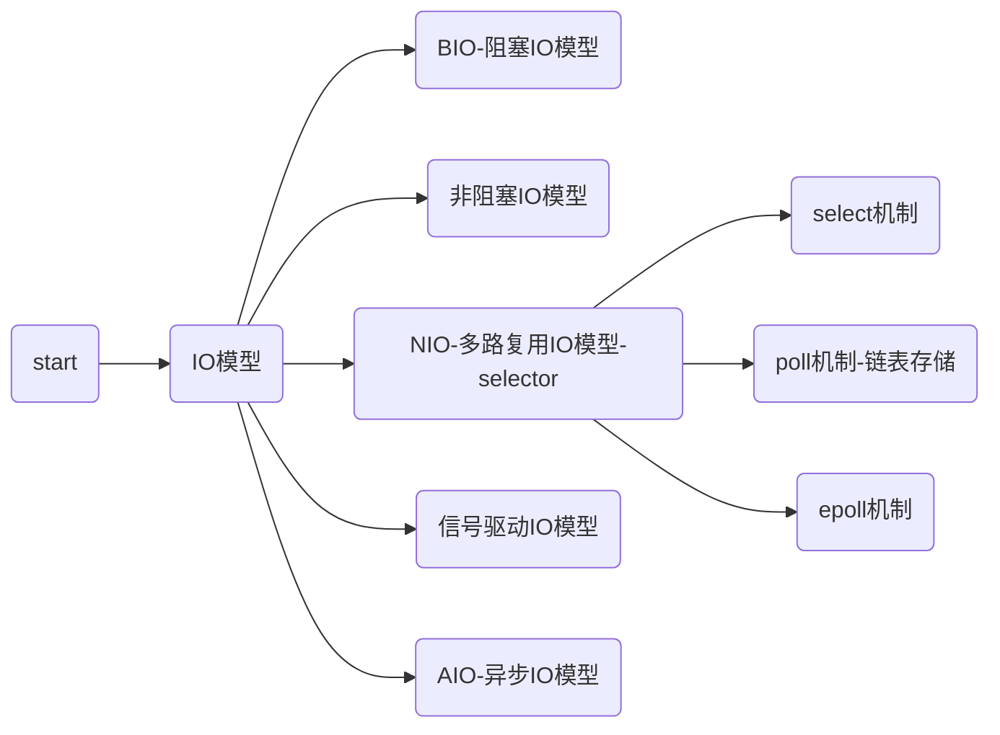

[toc]

# todo

- 思维方式+热情+能力（经验+能力+态度）
- Michael Jordan spirit  弱项--强项
- 弱项：
  - 架构设计：设计流程、识别复杂度、解决方案（设计题目、行业案例）
  - 算法题目：解题思路、代码落地
  - 归纳总结：
  - 规划能力：（计划能力）
  - 全局思维：（战略思维）
  - 思考能力

> 调整状态：批判型思维、成长型思维、七个好习惯 不卑不亢 分享的心态 解决问题的思维
> 学习方法：费曼学习法（听-写-再听）、整体性学习、刻意练习、5w1h、问题-思考-解决方案、学习-总结-产出文章
> 指导思想：运用批判性思维、不断的问问题、不断深入总结。你知道的越多，你不知道的就会越多，很正常。你能得到多少取决于你知道多少
>
> 解决问题：第一性原理(找到信息的源头-mvcc或权威信息info)，提出问题-解决问题 
>
> 收集真实项目中的案例及解决方案，深入原理透过问题看本质，形成问题--方案--原理模式。并深入总结各个行业的架构。
>

* 字节大佬
* github     system-design-primer
* 路人张
* 多领域知识、透过问题看本质。
>体现解决问题的能力，要深入到案例的核心问题(与业界问题的共性)，给出解决方案 。比如收集快手、滴滴、京东的案例的核心问题是什么？
* 另外要拥有两种能力：解决核心问题的能力（竞争力）和预言系统发展面临的问题给出解决方案（创新力）
>学习原则：基础理论决定上层建筑；打破沙锅问到底；搞清楚，不要不懂装懂；只有经过不断学习总结才能得到；以结果为导向，一定要总结表出核心理解，并刻意练习。
>总结并深入理解原理及面试题，并通过培训视频再反复、再实践、刻意练习、精进理解。
>
>>技术点面试：  从基本原理思考
>1. 基本概念？重点流程，越详细越好？
>
>2. 提出问题，解决问题，提出风险，解决风险。
>
>3. 类比？优缺点？
>
>4. 原理是什么？
>
>5. 应用场景是什么？
>
>6. 自己设计会如何实现？实现优缺点？如何改进 ？
>
>  https://xie.infoq.cn/article/684d1ce51c0d9ec654941a26b
>>视频课程： [https://ke.qq.com/course/399017?taid=12694231110260393](https://ke.qq.com/course/399017?taid=12694231110260393)
>>面试过程：自我介绍、架构认知；案例沟通；基础知识；设计扩展
>>重要题目：5 星最为重要
>>每个领域必须有书籍支持，如 jvm 对应书籍《深入 java 虚拟机》，算法《经典算法解析》，书本上最具体权威和整体性。
>>面试八股文：
>>[https://github.com/wolverinn/Waking-Up](https://github.com/wolverinn/Waking-Up)
>>[https://zhuanlan.zhihu.com/p/398785613](https://zhuanlan.zhihu.com/p/398785613)
>>字节大佬总结  *****
>>Anything in life worth doing is worth overdoing. Moderation is for cowards.
>>目标之一：系统架构设计师证  [https://www.educity.cn/rk/zhenti/jiagou/](https://www.educity.cn/rk/zhenti/jiagou/)
>>阿里面试：源码考察;高可用架构的项目经验;大厂的程序员思维;面试反套路技巧（价值观+行为问题)  钻研精神和批判性思维 
>>
>>https://javapub.blog.csdn.net/category_11740063.html


> tag : 面试总结

# Java 基础

>Java 基础篇： 基础结构+集合+异常+反射+IO+TCP+多线程

## 基础结构

### String,StringBuffer,StringBuilder 之间的区别？

* **是否可变**：String 类中用数组保存字符串，因为是 final 修饰符，所以 String 对象是不可变的。字符串拼接会产生大量的中间对象。StringBuffer 和 StringBuilder 都继承自 AbtractStringBuilder 类，也是使用字符数组保存字符串，这两个对象是可变的。
* **是否多线程安全**：String 对象是不可变的，可以理解为常量，所以是线程安全的。StringBuffer 对方法加了同步锁（synchronized）, 所以是线程安全的，StringBuilder 是非线程安全的，单线程场景中性能比较高。

### ArrayList 和 LinkedList 有什么区别？ 

* **数据结构**：ArrayList 是**动态数组结构**，LinkedList 是**双向链表结构**（可用于实现堆栈和队列 ），两个都是对 List 接口的实现。
* **随机访问效率**：前者比后者效率高，后者是线性的数据存储方式，所以需要移动指针从前到后查找。
* 增删操作：后者比前者效率高，前者要进行数据的移动。
### HashMap 中哈希算法的原理是什么？ 

1. 哈希码计算：
   当向HashMap添加键值对时，首先调用键对象的hashCode()方法，这个方法返回一个整数值，通常这个值是对键对象的内容进行某种特定计算的结果，目的是为了唯一且尽可能随机地代表键对象。理想情况下，不同的键对象应产生不同的哈希码，且相似的键对象应当产生相似的哈希码（以利于哈希算法的性能）。

2. 哈希码索引定位：
   得到哈希码之后，HashMap会进一步将其转换为数组的实际索引。这通常涉及到将哈希码与数组长度进行某种运算（在Java的HashMap实现中，利用的是哈希码与容量减一的按位与操作，确保结果始终位于数组的有效索引范围内）。这样做的目的是为了适配数组的大小，同时尽量减少哈希冲突。

   ``` java
      static int indexFor(int h, int length) {
          return h & (length-1);
      }
   ```

   

3. 解决哈希冲突：
   即便通过精心设计的哈希函数，也不能完全避免多个键具有相同的哈希码（这种现象称为哈希冲突）。为了解决这个问题，HashMap采用了链地址法，即将哈希码相同的所有键值对放在同一个数组槽位对应的链表或者红黑树中（在Java 8以后的版本中，当链表长度达到一定程度时会转化为红黑树）。
4. 总之，Java HashMap中的哈希算法是用来高效定位键值对在内部数据结构中的存储位置，通过哈希函数生成哈希码，并通过特定的索引计算方法，将哈希码映射为数组的索引位置，以支持快速的插入、查找和删除操作。同时，通过链表或红黑树处理哈希冲突，保持较高的数据组织效率。

### HashMap 的工作原理是什么？ 

>哈希表也叫散列表，是一种重要的数据结构 应用场景之一：缓存技术（memcached 核心就是一个大的哈希表） 
* HashMap 由**数组+链表**组成的，数组是 HashMap 的主体，链表则是主要为了解决哈希冲突而存在的。

* put方法原理

  1. 计算哈希值：
  当调用put(K key, V value)时，首先计算给定键key的哈希码(hash)，这是通过调用key对象的hashCode()方法并进一步处理这个哈希码以适应数组大小来完成的。
  2. 定位数组槽位：
  根据计算出的哈希值，找到对应的数组槽位。即通过 hash & (table.length - 1) 计算出数组索引，这里的table是HashMap内部维护的一个数组。
  3. 插入元素：
  如果找到的数组槽位为空，则直接创建一个新的节点(Node)，并将键值对插入到该槽位。
  若槽位不为空，则说明存在哈希冲突，此时：
  首先检查第一个节点的键是否与新插入的键相等，如果相等则替换旧值。
  若不相等，则继续沿着链表或红黑树进行查找（若链表长度达到阈值后转为红黑树结构，这是一种优化称为“链表转红黑树”的机制，也叫作“平衡树”转换）。
  在链表中，遍历直到找到相等的键或者到达链尾。
  在红黑树中，利用红黑树的特性进行高效的键查找和插入操作。
  如果找到了相同的键，则更新其值；如果没有找到，则在链表或红黑树末尾插入新的节点。
  4. 容量调整：
  当插入新元素后，还需要检查当前HashMap的实际大小（entry数量）是否超过了阈值（load factor * capacity）。如果超过阈值，将会触发扩容操作（resize）：创建一个新的更大的数组。将所有已存在的元素重新映射到新的数组上，这个过程会重新计算哈希值和索引，并保持原有的键值对关系。

* get方法原理：

  * 计算哈希值：调用hashCode()方法计算key的哈希码   hash=hash(key)

  * 定位桶索引的位置：通过映射策略（通常是取模运算）计算索引位置

    Node<K, V> tab;

    if((tab = table) != null && n == table.length - 1) {

    ​	Node<K, V> first = table[hash & (n - 1)];

    }

* 参数：HashMap 中容量、负荷因子和阀值是重要的参数。HashMap 默认的初始容量是 16，负荷因子是 0.75。阀值 = 负荷系数 x 容量。添加 Entry 时，如果 Map 的大小 > 阀值，HashMap 会对 Map 的内容重新哈希，使用更大的容量（容量总是 2 的幂）。

* 负载因子是空间和时间效率的衡量：设置过小时，可以降低碰撞的概率，提高插入和查询性能，但同时会占用更多的内存。设置过大时，可以在一定的程度上减少内存的占用，但在达到临界值时，会增加碰撞的概率，影响插入和查询的性能。

* 更新：HashMap 初始容量 16，static final int DEFAULT_INITIAL_CAPACITY = 1 << 4; // aka 16

  

  **jdk1.8 put 过程**
  
  


**jdk1.7 vs jdk1.8 重要参数对比：**


### 重新调整 HashMap 大小存在什么问题吗？ 

1. 性能开销

   - 扩容操作会新创建一个内部数据数组(Node[] table)，将消耗额外的内存资源。

   - 所有已存在的键值对都会重新计算在数组中的位置，这是一个线性操作，如果数据量比较大会导致性能急剧的下降。

2. 并发问题：在并发场景下，Resize()操作可能会导致数据不一致或其他并发问题，java8中的concurrentHashMap解决了这个问题。

3. 内存碎片：频繁的扩缩容会导致内存分配上的碎片化，导致内存的利用率不高。

4. 空间浪费：当HashMap数据量突然减少时(如删除大量元素)，并不会立即缩小内部数组的大小，而是要等到下一插入数据时才会调整数组的大小，这段时间就会导致空间的浪费。

### 为何 HashMap 的数组长度一定是2的次幂？ 
HashMap设计成2的次幂是为了实现高效的计算索引和更均匀的数据分布：
1. 提高索引计算效率
	HashMap使用散列函数计算键的哈希码，并通过某种方式转化为数组的索引。当数组的长度为2的幂次方时，可以位运算来代替传统的取模运算来确定元素的位置。位运算的速度要远快于取模运算，这样显著的提高了索引效率。
2. 分布更加均匀：当数组的长度为2的次幂方时，采用哈希码的低位进行索引的计算使得元素在数组中的分布更加均匀。这是因为(hash & (n - 1))的结果充分利用高位和低位的信息，减少不同健产生相同索引的可能性，有利于提高整体的查找、插入和删除的效率。
3. 提高扩容效率
当HashMap需要扩容时，通常是容量翻倍。由于原来的容量是2的幂次方，翻倍后的容量也是2的幂次方。这样，在迁移元素时，只需要简单改变索引的计算方式，而不必重新计算哈希值，极大的简化了扩容的过程，提高了扩容的效率。

### 如何自己实现HashMap？

### TreeMap 有什么特点？

TreeMap在Java集合框架中具有以下显著特点：

1. 有序性：
   TreeMap的键是有序的。它可以按照键的自然顺序（升序或降序）进行排序，也就是说，当你遍历TreeMap时，会得到有序的键值对序列。如果键实现了Comparable接口，那么TreeMap将按照此接口定义的排序规则进行排序。另外，也可以通过构造函数传入自定义的Comparator对象来自定义排序逻辑。
2. 基于红黑树：
   TreeMap的内部实现基于红黑树（Red-Black Tree），这是一种自平衡二叉查找树。这种数据结构确保了插入、删除和查找操作的高效性，即使在最坏的情况下，也能保证基本操作的时间复杂度为O(log n)。
3. 不允许键为null：
   TreeMap的键不允许为null，因为null无法参与比较。如果尝试将键为null的元素放入TreeMap，将会抛出NullPointerException。
4. 键的唯一性：
   和其它Map一样，TreeMap中的键必须是唯一的。如果有两个键经过比较（无论是自然排序还是自定义比较器）认为相等，则后插入的键值对将替换原有的键值对。
5. 集合视图：
   TreeMap提供了NavigableMap接口的支持，可以通过subMap(), headMap(), tailMap()方法获取部分有序的子视图，这些子视图也是TreeMap实例。
6. 序列化：
   TreeMap实现了Serializable接口，因此可以被序列化和反序列化。
7. 性能考虑：
   与HashMap相比，由于其内部结构和排序机制，对于插入、删除和查找操作，TreeMap的性能通常不如HashMap快，尤其是当数据量较大时。但是，如果你的应用场景需要一个自动排序的Map，TreeMap是一个很好的选择。

### hashmap 与 hashtable 有什么不同？

>线程安全、性能方面、迭代器
* 结构：HashMap 和 Hashtable 都**实现了 Map 接口**，前者允许空的键值对，后者不允许。
* 线程安全：Hashtable 是**线程安全**的，HashMap 不是。所以单线程情况下 HashMap 性能比较好。JDK5 提供了 ConcurrentHashMap 替代 Hashtable,比 Hashtable 有更好的扩展性。
* 迭代器：HashMap 的迭代器（Iterator）是 fail-fast 的迭代器，而 Hashtable 是 enumerator 迭代器不是 fail-fast 的， 所以当有其他线程改变了 HashMap 的结构时，会抛出 ConcurrentModificationException。 （让 HashMap 同步 Map m = Collections.synchronizeMap(hashMap);）

### 有没有有序的 Map 实现类呢？

1. LinkedHashMap：
    LinkedHashMap继承自HashMap，它不仅提供了HashMap的特性，还维护了元素的插入顺序或者最近最少使用的（LRU）访问顺序。通过维护一个双向链表，可以按照插入顺序或访问顺序迭代元素。
2. TreeMap：
    TreeMap基于红黑树（RB-tree）实现，它能够确保所有的Key-Value对按照Key的自然排序或自定义Comparator提供的比较规则进行排序。如果Key实现了Comparable接口，则默认按照自然顺序排序；如果传入了Comparator，则按照Comparator定义的顺序排序。
3. EnumMap：
    EnumMap是一个特殊的Map实现，用于枚举类型的键。它的内部实现使得键的顺序总是与枚举类型声明时的顺序一致，因此它是有序的。
4. SortedMap接口：
    SortedMap是Map接口的子接口，它添加了有序Map的功能。TreeMap是SortedMap的一个实现，符合此接口的要求。

总结来说，如果你需要一个有序的Map，可以选择LinkedHashMap来保持插入顺序或者访问顺序，或者选择TreeMap来保持Key的排序顺序。

### 为什么用 HashMap？

使用Java的HashMap类主要是因为它具备以下特点和优势，适用于多种编程场景：
1. 高效查找：
HashMap通过哈希函数将键映射到数组的具体索引，理论上能够在常数时间内完成插入、删除和查找操作。尽管在实际应用中，由于哈希冲突的存在，平均性能可能不是严格的O(1)，但在大多数情况下仍表现得非常高效。
2. 动态扩容：
HashMap会自动根据元素的数量调整其内部数组的大小，即进行扩容。当元素数量超过负载因子所设定的阈值时，会创建一个新的更大的数组，并将已有元素重新哈希至新的数组中，以此保持良好的性能。
3. 灵活性：
HashMap允许null键和null值，这在某些应用场景下提供了便利。相较于早期的Hashtable，HashMap在这方面更加灵活。
4. 非线程安全：
HashMap是非同步的，因此在单线程环境中，由于不需要进行同步操作，它的执行效率更高。在多线程环境，若需保证线程安全，可使用ConcurrentHashMap，或手动添加同步机制。
5. 数据结构：
HashMap使用数组+链表/红黑树的混合数据结构，数组负责快速定位，链表或红黑树负责处理哈希冲突。当链表长度超过一定阈值时，链表会转换为红黑树，进一步优化查找性能。
6. 映射关系：
HashMap用来存储键值对映射关系，非常适合需要进行关联操作、检索操作的场合，例如缓存、数据库表记录的字段与值的临时存储等。
结合以上特点，HashMap成为Java编程中广泛使用的数据结构，尤其是在需要快速存取、无需保证元素顺序的场景下。

### hashmap 有什么方法可以减少碰撞？ @@@@

* 扰动函数可以减少碰撞
原理是如果两个不相等的对象返回不同的 hashcode 的话，那么碰撞的几率就会小些。这就意味着存链表结构减小，这样取值的话就不会频繁调用 equal 方法，从而提高 HashMap 的性能（扰动即 Hash 方法内部的算法实现，目的是让不同对象返回不同 hashcode）。

* **使用不可变的、声明作 final 对象**，并且采用合适的 equals() 和 hashCode() 方法，将会减少碰撞的发生。**不可变性使得能够缓存不同键的 hashcode**，这将提高整个获取对象的速度，使用 String、Integer 这样的 wrapper 类作为键是非常好的选择。
### 拉链法导致的链表过深，为什么不用二叉查找树代替而选择红黑树？为什么不一直使用红黑树？ 

* 之所以选择红黑树是为了**解决二叉查找树的缺陷**：二叉查找树在特殊情况下会变成一条线性结构（这就跟原来使用链表结构一样了，造成层次很深的问题），**遍历查找会非常慢**。而红黑树在插入新数据后可能需要通过左旋、右旋、变色这些操作来保持平衡。 (由于二叉树是非线性结构，因此，树的遍历实质上是将二叉树的各个结点转换成为一个线性序列来表示。 )
* 引入红黑树就是为了查找数据快，解决链表查询深度的问题。我们知道红黑树属于平衡二叉树，为了保持“平衡”是需要付出代价的，但是该代价所损耗的资源要比遍历线性链表要少。所以当长度大于 8 的时候，会使用红黑树；如果链表长度很短的话，根本不需要引入红黑树，引入反而会慢。
### 说说你对红黑树的见解 ?


* **节点颜色**：根节点总是黑色的，每个节点非红即黑；如果**节点是红色的**，则它的子节点必须是黑色的（反之不一定）；每个叶子节点都是**黑色的空节点**（NIL 节点）
* **路径长度**：从根节点到叶节点或空子节点的每条路径，必须包含相同数目的**黑色节点**（即相同的黑色高度）
### 解决 hash 碰撞还有那些办法？

>HashMap 即是采用了链地址法，也就是数组+链表的方式。
* 开放定址法
* 再散列函数法
* 链地址法

### 可以使用 CocurrentHashMap 来代替 Hashtable 吗？ 

* 我们知道 Hashtable 是 synchronized 的，但是 ConcurrentHashMap 同步性能更好，因为它仅仅根据同步级别对 map 的一部分进行上锁 ConcurrentHashMap 当然可以代替 HashTable，但是 HashTable 提供更强的线程安全性 它们都可以用于多线程的环境，但是当 Hashtable 的大小增加到一定的时候，性能会急剧下降，因为迭代时需要被锁定很长的时间。由于 ConcurrentHashMap 引入了分割（segmentation），不论它变得多么大，仅仅需要锁定 Map 的某个部分，其它的线程不需要等到迭代完成才能访问 Map。简而言之，在迭代的过程中，ConcurrentHashMap 仅仅锁定 Map 的某个部分，而 Hashtable 则会锁定整个 Map
### CocurrentHashMap（JDK 1.7）

* CocurrentHashMap 是由 Segment 数组和 HashEntry 数组和链表组成 Segment 是基于重入锁（ReentrantLock）：一个数据段竞争锁。每个 HashEntry 一个链表结构的元素，利用 Hash 算法得到索引确定归属的数据段，也就是对应到在修改时需要竞争获取的锁。ConcurrentHashMap 支持 CurrencyLevel（Segment 数组数量）的线程并发。每当一个线程占用锁访问一个 Segment 时，不会影响到其他的 Segment 核心数据如 value，以及链表都是 volatile 修饰的，保证了获取时的可见性 首先是通过 key 定位到 Segment，之后在对应的 Segment 中进行具体的 put 操作如下： 将当前 Segment 中的 table 通过 key 的 hashcode 定位到 HashEntry。 遍历该 HashEntry，如果不为空则判断传入的 key 和当前遍历的 key 是否相等，相等则覆盖旧的 value 不为空则需要新建一个 HashEntry 并加入到 Segment 中，同时会先判断是否需要扩容 最后会解除在 1 中所获取当前 Segment 的锁。 虽然 HashEntry 中的 value 是用 volatile 关键词修饰的，但是并不能保证并发的原子性，所以 put 操作时仍然需要加锁处理 首先第一步的时候会尝试获取锁，如果获取失败肯定就有其他线程存在竞争，则利用 scanAndLockForPut() 自旋获取锁。
* 尝试自旋获取锁 如果重试的次数达到了 MAX_SCAN_RETRIES 则改为阻塞锁获取，保证能获取成功。最后解除当前 Segment 的锁
### CocurrentHashMap（JDK 1.8） @@@@

* CocurrentHashMap 抛弃了原有的 Segment 分段锁，采用了 CAS + synchronized 来保证并发安全性。其中的 val next 都用了 volatile 修饰，保证了可见性。
* 最大特点是引入了 CAS 借助 Unsafe 来实现 native code。CAS 有 3 个操作数，内存值 V、旧的预期值 A、要修改的新值 B。当且仅当预期值 A 和内存值 V 相同时，将内存值 V 修改为 B，否则什么都不做。Unsafe 借助 CPU 指令 cmpxchg 来实现。
* CAS 使用实例 对 sizeCtl 的控制都是用 CAS 来实现的：
-1 代表 table 正在初始化 N 表示有 -N-1 个线程正在进行扩容操作 如果 table 未初始化，表示 table 需要初始化的大小 如果 table 初始化完成，表示 table 的容量，默认是 table 大小的 0.75 倍，用这个公式算 0.75（n – (n >>> 2)） CAS 会出现的问题：ABA 解决：对变量增加一个版本号，每次修改，版本号加 1，比较的时候比较版本号。

* put 过程 根据 key 计算出 hashcode 判断是否需要进行初始化 通过 key 定位出的 Node，如果为空表示当前位置可以写入数据，利用 CAS 尝试写入，失败则自旋保证成功 如果当前位置的 hashcode == MOVED == -1,则需要进行扩容 如果都不满足，则利用 synchronized 锁写入数据 如果数量大于 TREEIFY_THRESHOLD 则要转换为红黑树
* get 过程 根据计算出来的 hashcode 寻址，如果就在桶上那么直接返回值 如果是红黑树那就按照树的方式获取值 就不满足那就按照链表的方式遍历获取值
* ConcurrentHashMap 在 Java 8 中存在一个 bug 会进入死循环，原因是递归创建 ConcurrentHashMap 对象，但是在 JDK 1.9 已经修复了。场景重现如下：
```plain
public class ConcurrentHashMapDemo{
    private Map<Integer,Integer> cache =new ConcurrentHashMap<>(15);
 
    public static void main(String[]args){
        ConcurrentHashMapDemo ch =    new ConcurrentHashMapDemo();
        System.out.println(ch.fibonaacci(80));        
    }
 
    public int fibonaacci(Integer i){        
        if(i==0||i ==1) {                
            return i;        
        }
 
        return cache.computeIfAbsent(i,(key) -> {
            System.out.println("fibonaacci : "+key);
            return fibonaacci(key -1)+fibonaacci(key - 2);        
        });       
    }
}

```

#### 

### HashSet 与 TreeSet 的比较？

* 基本结构：TreeSet 是**二叉树**实现的，Treeset 中的数据是自动排好序的，不允许放入 null 值 。HashSet 是**哈希表**实现的，HashSet 中的数据是无序的，可以放入 null，但只能放入一个 null，两者中的值都不能重复，就如数据库中唯一约束 。
* **实现 HashCode****：**HashSet 要求放入的对象必须**实现 HashCode()方法**，放入的对象，是以 hashcode 码作为标识的，而具有相同内容的 String 对象，hashcode 是一样， 所以放入的内容不能重复。但是同一个类的对象可以放入不同的实例。
* 适用场景：HashSet 是基于 Hash 算法实现的，其**性能通常都优于 TreeSet**。我们通常都应该使用 HashSet，在我们需要排序的功能时，我们才使用 TreeSet。
### 多线程场景下如何使用 ArrayList？

* ArrayList 不是线程安全的，如果遇到多线程场景，可以通过 Collections 的 synchronizedList 方法将其转换成线程安全的容器后再使用。例如像下面这样：
```plain
List<String> synchronizedList = Collections.synchronizedList(list);
synchronizedList.add("aaa");
synchronizedList.add("bbb");
for (int i = 0; i < synchronizedList.size(); i++)
{
    System.out.println(synchronizedList.get(i));
}
```
### ArrayList 有什么优缺点？

* 优点：**查询效率高、顺序添加**
    * ArrayList 底层以**数组实现**，是一种随机访问模式。ArrayList 实现了 RandomAccess 接口，因此查找的时候非常快。
    * ArrayList 在**顺序添加**一个元素的时候非常方便。
* 缺点：**插入删除时需要元素复制**
    * 删除元素的时候，需要做一次**元素复制**操作。如果要复制的元素很多，那么就会比较耗费性能。
    * 插入元素的时候，也需要做一次元素复制操作，缺点同上。ArrayList 比较适合顺序添加、随机访问的场景。
### 为什么 ArrayList 的 elementData 加上 transient 修饰？

**ArrayList 支持序列化，为了加快序列化的速度，减小序列化之后的文件大小。**transient 修饰后不会被序列化。

* ArrayList 中的数组定义如下：
```plain
private transient Object[] elementData;

再看一下 ArrayList 的定义：
public class ArrayList<E> extends AbstractList<E>
        implements List<E>, RandomAccess, Cloneable, java.io.Serializable
```
可以看到 ArrayList 实现了 Serializable 接口，这意味着 ArrayList 支持序列化。transient 的作用是说不希望 elementData 数组被序列化，重写了 writeObject 实现：
```plain
private void writeObject(java.io.ObjectOutputStream s) throws java.io.IOException{
    // Write out element count, and any hidden stuff
    int expectedModCount = modCount;
    s.defaultWriteObject();
        // Write out array length
    s.writeInt(elementData.length);
        // Write out all elements in the proper order.
    for (int i=0; i<size; i++)
        s.writeObject(elementData[i]);
    if (modCount != expectedModCount) {
        throw new ConcurrentModificationException();
    }

```
每次序列化时，先调用 defaultWriteObject() 方法序列化 ArrayList 中的非 transient 元素，然后遍历 elementData，只序列化已存入的元素，这样既加快了序列化的速度，又减小了序列化之后的文件大小。
### 插入数据时，ArrayList、LinkedList、Vector 谁速度较快？ @@@@

* ArrayList、Vector 底层的实现都是使用**数组方式**存储数据。数组元素数大于实际存储的数据以便增加和插入元素，它们都允许直接按序号索引元素，但是插入元素要涉及数组元素移动等内存操作，所以索引数据快而插入数据慢。
* Vector 中的方法由于加了 synchronized 修饰，因此 Vector 是线程安全容器，但性能上较 ArrayList 差。
* LinkedList 使用**双向链表实现存储**，按序号索引数据需要进行前向或后向遍历，但插入数据时只需要记录当前项的前后项即可，所以 LinkedList 插入速度较快。
### 强引用，软引用和弱引用的区别 @@@@

* 强引用：只有这个引用被释放之后，对象才会被释放掉，只要引用存在，垃圾回收器永远不会回收，这是最常见的 New 出来的对象。
* 软引用：内存溢出之前通过代码回收的引用。软引用主要用户实现类似缓存的功能，在内存足够的情况下直接通过软引用取值，无需从繁忙的真实来源查询数据，提升速度；当内存不足时，自动删除这部分缓存数据，从真正的来源查询这些数据。
* 弱引用：第二次垃圾回收时回收的引用，短时间内通过弱引用取对应的数据，可以取到，当执行过第二次垃圾回收时，将返回 null。弱引用主要用于监控对象是否已经被垃圾回收器标记为即将回收的垃圾，可以通过弱引用的 isEnQueued 方法返回对象是否被垃圾回收器标记。

### ArrayList如何扩容 

``` java
public boolean add(E e) {
  //确保内部容量(通过判断，如果够则不进行操作；容量不够就扩容来确保内部容量)
  ensureCapacityInternal(size + 1);  // ①Increments modCount!!
  elementData[size++] = e;//②
  return true;
}
```

ArrayList在进行初始化时如果未指定initCapacity时会延迟分配对象的数组空间，当第一次插入元素时分配10个对象空间。假设有20元素需要插入，分别在第一次的时候，将ArrayList空间初始化为10，然后按1.5进行扩容。当添加第11个元素时，ArrayList扩容为10*1.5=15。

``` java
/*
    *增加容量，以确保它至少能容纳
    *由最小容量参数指定的元素数。
    * @param mincapacity所需的最小容量
    */
    private void grow(int minCapacity) {
        // overflow-conscious code
        int oldCapacity = elementData.length;
        //>>位运算，右移动一位。 整体相当于newCapacity =oldCapacity + 0.5 * oldCapacity  
        // jdk1.7采用位运算比以前的计算方式更快
        int newCapacity = oldCapacity + (oldCapacity >> 1);
        if (newCapacity - minCapacity < 0)
            newCapacity = minCapacity;
       //jdk1.7这里增加了对元素个数的最大个数判断,jdk1.7以前是没有最大值判断的，MAX_ARRAY_SIZE 为int最大值减去8（不清楚为什么用这个值做比较）
        if (newCapacity - MAX_ARRAY_SIZE > 0)
            newCapacity = hugeCapacity(minCapacity);
        // 最重要的复制元素方法
        elementData = Arrays.copyOf(elementData, newCapacity);
    }
```


### jdk8特性


## stream原理  //todo

stream原理

流水线机制 (Pipeline):
Stream API 实现的核心是采用流水线的方式组织操作。每个操作（无论是中间还是终端）都被封装为一个 Pipeline 对象，形成了一个双向链表结构。链表中的节点代表了不同的操作阶段，每个节点具有以下属性：
sourceStage: 指向源头数据源的引用。
previousStage: 指向前一个操作阶段（上游）的引用。
nextStage: 指向下一个操作阶段（下游）的引用。
操作分类:
无状态操作 (Stateless Operations): 如 map、filter 等，它们对每个单独的元素独立应用转换规则，不依赖于其他元素或外部状态。这类操作对应的 Pipeline 对象通常是 StatelessOp。
有状态操作 (Stateful Operations): 如 sorted、distinct 等，它们可能需要查看多个元素或保持某种状态才能做出决策。对应的 Pipeline 对象为 StatefullOp。
惰性求值 (Laziness):
中间操作只构建流水线而不触发实际计算。只有当终端操作被执行时，才会触发从源头到终端的整个流水线的计算。这种设计有利于提高效率，避免不必要的计算，并支持无限流的处理。
短路特性 (Short-Circuiting):
一些终端操作（如 findFirst、anyMatch）在找到满足条件的结果后即可停止进一步的流处理。这有助于提升性能，特别是对于大数据集或长流水线而言。
并行化支持:
Stream API 内置了对并行流的支持。在执行过程中，它可以自动根据硬件资源和数据特性将工作分解为多个子任务，在多个线程上并行执行。并行流仍然遵循相同的流水线模型，但在执行过程中会对数据分区、调度任务以及合并结果等方面进行额外处理，以确保正确性和性能。

## IO部分（IO部分文件 ）

### 理论基础

> 参考有道 interview-notes-new中的IO部分



### select、poll、epoll有什么区别？底层数据结构是什么样的？

> 类比案例：某教室有10名学生和1名老师，这些学生上课会不停的提问，所以一个老师处理不了这么多的问题。那么学校为每个学生都配一名老师，也就是这个教室目前有10名老师。此后，只要有新的转校生，那么就会为这个学生专门分配一个老师，因为转校生也喜欢提问题。如果把以上例子中的学生比作客户端，那么老师就是负责进行数据交换的服务端。则该例子可以比作是多进程的方式。
> 后来有一天，来了一位具有超能力的老师，这位老师回答问题非常迅速，并且可以应对所有的问题。而这位老师采用的方式是学生提问前必须先举手，确认举手学生后在回答问题。则现在的情况就是IO复用。
>
> https://blog.csdn.net/wteruiycbqqvwt/article/details/90299610
>
> https://zhuanlan.zhihu.com/p/272891398

select，poll，epoll都是==IO多路复用的机制==。I/O多路复用就通过一种机制，可以监视多个描述符，一旦某个描述符就绪（一般是读就绪或者写就绪），能够通知程序进行相应的读写操作。但select，poll，epoll本质上都是同步I/O，因为他们都需要在读写事件就绪后==自己负责进行读写==，也就是说这个读写过程是阻塞的，而异步I/O则无需自己负责进行读写，异步I/O的实现会==负责把数据从内核拷贝到用户空间==。  


​											**fd事件数组的遍历**


1. 支持一个进程所能打开的==最大连接数==
   select：单个进程所能打开的最大连接数有==FD_SETSIZE==宏定义，其大小是32个整数的大小（在32位的机器上，大小就是3232，同理64位机器上FD_SETSIZE为3264），当然我们可以对进行修改，然后重新编译内核，但是性能可能会受到影响，这需要进一步的测试。
   poll：poll本质上和select没有区别，但是它==没有最大连接数的限制==，原因是它是基于==链表来存储==的。
   epoll：虽然连接数有上限，但是很大，1G内存的机器上可以打开==10万左右==的连接，2G内存的机器可以打开20万左右的连接。

2. ==FD剧增后带来的IO效率问题==

   select：因为每次调用时都会对连接进行==线性遍历==，所以随着FD的增加会造成遍历速度慢的“线性下降性能问题”。
   poll：同上
   epoll：因为epoll内核中实现是根据每个==fd上的callback函数来实现的==，只有==活跃的socket==才会主动调用callback，所以在活跃socket较少的情况下，使用epoll没有前面两者的线性下降的性能问题，但是所有socket都很活跃的情况下，可能会有性能问题。

3. ==消息传递方式==

   select：内核需要将消息传递到用户空间，都需要==内核拷贝动作==

   poll：同上
   epoll：epoll通过内核和用户==空间共享==一块内存，利用mmap()文件映射内存加速与内核空间的消息传递，减少了复制的开销。

扩展知识：

- select>时间复杂度O(n)

  它仅仅知道了，有I/O事件发生了，却并==不知道是哪几个流==（可能有一个，多个，甚至全部），我们只能无差别轮询所有流，找出能读出数据，或者写入数据的流，对他们进行操作。所以select具有O(n)的无差别轮询复杂度，同时处理的流越多，无差别轮询时间就越长。

- poll>时间复杂度O(n)

  poll本质上和select没有区别，它将用户传入的==数组拷贝到内核空间==，然后查询每个fd对应的设备状态， 但是它==没有最大连接数的限制==，原因是它是基于链表来存储的.

- epoll>时间复杂度O(1)

  epoll可以理解为==event poll==，不同于忙轮询和无差别轮询，epoll会把哪个流发生了怎样的I/O事件通知我们。所以我们说epoll实际上是事件驱动（每个事件关联上fd）的，此时我们对这些流的操作都是有意义的。

- epoll跟select都能提供多路I/O复用的解决方案。在现在的Linux内核里有都能够支持，其中epoll是Linux所特有，而select则应该是POSIX所规定，一般操作系统均有实现。

epoll的优点：

1、==没有最大并发连接的限制==，能打开的FD的上限远大于1024（1G的内存上能监听约10万个端口）；
2、==效率提升，不是轮询的方式==，不会随着FD数目的增加效率下降。只有活跃可用的FD才会调用callback函数；即Epoll最大的优点就在于它==只管你“活跃”的连接==，而跟连接总数无关，因此在实际的网络环境中，Epoll的效率就会远远高于select和poll。

3、 ==内存拷贝==，利用mmap()文件映射内存加速与内核空间的消息传递；即epoll使用mmap减少复制开销。

### 有几种IO模型，有什么区别？

- 阻塞io模型
- 非阻塞io模型
- 多路复用io模型
- 信号驱动io模型
- 异步io模型

基于多路复用的高性能 I/O 模型

### 零拷贝 vs 传统网络传输

* **零拷贝技术**：只需将磁盘文件中的数据复制到页面缓冲中一次，然后将数据直接从页面缓存复制到网络中。这样避免了数据在用户态和内核态之间重复的复制操作，消息的使用速度基本等同于网络连接的速度 

  s


### BIO,NIO,AIO有什么区别？

- Java BIO ： 同步并阻塞，服务器实现模式为一个连接一个线程，即客户端有连接请求时服务器端就需要启动一个线程进行处理，如果这个连接不做任何事情会造成不必要的线程开销，当然可以通过线程池机制改善。
- Java NIO ： 同步非阻塞，服务器实现模式为一个请求一个线程，即客户端发送的连接请求都会注册到多路复用器上，多路复用器轮询到连接有I/O请求时才启动一个线程进行处理。
- Java AIO： 异步非阻塞，服务器实现模式为一个有效请求一个线程，客户端的I/O请求都是由OS先完成了再通知服务器应用去启动线程进行处理。
- NIO比BIO的改善之处是把一些无效的连接挡在了启动线程之前，减少了这部分资源的浪费（因为我们都知道每创建一个线程，就要为这个线程分配一定的内存空间）
- AIO比NIO的进一步改善之处是将一些暂时可能无效的请求挡在了启动线程之前，比如在NIO的处理方式中，当一个请求来的话，开启线程进行处理，但这个请求所需要的资源还没有就绪，此时必须等待后端的应用资源，这时线程就被阻塞了。


## 多线程部分

>整体性：
>理论基础->设计模式-> 并发工具-> 并发框架（mubu：多线程）
>理论基础：JMM（可见性、有序性）
>《java 并发编程实战》、极客时间
>
>参考多线程部分


## 事务相关-old

1. 事务隔离级别有哪些？Mysql 默认隔离级别是什么？  *****
**SQL 标准定义的 4 个隔离级别：**

* **READ-UNCOMMITTED**(读取未提交)：最低的隔离级别，允许读取尚未提交的数据变更，可能会导致脏读、幻读或不可重复读。
* **READ-COMMITTED(读取已提交)**：允许读取并发事务已经提交的数据，可以阻⽌脏读，但是幻读或不可重复读仍有可能发⽣。
* **REPEATABLE-READ(可重复读)**：对同⼀字段的多次读取结果都是⼀致的，除⾮数据是被本身事务⾃⼰所修改，可以阻⽌脏读和不可重复读，但**幻读**仍有可能发⽣。(mysql 默认隔离级别)
* **SERIALIZABLE(可串⾏化)**：**最⾼的隔离级别**，完全服从 ACID 的隔离级别。所有的事务依次逐个执⾏，这样事务之间就完全不可能产⽣⼲扰，也就是说，该级别可以防⽌脏读、不可重复读以及幻读。
**Mysql InnoDB 存储引擎：**默认⽀持的隔离级别是 REPEATABLE-READ（可重读）, 在此隔离级别下使⽤的是 Next-KeyLock 锁算法，可以避免幻读的产⽣，这与其他数据库系统(如 SQLServer)是不同的。已经可以完全保证事务的隔离性要求，即达到了 SQL 标准的 SERIALIZABLE(**可串⾏化**)隔离级别。

**gap lock**：在索引记录之间或前后加锁，并不包含索引本身。gap lock 的机制主要用来解决可重复读模式下的幻读问题。

因为隔离级别越低，事务请求的锁越少，所以⼤部分数据库系统的隔离级别都是 READ-COMMITTED(读取提交内容)，但是你要知道的是 InnoDB 存储引擎默认使⽤ REPEAaTABLE-READ（可重读）**并不会有任何性能损失**。


## JVM 部分 *****

>  基础：JMM、jvm 内存的划分、类加载过程、GC 过程

 [JVM.md](JVM.md) 

# 网络部分  *****

> 参见网络部分


# 设计模式、基础理论 *****

1. 贫血模式、充血模式
2. 设计原则、23 设计模式
3. cap、base
4. 一致性协议 
5. 开源框架的设计模式

# 源码部分

>[https://time.geekbang.org/column/article/229996](https://time.geekbang.org/column/article/229996)
>
>LinkedHashmap 的底层实现
>
>dubbo源码实现
>
>ratelimitor源码实现

spring spi ： 

https://blog.csdn.net/qq_16498553/article/details/108176139

# 分布式、微服务、中台

>SpringBoot+SpringCloud 分布式开发篇： 微服务入门+实战
>
>参考：open 开源框架

微服务部分


# 设计题
>[https://github.com/donnemartin/system-design-primer/blob/master/README-zh-Hans.md#%E5%AD%A6%E4%B9%A0%E6%8C%87%E5%BC%95](https://github.com/donnemartin/system-design-primer/blob/master/README-zh-Hans.md#%E5%AD%A6%E4%B9%A0%E6%8C%87%E5%BC%95)
>
>参见设计部分
>
> * 如果让你实现一个线程安全的队列，你会怎么实现。
> * 如何从 0 到 1 设计一个类似 Dubbo 的 RPC 框架？
> * 如果让你实现一个 mq，怎么样保证消息不丢失
```plain
 手撕代码：按层次遍历二叉树？
```
统计 100G 的 ip 文件中出现 ip 次数最多的 100 个 ip
 5 台服务器如何选出 leader(选举算法)

4 亿个 int 数，如何找出重复的数（用 hash 方法，建一个 2 的 32 次 方个 bit 的 hash 数组，每取一个 int 数，可 hash 下 2 的 32 次方找到它在 h ash 数组中的位置，然后将 bit 置 1 表示已存在）

4 亿个 url，找出其中重复的（考虑内存不够，通过 hash 算法，将 url 分配到 1000 个文件中，不同的文件间肯定就不会重复了，再分别找出重复 的） 有 1 万个数组，每个数组有 1000 个整数，每个数组都是降序的，从中找出 最大的 N 个数，N<1000

113. LinkedHashmap 的底层实现


微博关注的设计 

京东

滴滴的设计

微信的一些设计 


# 中间件篇

>深入了解其中的组件及源码及模式的应用
1. mysql
[mysql索引案例](https://shimo.im/docs/YXygQH6Hcvdt8RWp)


2. redis


3. kafka

## zookeeper

zookeeper是一个分布式的，开放源码的分布式应用程序==协调服务==，是google Chubby一个开源实现，也是==hadoop和HBase的重要组件==。功能包含配置服务、域名服务、分布式同步、组服务等。

``` flow
start=>start: start
op=>operation: ClientA
op1=>operation: ZServer(RootNode-c)
op2=>operation: ClientB
end=>end: end

op(right)->op1
op1(right)->op2
```


###  节点信息

- 持久节点、
- 临时节点、
- 顺序节点

### watch原理

zookeeper用znode存放数据，并且把c的值存储在里面，如果c的值被更新了，如何通知clientA和ClientB呢？

通过三个步骤来实现：

- 客户端注册watcher：客户端发送watcher到服务端进行注册时，会将这个watcher保存在本地的zk watchManager中，这样做是为了服务端响应后，从本地就可以获取watcher进行处理。
- 服务端处理watcher：服务端获取注册请求，从dataTree中对应的znode里获取数据。客户端接收服务端返回数据，服务端将watcher添加到watchManager中。
- 客户端回调watcher：服务端会发送watcherEvent事件，客户端用回调函数（sendTread）进行接收，会将事件发送给EventThread。然后通过eventType知道哪个watcher被响应了，从本地的zk WatchManager中取出watcher放到waitingEvent队列中等待处理。


### version原理与使用//todo

多个客户端修改C的值，version用来保证分布式数据的原子性操作。--乐观锁解决方案
还有一种是利用znode的有序性，在值c下创建临时顺序节点，更新时按节点id作为优先级更行 更新。

### 会话的原理与使用
客户端和服务端进行通信称为会话，有四种状态：connectingf,connected,re..,re...


### 服务群组
- 问题：服务器依赖于zk服务器，如果==zk挂了怎么办？==
- 为提高zk的可用性，引入了==服务集群==的概念。zk客户端可以将事务请求发送给任意一台zk服务器，无论哪个服务器都会把==请求转交给领导者==。领导者将数据写入znode之前，会向zookeeper集群的其他跟随都==发送广播==消息。这里的广播用到了==zab协议，这是paxos协议的实践。说白了就是一两阶段提交。==
- 具体方式如下：
  - 当集群==领导者==接收到==提交消息==后，向集群跟随都发送一个proposal
  - 当集群跟随者接收到propoal后，向领导者==反馈一个ack==，表示接收到proposal，并且已经做准备好。
  - 领导者进行==仲裁==，如果接收到数量过半的跟随者发送的ack信息（包括领导者自己），就发送消息通知跟随者进行提交。接下来跟随者把数据写入到znode中。
- 还有一个问题，zk如何处理这么多的请求呢？这就用到了观察者。


### zab 协议（看分布式协同部分-zab算法）

 


1. [https://blog.csdn.net/langzhouxing/article/details/103741247](https://blog.csdn.net/langzhouxing/article/details/103741247)
2. Dubbo
3. spring

```plain
 spring 中用到了什么，ioc 有什么好处，aop 是怎么实现的？
```

## 8.shell

1. 用 awk 统计一个 ip 文件中 top10


# 思想篇

1. devops

   ## 工程思想 

   ​		工程化思想在软件开发和信息技术领域中，是指将系统性的、规范化的方法应用于项目开发、运维管理以及整个生命周期的各个环节，旨在提升产品质量、保证开发效率、降低成本和风险。

   工程化思想的主要要点和实践包括：

   1. 系统性：看待整个软件开发过程如同一个复杂的系统，每个组成部分（如需求分析、设计、编码、测试、部署、维护）都需要相互协调和配合，以实现总体目标。
   2. 标准化与规范化：建立统一的技术标准、编程规范、文档模板以及团队协作流程，确保软件产品从设计、实现到维护的全过程遵循一致的标准，便于多人协作和后期维护。
   3. 迭代与增量开发：采用敏捷开发或迭代开发模式，以小步快跑的方式推进项目，通过快速反馈和调整，逐步完善软件产品，降低一次性设计的风险。
   4. 测试驱动开发：重视软件质量，强调先编写测试用例，然后再编写满足测试用例的代码，以保证软件功能的正确性和可靠性。
   5. 自动化工具的应用：积极采用自动化工具进行构建、测试、部署、监控等操作，减轻重复劳动，提高效率，降低人为错误。
   6. 风险管理与变更控制：预先识别可能遇到的风险和问题，建立系统的稳健性和可扩展性。

   7. 持续集成与持续部署契约式设计与接口管理**：（CI/CD）：通过自动化明确系统组件间的接口约定和职责边界，采用契约式设计来增强流水线将代码频繁合并到主风险管理计划，并对变更请求进行有效的管理与控制，确保项目进度和成果不受重大影响。

   8. 分支，并持续交付到生产环境，确保软件始终处于可发布状态。

   9. 团队协作与沟通：强调良好的团队协作文化，鼓励跨职能团队间的紧密沟通，确保需求传递准确、问题解决迅速。

      总之，工程化思想倡导在软件开发中运用工程原理和最佳实践，强调预防而非事后补救，追求整个软件开发生命周期的可控性、可预测性和可持续性。

## 如何进行项目管理推进项目进度

阿里在项目开发中推进项目进度主要依靠一套系统化、精细化的项目管理方法和实践，以下列举了一些关键的推进策略和方法：

1. 明确项目目标与规划：
   在项目启动阶段，阿里会非常清晰地定义项目目标，梳理出详尽的项目范围说明书和WBS（Work Breakdown Structure，工作分解结构），并将任务分解成可量化、可追踪的工作包。
2. 敏捷开发与迭代管理：
   阿里采用敏捷开发方法，如Scrum或Kanban等，进行短周期迭代开发，通过每日站会、冲刺评审会议、回顾会议等形式，保证团队成员对项目进展的实时了解，并快速响应变化，调整开发计划。
3. 进度跟踪与监控：
利用项目管理工具和平台，实时跟踪和监控项目进度，包括任务完成情况、关键路径、风险预警等，确保项目按计划顺利推进。
4. 资源配置与优化：
根据项目需求和进度计划，合理调配人力资源和其他资源，确保在关键节点有足够的资源支撑，必要时进行资源的动态调整。
5. 风险管理与应对：
对项目中的潜在风险进行识别、评估和应对，提前制定风险管理计划，一旦发生风险事件，能够迅速反应并采取措施，确保项目进度不受严重影响。
6. 跨部门协同：
阿里特别强调团队间协同合作，通过跨部门项目组的形式，打破部门壁垒，加强信息同步，共同推进项目进程。
7. 进度可视化与透明沟通：
通过项目看板等工具，将项目进度直观呈现出来，增加项目进度的透明度，促使所有利益相关者都能及时了解到项目进展和面临的问题，促进沟通和决策。
8. 激励与考核机制：
设定明确的绩效指标，与个人和团队的奖励制度挂钩，激发团队成员的积极性和主动性，推动项目按时高质量完成。
9. 持续改进与复盘：
定期进行项目复盘，分析项目执行过程中的成功与不足，提炼经验教训，不断优化项目管理流程和方法，持续改进项目推进效率。
10. 高层领导力支持：
项目进度推进离不开高层领导的支持与监督，高层管理者会在关键时刻提供决策支持，帮助解决项目推进中的难题。
通过上述多种方式，阿里能够在项目开发过程中有效地推进项目进度，确保项目按时交付的同时，也注重提升项目的质量和团队的成长。

## 主导系统稳定性的实践经验

主导系统稳定性的实践经验涉及多个方面，以下是一些核心原则和实践经验总结：
1. 架构设计
冗余与高可用性：设计高可用系统架构，包括但不限于服务的冗余部署（主从、集群、负载均衡）、数据存储的冗余备份（RAID、分布式存储、数据库主从复制）。
2. 解耦与微服务化：通过微服务架构降低系统之间的耦合度，使得单个服务的故障不会影响整个系统，同时也便于独立扩展和维护各个服务。
3. 容量规划与资源监控
- 资源监控与预警：实时监控系统资源使用情况（如CPU、内存、磁盘、网络带宽等），设置合理的阈值预警，及时发现并解决问题。
- 性能压测与容量规划：定期进行性能测试以评估系统承载能力，并根据业务发展和预期峰值进行容量规划。
4. 故障恢复与灾难恢复
- 自动故障转移：在硬件或软件出现故障时，能够自动切换到备用资源，比如服务实例的健康检查和自动重启、数据库主从切换等。
- 灾备方案：设计异地或异机备份策略，确保在极端情况下能够快速恢复服务，如双活数据中心、冷热备切换等。
可观测性与日志追踪
5. 日志与追踪系统：建立完善的日志管理系统，包括应用程序日志、错误日志和审计日志，并使用分布式追踪系统（如Zipkin、Jaeger）了解请求在系统内部的流转情况。
监控仪表板与报警机制：搭建可视化监控平台，展示关键业务指标和系统状态，并设置合适的报警规则，确保出现问题时能第一时间得到通知。
6. 滚动更新与灰度发布
滚动更新：在不影响用户体验的前提下，逐步替换旧版服务为新版服务，确保新版本的稳定性和兼容性。
蓝绿部署与金丝雀发布：采用不同的部署策略进行新版本的上线验证，先让少量用户或流量尝试新版本，确认无误后再全面切换。
7. 安全性保障
- 安全防护：对系统进行必要的安全加固，如防火墙配置、DDoS防御、权限管理、加密传输等。
漏洞扫描与修复：定期进行安全漏洞扫描和补丁更新，防范因安全漏洞导致的系统不稳定。
8. 持续集成与持续部署（CI/CD）
自动化测试：实现自动化单元测试、集成测试、端到端测试，确保每次变更的质量可控。
代码审查与质量管理：严格执行代码审查制度，确保代码风格统一、质量优良。
9. 运维规范与应急预案
运维SOP：制定严格的运维标准操作流程（SOP），包括日常运维、应急处理、故障恢复等环节。
应急预案演练：定期组织应急预案演练，提升团队在实际故障面前的响应速度和协同作战能力。

综合运用以上经验和实践，结合具体的业务场景和团队实际情况，可以有效地主导系统的稳定性，确保服务的可靠运行。

## 在电商系统中，读写强依赖的场景有什么？如何解决？

在电商系统中，读写强依赖的典型场景有：

1. 库存管理：商品库存的读写操作是强依赖场景，例如在用户下单购买商品时，需要首先读取当前库存，然后扣减库存，这两个操作必须保持原子性，防止超卖现象。
2. 订单状态变更：从创建订单、支付成功到订单发货，订单状态的每一次变更都涉及到读取当前状态和更新状态的操作，这些操作要求严格的一致性，防止并发冲突导致的状态混乱。
3. 用户账户余额变动：在处理用户充值、消费、退款等操作时，需要读取用户当前账户余额，并在计算后更新新的余额，同样要求这一系列操作具有原子性和一致性。
4. 优惠券的领取与使用：在用户领取或使用优惠券时，需要先读取优惠券剩余量，再决定是否允许领取或消耗，防止优惠券被超额使用。

解决读写强依赖的常见方法包括：

1. 数据库事务：利用数据库的事务机制，确保读写操作在一个事务中完成，以达到原子性和一致性，如使用BEGIN TRANSACTION、COMMIT和ROLLBACK语句来管理事务。
2. 乐观锁与悲观锁：
   悲观锁：在读取数据时就锁定资源，直到事务结束才释放，防止其他事务在此期间对数据进行修改。
   乐观锁：假定并发冲突不常发生，在读取时并不加锁，但在更新时检查数据自上次读取以来是否已被他人修改，常见的实现方式是通过版本号或时间戳来进行条件判断更新。
3. 分布式锁：在分布式系统中，使用分布式锁服务（如Redis、Zookeeper等）来协调不同节点间的并发操作，确保只有一个节点在执行写操作。
4. 队列处理：将写操作异步化，通过消息队列处理并发请求，比如订单创建、库存扣减等操作，先把请求放入队列，然后由后台服务顺序处理，从而避免直接的竞争条件。

5. 读写分离：通过数据库的主从复制实现读写分离，将大部分读操作发送到只读副本，写操作集中在主数据库上，以此减轻读写冲突。
6. 缓存与本地缓存：对于高频读操作，使用缓存技术（如Redis）存储热点数据，减少对数据库的直接读取；而对于写操作，可以考虑在本地缓存中暂存待写入的数据，批量或延时写入数据库。

7. 数据库架构优化：针对强依赖场景，设计适合的数据库架构，比如引入分库分表、数据分区等，根据业务逻辑合理分配和管理数据，减少不必要的读写竞争。

结合具体的业务场景和系统架构，选择恰当的解决策略至关重要，以保证电商系统的稳定性和数据一致性。

# 分布式架构设计与实践

> 《分布式架构原理与实践 》 崔晧

## 分布式事务

### ACID理论

### CAP理论

### BASE理论

### DTP模式

分布式事务2pc解决方案

分布式事务TCC解决方案

## 分布式选举

### Raft算法

etcd


### Gossip算法

- 定义：Gossip protocol。 原本用于分布式数据库多个节点同步数据，后被广泛用于数据库复制、信息扩散、集群身份确认等，应用实例有Redis集群，cassandra集群。

- 原理：Gossip算法的论文有《Efficient Reconciliation and Flow Control for Anti-Entropy Protocols》等。Gossip算法又被称为反熵（Anti-Entropy），是一种在分布式系统中广泛使用的算法。它利用一种随机、带有传染性的方式，将信息传播到整个网络中，并在一定时间内，使得系统内的所有节点数据一致。Gossip算法的消息传播主要有两种方式：

  反熵（Anti-Entropy）和谣言传播（Rumor-Mongering）。反熵是节点相对固定，节点数量不多，以固定概率传播所有的数据。每个节点周期性地随机选择其他节点，通过互相交换各自的所有数据来消除两者之间的差异，实现数据的最终一致性。

  谣言传播是节点动态变化，节点数量较多，仅传播新到达的数据。当一个节点有了新信息后，这个节点变成活跃状态，并周期性地向其他节点传播新信息。直到所有的节点都知道该新信息。由于节点之间只传播新信息，所以大大减少了通信负担。

- 与zab协议对比：

  - Gossip协议是一种<u>无中心化</u>的协议，不依赖于任何中心节点，所有节点都可以是对等的，任意节点都可以将消息传播到全网。而ZAB协议需要一个领导者节点来协调所有节点的操作，因此它是一种中心化的协议。
  - Gossip协议适用于对<u>实时性要求不高</u>的场景，如Redis集群和Kafka集群。ZAB协议适用于对实时性要求较高的场景，如ZooKeeper集群。
  - Gossip协议的消息传递方式是<u>随机选择</u>的，即任意节点都可以将消息转发给其他节点。而ZAB协议的消息传递方式是有序的，即领导者节点会按照顺序将消息广播给所有节点。
  - Gossip协议的优点在于简单和易于实现，但其缺点是可能会产生大量的网络通信和延迟。ZAB协议的优点在于能够保证消息的有序性和一致性，但其缺点是实现较为复杂，且需要一个领导者节点来协调操作。

- Cassandra的三次握手：是指在进行数据读写操作时，客户端与Cassandra节点之间的三次通信过程。具体来说，当客户端想要与Cassandra节点进行通信时，它需要与目标节点进行三次握手来建立连接。
  - 第一次握手：客户端向目标节点发送一个"HELLO"消息，其中包含客户端的协议版本和IP地址等信息。
  - 第二次握手：目标节点收到"HELLO"消息后，会回复一个"Welcome"消息，其中包含节点的协议版本和IP地址等信息。
  - 第三次握手：客户端收到"Welcome"消息后，会发送一个"Auth"消息，其中包含客户端的身份验证信息（如用户名和密码等）。目标节点收到"Auth"消息后，会进行身份验证，如果验证通过，则客户端与目标节点之间的连接建立成功，可以进行后续的数据读写操作。

​			通过三次握手的过程，Cassandra可以确保客户端与目标节点之间的通信安全性和可靠性。

### ZAB算法     //todo

zab（zookeeper atomic broadcast）是zk的==原子消息广播协议==，设计目的是==保持集群数据的一致性==。基本模式包含两种：==崩溃恢复模式和原子广播模式==

- zab选举过程会涉及==四种状态==
  - Looking状态：即选举状态，此时集群中==不存在领导者==，所有的节点进行选举状态。
  - Leading状态：即领导状态，已选领导者，可以向集群中其它的节点==广播和同步==信息。
  - Following状态：即跟随状态，此时集群已选领导者，其他的节点进行==跟随状态==并跟随领导者。
  - Observing状态：即观察状态，当前节点为观察者，保持观望并且没有==投票树和选举权==。

- 三元组（serverid节点id，zxid事务id，epoch选举轮数）

- 集群初始化选举过程：==发现阶段、同步阶段、广播阶段==

  - 第一步：集群初始化时，所有的节点都没有感知到领导者的存在。因此发起选举，进行==第一轮的投票==即epoch=1。由此时==无事务处理==，所以三个节点zxid=0。此时每个节点都会==推选 自己为领导者==，向其他两个节点广播投票消息。按照投票的二元组（serverId，zxId），所有的节点都会把自己的节点ID和事务ID发送给其他的节点。

  - 第二步：==三个节点zxid都为0，比较serverId==，将serverID比较大的节点推选为领导者，所以节点1和节点2都会修改投票信息为（3，0），然后发给集群中其他的节点，也就是选举节点3作为领导者。

  - 第三步：集群中所有的节点都把票都给节点3，因此==节点3当选为集群领导者==。节点3进行leading状态，节点1和节点2作为跟随者进行了flowing状态。

    

  

  
  
  


分布式锁


# 算法篇（algorithm 算法）

> 见算法总结 


1. 记一次分布式锁的优化？

2. 记一次分布式事务调优？

3. 京东使用缓存来优化性能？

4. 记一次双十一抢购性能瓶颈优化？


# 工作心得(理论)

1.  架构的本质是打造一个**有序的系统**。
2. 每个程序员都有自己的工具箱，里面包含了：各种技术（基本知识、原理、应用）、各种案例（经验）、各种分析能力（软技能），还有理论知识（模式和重构 ），以此为术的部分，不断的积累和深入，逐渐形成一个整体。基于此来应用对复杂应用系统的复杂性。合理设计业务架构、应用架构、技术架构，保证系统的高可用、高性能、高扩展和可伸缩。
3. 整体性学习：知识要靠总结，不断精进。学到、听到，只会积累最大化到 30%，要做到“得到”，就要不断的进行总结、提炼、实践、再总结、再提炼、再实践。不断精进，不断丰富自己的总结，不断循环此过程，在此过程中会有新的案例、新的场景的加入，会不断的提升自己的知识，形成整体性学习的过程。
架构修炼 术--道


抽象思维：

透过问题看本质：

多领域知识：

技术前瞻性：

平衡取舍：

出色程序员：


# 面试流程

1. 自我介绍
2. 最深的一个项目：最难的、最复杂、印象最深的
   1. Devops平台架构设计方案及问题
3. 案例沟通：
   1. 大型网站的架构设计
   2. 分布式系统：
   3. OOM
4. 原理沟通：
   1. 中间件：mysql, redis, kafka,
5. 算法题目：
6. 设计题目：

# 自我介绍

> 1、在一个或者多个方面（产品，技术，工程）有业内一流专家级别的技术和认知/思维水准；有中长期的产品/技术视野；
>
> 2、在架构领域有较深积累，有过大型复杂产品业务架构或基础架构工作优先；
>
> 3、具备一定的业务sense，极强的ownership，良好的沟通和协作能力优先；

1. 最近一份工作是致远互联，主要负责研发效能平台架构设计，完成了由阿里云devops升级为云原生过程的设计和改造，接入公司前端和后端近30个核心项目

1. 上一份工作快手，之前在滴滴和京东，再早以前主要是从事金融系统的开发，包括银行和p2p相关的业务，有十多年的研发经验和三年多的项目管理经验。

   - 在快手参与devops平台（研发效能平台）==从 0 到 1==的建设，职责是微服务的拆分、技术方案的产出和核心功能落地。主要负责研发工作流中的代码评审、代码扫描和涉及QA的测试服务化平台，这些都是质量中台的一部分。现在接入进度是：电商、音视频和商业化基本全量接入，其他业务线进度大概在60%左右。（直线汇报 7-10）（devops 关于代码评审部分 系统发展瓶颈，停止活水）

   - 在滴滴是是在网约车部门，主要是以架构师身份横向支持对司机的判责平台、判罚平台，并独立负责申诉平台。==主要职责参与方案评审和核心功能==落地，并参与了网络车服务治理项目==。为网络车下单提供接口//todo（直线汇报 2）（规则引擎）（无大流量、高并发）

   - 在京东物流是在==订单履约部门==，是从京东商城交易部门拆分出来的，前期支持过促销系统、后面主要负责交易系统中关于时效部分的==服务拆分==（涉及时效相关的业务）和小程序平台建设。拆分后主要负责三个模块：==商详页时效模块、自提模块和运费模块==（自营产品时效相关的业务）,以及618和双11大促前==系统性能优化和稳定性建设。==（三方商家的对接。后期调整到大件中间件架构升级）（7-10 人）（大流量、高并发）（组织多次调整不稳定、离家远）（交易系统和秒杀系统、时效系统、小程序建设，==服务拆分==、架构演进、技术前瞻）
   - 再往前，有多年的金融行业经验，涉及银行核心交易、网上银行、P2P 等。

   ==总结起来：==

   ==功能性需求==：根据业务需求进行系统服务的拆分和系统设计，制定相应的技术架构方案和具体实施方案，并进行核心功能落地。

   ==非功能性需求==：系统性能调优（数据库调优）、系统稳定性建设、提高系统可用性、扩展性、安全性。

1. 所以职业背景涉及电商、出行，以及金融行业，熟悉系统架构设计和系统优化。

2. 主要负责业务架构的梳理（把控方向），技术方案产出、核心功能的开发。

  快手业绩：

* 代码评审(kdev-cr)：近两年时间里，自研 kdev-cr 代码评审工具。规范了代码评审的流程，并使快手由快审、gerrit、rb、pha 等 5 个代码评审工具收敛到 2 个。
* 测试服务化：统一了快手 20 多个测试相关的平台，完成了电商、商业化和主站等主要业务方的接入。日活跃用户 1200 左右。
* kdev-themis：对快手规范、业界扩展规范进行落地实现，对规则进行分类分级的管控。实现了异步全量规则扫描和融入流程卡点的落地，现在一期已经完成在电商和商业化的实施。
2. 介绍业务架构和技术架构（代码评审文档）
研发效能理解：

4. 研发效能：研发工作流(功能 0-60，业务 30%核心业务、稳定性 0-65)、配置管理（gitlab、nexus）、效能洞察、质量中台
5. 质量中台：测试服务化、代码检查
6. 业务模型：（需求-迭代-分支-代码-环境-集成-发布-上线）

# DDD

> https://www.bilibili.com/video/BV1Tq4y167y8?from=search&seid=14023842233632722080&spm_id_from=333.337.0.0]
> https://www.jianshu.com/p/761782f4bbd7  （需要认真分析）
> https://blog.csdn.net/jastate/article/details/108352835


# 架构认知篇

>架构：大型网站架构特点及扩展问题、6 边型架构、CQRS、分布式架构
>大型网站的演化过程
>不同的领域架构背景：金融、电商、出行、效能、外卖
>《人人都是架构师》
>《亿级流量网站核心技术》
>[https://zhuanlan.zhihu.com/p/479341952](https://zhuanlan.zhihu.com/p/479341952)    //todo
1. 架构师修炼过程 *****


第一层**境界**，在刚接手项目的时候，**业务不熟**，还时不时被业务方说出来的术语弄的一楞一楞，把问题比作山，则是横看成岭侧成峰，此时**看山不是山**。

第二层境界，对业务和系统都有足够的了解，可以设计出一个能解决问题的方案，但是这个系统是各个小系统串起来的，解决了问题，此时就是能看清楚山的全貌，能够**看山还是山**了。

第三层境界，可以**发现问题的本质**，在设计上也进行了升级，得出一个通过的方案，不光解决当下的问题，还可以解决一些潜在的问题，但是往往会过度设计方案，生造概念，理解和实现均困难，系统的无序度反而增加，此时看到的是问题本质，便**看山又不是山**了。

第四层境界，了解问题本质的基础上，同时考虑现状，评估未来，去除过度设计，简洁明了，不多做，不少做，既解决当前问题，又保留最基本的扩展，此时山还是那个山。

2. 单架构到中台架构（电商架构）*****
### a. 单体系统

​      

* 第一代的电商系统是一个**单体架构**，所有的代码都打包在一个应用里，部署的时候会有多个实例，我们通过负载均衡，把用户请求分发到具体的实例中。这个时候，所有的数据表还在一个数据库里。
* 这里的问题是，单体应用的所有代码都放在一起，**代码编译**需要很长时间，应用启动也需要很长时间，并且代码相互依赖，**开发效率****低**，**并行开发困难**。随着单体应用的体量越变越大，这些问题也越来越突出。
### b. soa 架构


* 针对单体应用体量过大带来的问题，我们对系统进行**拆分**，把整体系统分为多个子系统。比如在图中，我们把系统拆分为交易系统和账户系统，这两个系统（或者说服务）通过内部的负载均衡进行相互调用，这个时候，底层数据库还没有拆分，两个系统还是访问同一个数据库。
* 通过拆分，系统整体就变成了 SOA 架构，这样，我们减少了代码冲突，系统的开发也变得更加高效，部署的时候，我们也更容易针对各个系统的处理能力进行水平扩展。
* 但这里的问题是，内部服务通过**中心化的负载均衡**进行访问，中心化的负载均衡增加了服务的调用时间。此外，在电商场景下，内部的服务很多，服务调用的频率很高，每秒可能有上百万次，导致了负载均衡的连接能力不够。而且负载均衡是单点，如果它出了问题，很容易引发系统整体的可用性问题（即使负载均衡是多实例，当系统流量很大时，也会因为某台负载有问题，导致其他节点压力增大而引起雪崩效应）

### c. 服务调用去中心化


* 针对内部服务路由中心化的问题，我们**去掉了内部的负载均衡**，加入了**服务注册中心**，比如 ZooKeeper。当服务实例启动或退出时，它们会自动在注册中心进行注册或销毁，服务的客户端和注册中心保持长连接，可以实时地获取可用的服务列表；然后在客户端，根据相应的算法选择服务实例，直接调用服务。每次调用无需经过注册中心，如果注册中心有问题，也只是新的服务实例无法注册，或者是已有的服务实例无法注销，这对客户端调用服务的影响是非常有限的。
* 当然，通过注册中心和更体系化的微服务框架，我们还可以实现完善的服务治理，包括服务隔离、熔断、降级，这些都是对原来简单的负载均衡方式的加强，能够进一步提升服务的可用性。现在，我们解决了服务调用的问题，但随着业务量逐渐变大，数据表越来越多，数据量也越来越大，单个数据库（比如 Oracle）的**性能和储存容量**已经无法满足需求了。这个时候，我们就需要对数据库进行改造，提升它的处理能力。


### d. 垂直分库（性能）


* 对于单个数据库性能和容量瓶颈，解决的办法就是，我们对**数据库进行垂直拆分****，**按照业务拆分为交易数据库和账户数据库，这样就可以满足它们各自的容量和性能需求，同时也避免了不同业务数据表之间的相互耦合。你可以认为垂直分库是系统拆分的第二阶段，这样，通过第一阶段的应用代码拆分和这里的数据库表拆分，交易系统和账户系统就可以独立发展。
* 不过，新的问题又来了，垂直分库后，每个数据库都是**单实例**。随着业务的发展，和原来系统只有单个数据库类似，现在交易系统也只有一个数据库，它的性能和容量还是有问题，并且数据库单实例也带来了可用性的问题，如果数据库挂了，相应的系统也就不可用。
### d1. 水平分库及高可用部署


* 针对单个数据库的可用性问题，我们可以采用 MHA 高可用（Master High Availability）方式部署。比如数据库部署**一主多从**，通过 MHA 机制，我们可以实时检测主库的可用性，如果主库有问题，系统会自动 Failover（故障转移）到最新的从库。
* 另一方面，我们还可以利用多个从库支持读写分离，减轻主库的访问压力。针对单个数据库的性能和容量问题，首先我们可以引入缓存，在高读写比的场景下，让应用先访问缓存，大大减轻对底层数据库的压力。然后，我们可以对数据库按照某个维度（比如用户维度），进行水平拆分，把数据记录分布到多个实例中，最终分散主库的写压力以及数据存储的瓶颈
* 当系统体量发展到了一定程度，我们又碰到了新的问题：**单个机房****的服务器**不够用，无法在同一个机房找到更多的机器部署交易系统和账户系统。
### e. 多机房部署


* 对于单机房服务器不够的问题，我们可以在**新的机房部署交易系统和账户系统**，为了落地方便，所有服务还是注册到旧机房的注册中心，数据还是存放在旧机房的交易数据库和账户数据库。 这样，我们通过在新机房部署应用，对应用节点进行水平扩展，从而解决了单机房机器不足的问题。
* 但这里产生了跨机房访问的问题：首先，我们只有**一个服务注册中心**，服务实例一部分部署在老机房，一部分部署在新机房，对于服务调用者来说，它会同时访问新旧机房的服务实例；其次，数据库部署在老机房，新机房的应用会访问旧机房的数据库。这两种情况，都会产生大量的**跨机房访问**，我们知道，根据机房物理距离的不同，跨机房访问的网络延时在数十毫秒到数百毫秒之间，是机房内部通信耗时的上千倍，这会对应用的性能产生很大影响，而且跨机房的网络可用性也经常是一个问题。
### e1. 服务调用本地化


* 为了避免服务的**跨机房访问**，我们在新机房也单独**部署了服务注册中心**，让每个机房的服务注册到同机房的注册中心。这样，客户端的服务调用会路由到同机房的服务端，实现了服务调用的本地化，大大降低了跨机房通信带来的延时和不可用性问题。
* 这时，随着业务越来越复杂，新的问题又来了：**交易系统会依赖很多周边服务**。比如下单后，我们需要给用户送积分，交易系统会同步调用积分服务。但是同步调用积分服务，一方面会影响下单的性能，另一方面如果积分服务不可用，会导致核心的下单功能失败。
### e2. 依赖分级管理


* 对于外部服务依赖的可用性问题，我们的解决办法是，针对这些**外部依赖进行分级管理**，根据依赖功能的重要性不同，把它们分为强依赖和弱依赖。
    * 对于强依赖，我们实时同步调用，比如在用户下单时调用库存服务，由于库存非常重要，必须实时扣减，如果调用库存服务失败，下单也失败。
    * 对于大量的弱依赖，我们以异步消息的方式进行信息同步，比如对于积分服务，可以通过柔性事务来保证数据的最终一致性，这样大大提升了核心系统的性能和可用性。
* 不过，这里存在的问题是，新机房的交易系统和账户系统都在**访问老机房的数据库**，有跨机房数据库访问的性能问题，以及老机房整体故障带来的可用性问题。比如说，机房断电，通信光纤有问题或者发生自然灾害，导致老机房整体不可用，这就会导致所有系统都不可用
### e3. 多机房独立部署


* 针对机房整体不可用的问题，解决方案是，我们在**多个机房做对等的部署**，这样每个机房的系统可以形成内部闭环，包括服务、注册中心和数据库，机房之间不产生直接的相互依赖，从而实现了机房级别的水平部署。
* 如果系统的单元化做得完善，我们还可以进一步支持**虚拟机房**的概念，一个物理机房可以部署多个虚拟机房，每个虚拟机房包含了一个完整的系统。通过多机房独立部署，我们极大地提升了系统的可用性、处理能力和可伸缩性，可以应对系统面临的各种异常情况。
* 另外，最近几年，容器化技术的发展很快，原来很多的电商平台都是基于虚拟机部署，现在也纷纷改造为用 Docker+K8s 的方式部署，这大大提升了资源的利用率、系统的弹性伸缩能力。在面临资源瓶颈时，你可以考虑用这种方式来优化系统的部署。
* 问一下 多机房独立部署 数据库数据需要做同步吗？如何同步？
作者回复: 需要数据同步，可以是 A 地的主库包括部分数据（比如奇数用户 ID 的订单），同步给 B 地的从库，B 地也有主库（偶数用户 ID 的订单），同步给 A 地的从库，这样 A/B 地都有完整数据。如果 AB 物理挨得近，可以是裸光纤数据库同步的方式，远的话可以使用其他中间件同步。

3.  微服务到中台


第二种做法是，把各业务线中相同的核心逻辑抽取出来，通过抽象设计，实现通用化，共同服务于所有业务线的需求，系统结构整体上是一个“山”字型。


4. o2o 架构 *****


5. 你个人的最大的缺点是什么？
## 6. 在工作中和生活中遇见最大的挑战是什么？

7. 升级参考
## [https://blog.csdn.net/Java0258/article/details/117791068](https://blog.csdn.net/Java0258/article/details/117791068)

## 大型网站的架构


* 万无一失：高可用架构
    * 网站可用性的度量和考核
    * 高可用的网站架构
    * 高可用的应用
        * 通过负载均衡进行无状态的失效转移
        * 应用服务集群的 session 管理
    * 高可用 的服务
    * 高可有和的数据
        * CAP 原理
        * 数据备份
        * 失效转移
    * 高可用 的网站的软件质量保证
    * 网站的运行监控
* 永远止境：高伸缩性架构
    * 网站架构的伸缩性设计
        * 不同的功能进行物理分离实现伸缩（判责和判罚）
        * 单一功能通过集群规模实现伸缩
    * 应用服务器集群的伸缩性设计
        * HTTP 重定向负载均衡
        * DNS 域名解析的负载均衡
        * 反向代理负载均衡
        * IP 负载均衡
        * 数据链路层的负载均衡
        * 负载均衡算法
    * 分布式缓存的集群的伸缩性设计
        * memcache 分布式缓存集群的访问模型及伸缩性挑战
        * 分布式缓存的一致性 HASH 算法
    * 数据存储服务器集群的伸缩性设计
        * 关系型数据库集群的设计
        * NOSQL 数据库的伸缩性设计
* 瞬时响应：高性能架构
    * 网站的性能测试
    * WEB 端的性能优化
    * 应用服务器端的性能优化
    * 存储的性能优化
* 固若金汤：安全性架构
    * 攻击和防御
        * XSS 攻击
        * 注入攻击
        * DSRF 攻击
        * 其他漏洞攻击
        * WEB 应用服务防火墙
        * 网站的安全漏洞扫描
    * 信息加密技术及密钥的安全管理
    * 信息的过滤与反垃圾
    * 电子商务风险控制


## 六边型架构

CQRS

[https://zhuanlan.zhihu.com/p/115685384](https://zhuanlan.zhihu.com/p/115685384)

[https://www.jdon.com/cqrs.html](https://www.jdon.com/cqrs.html)  (详细分析)  命令查询的责任分离


9. 异地多活方案
10. [https://time.geekbang.org/column/article/10199](https://time.geekbang.org/column/article/10199)
## 效能整体规划


## 平台稳定性

>[https://www.infoq.cn/article/z4ssMNkS3w4EbbusTYO1](https://www.infoq.cn/article/z4ssMNkS3w4EbbusTYO1)

## 


//todo 

- 订单系统难点？

- Service Mesh

- 大流量、高并发应对策略  //todo

​		线上应急：扩容、降级、限流、熔断设计 

​		稳定性建设；

​		系统弹力设计：隔离设计、异步设计、幂等设计、缓存设计

​		稳定性：高可用、高性能、高扩展、可伸缩

- 服务如何治理 


## 认知能力总结

> 注意：要对自己沟通中的项目方案、原理知识有深入的了解：架构方案、工具实现原理、过程问题、思考过程。
>
> 宏观：战略思维、统筹思维
>
> 设计部分：设计题目的总结，各种能力的汇总，参考  项目经验

###  问题

- 不注重经验中具体问题的解决方案细节：具体流程、遇到的问题、问题的思考。从架构设计和实践原理方面深入阐述。（sonar、gitlab）
- 不注重star的表述方法、遇到问题-思考问题-解决问题的表述方法、问题细节细节细节（oom）
- 不注重表达战略性思维、思维不灵活，对要从事业务未想有深入的理解
- 不注重整体的表达思路、要突出的重点
- 忽略重要的点，要努力争取：英语面试中努力争取
- 不要不懂装懂


### 面试官期望：

``` text
gitee: 本人主要是技术方向，但是对自己工作中相关的开源产品gitlab 和 sonar 的了解比较粗浅，主要停留在使用和调用 API 的这个层面，产品的演进缺少更深度的个人理解
Good experience in technology, and has been leading teams before. Main experience is serving local customers. 
+ However, he seems that he is not flexible and may be stubborn in his own viewpoints. 
+ Can't see his strategic thinking skills nor his understanding of the business. 
```

 - 方案的深入理解：gitlab具体高可用方案如何实现、sonar高可用、方案中涉及到的问题


### 自己认知：

- 期望方向： devops架构师、电商促销架构师

- 架构设计实践（系统设计-设计部分）：设计模式之美中的实战
  - （pv、uv模块设计、文件系统设计、队列设计、接口的安全设计、限流框架、通用幂等框架等）
  - 系统架构：交易、订单、商品、搜索广告、促销
  - saas，paas，iaas
  - 项目经验：分布式缓存、事务型消息、金丝雀灰度、多线程使用、分布式锁--锁粒度
  
- Java技术基础：JVM、多线程、IO

- 架构设计理论：acid,cap,base,稳定性建设

- 分布式服务、微服务治理能力、中台建设能力：分布式体系和微服务体系

  

- 系统性能优化、系统稳定性建设

- 团队管理：明确流程规范、明确成员目标、提高技术能力（分享、评审）、增强团队意识（风险）

  

- 算法能力：

- 源码能力：spring、springboot、dubbo、rpc

- 中间件：redis, kafka,mysql,guava cache, retry,nacos, sentinel,


- 如何表述：关键在于提出问题、宏观整体的思考、对细节的恐怖追求
  - 项目经验：star 
  - 架构设计：   
  - 技术问题：发现、分析、解决、风险、扩展设计、复盘   
  - 技术原理：原理详细流程（问题--方案）、对比、实际项目应用、实现框架


## 软实力

- 赋能型：表达沟通，团队协作

  中性型：钝感力，自我认知

  消耗型：意志力，情绪感知，情绪管理

  以原则为中心！（原则：道盛和夫、顶级思维、道德经）

**综合上面所讲，再回到问题，如何提高个人软实力。**

**首要的是提高认知等级**。这需要依靠靠核心软实力：持续学习和独立思考。读书，行路，识人。多实践多经历，多接触在某一方面比自己认知等级高的人，见贤思齐。

**其次，形成自己的价值观和世界观。**有了国家和将领，信念的使命感可能就会降临，那个时候基本软实力层面已经自然而然提高或者是已经没那么重要了。

**对消耗型的的软实力，保持基本能力即可。**将更多的精力花在寻找目标和信念使命上，自然没有那么多杂乱的情绪需要去耗能。

# 面试题参考

> 优秀案例参考

1. [百度网盘](https://pan.baidu.com/disk/home#/all?vmode=list&path=%2F%E6%88%91%E7%9A%84%E6%96%87%E6%A1%A3%2Fimportant%2Fmianshiti%2F%E6%9E%B6%E6%9E%84%E5%B8%88%E9%9D%A2%E8%AF%95%E9%A2%98%E6%9C%80%E6%96%B0%E6%B1%87%E6%80%BB%EF%BC%88%E9%99%84%E8%AF%A6%E7%BB%86%E7%AD%94%E6%A1%88%EF%BC%89-%E4%BF%AE%E6%94%B9%E7%89%88)
2. interview-notes-new
3. [https://www.jianshu.com/p/e0acc54801ad](https://www.jianshu.com/p/e0acc54801ad)
4. javaGuide
5. [https://zhuanlan.zhihu.com/p/458928210](https://zhuanlan.zhihu.com/p/458928210)
6. 面经： [https://blog.csdn.net/mrchaochao/article/details/111904244](https://blog.csdn.net/mrchaochao/article/details/111904244)
[https://blog.csdn.net/mrchaochao/category_9919902.html](https://blog.csdn.net/mrchaochao/category_9919902.html)


 
