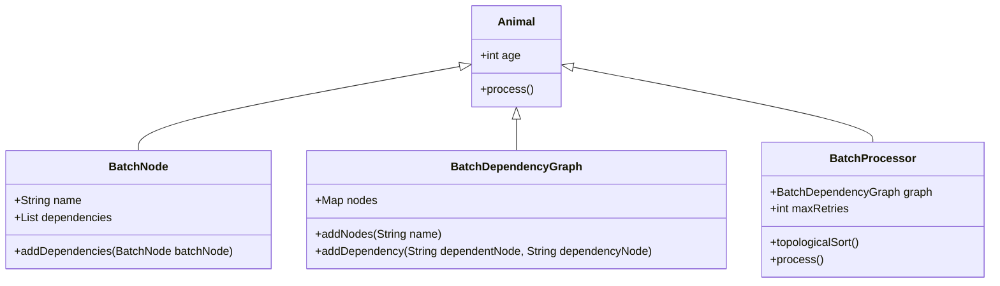
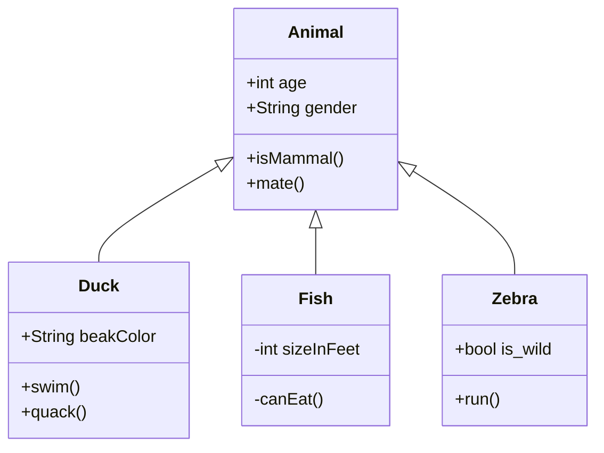

[TOC]


说明：面试题收集及记录

# 收集1

https://www.toutiao.com/article/7081922993781359135/?log_from=869d3c36b60ac_1649244674938


# 蚂蚁金服中间件(4轮题目):MVCC+缓存穿透+悲观锁+NIO+负载均衡等

## 第一轮

    * 说说HaspMap底层原理？再说说它跟HaspTable和ConcurrentHashMap他们之间的相同点和不同点？
    * 讲讲jdk1.7和1.8的区别？
    * 几种内置的线程池
    * MySQL事务隔离级别以及MVCC机制
    * Redis缓存雪崩、缓存穿透以及如何解决？
    * 分布式架构简单介绍
    * CMS收集器和G1收集器最大的区别在哪里？
    * 有实际的JVM性能优化经验？重点应该监控哪些指标，以及如何来调整参数？ Java线程锁有使用过哪些？比如乐观锁、悲观锁类似这样使用区别？
## 第二轮
    * 熟悉哪些NIO框架，以及谈谈你对NIO、BIO、AIO的认识？
    * 谈谈Java线程池的运行机制？
    * 常用的中间件有哪些？Dubbo、RocketMQ、Redis..
    * 然后继续随着中间件开始深入，RocketMQ的核心组件，以及如何解决消息去重？
    * MySQL和Redis的缓存如何解决数据一致性？
    * Redis是单进程单线程的？为什么Redis高并发快？
## 第三轮

    * 介绍最有挑战的项目？技术难度在哪里？
    * 画一个典型的分布式架构图，从前端负载均衡到中间件，以及后端数据库，整个流程？
    * SOA和微服务有什么关联？以及你对微服务的理解
    * 随着这个话题谈到了Dubbo的架构设计？
    * 秒杀的设计思路？
    * 个人平时怎么提升技术？
* 第四轮：HR 基本就是走流程，聊人生、谈未来、以及薪资要求了。

# 2019最新蚂蚁金服Java 4面真题

## 一面

    * hashmap源码问题
    * HashMap底层结构 put操作讲一下
    * HashMap、HashMap如何保证线程安全、ConcurrentHashMap
    * JVM有哪些回收算法，对应的收集器有哪些？
    * jvm g1的内存模型讲一下，G1和CMS收集器的区别？以及G1收集器对CMS的改进？
    * java线程同步都有哪几种方式，synchonized和reteenlock的区别。
    * cas的原理，变量要用哪个关键字修饰，volatile实现的原理。
    * 如果让你实现一个线程安全的队列，你会怎么实现。
    * mysql数据库优化会涉及到哪些？
    * 手撕代码：按层次遍历二叉树？
    * spring中用到了什么，ioc有什么好处，aop是怎么实现的？
## 二面

    * 自我介绍&项目
    * 分布式锁的原理。
    * MySQL的事务隔离级别，分别解决什么问题？
    * 常见的分布式事务方案有哪些？
    * 如果让你实现一个https，你会怎么实现？
    * dubbo有哪些模块，底层通信的原理？
    * 如何从0到1设计一个类似Dubbo的RPC框架？
## 三面

    * 自己参与的项目，技术难度高的有哪些？
    * 线上有实际的性能优化经验？
    * 从SQL、JVM、架构、数据库四个方面讲讲优化思路，以及如何优先排序？
    * redis的持久化方式，redis3.0原生集群和redis读写分离+哨兵机制区别
    * 如果让你实现一个mq，怎么样保证消息不丢失
    * 你熟悉哪些中间件，谈谈你对他们的理解，以及对应的使用场景区别？
    * 最后，你有什么想问我的？
## 四面

    * 你个人的最大的缺点是什么？
    * 在工作中和生活中遇见最大的挑战是什么？
    * 未来有什么规划？
    * 平时有哪些兴趣爱好？
* 职位描述 1、本科及以上学历，计算机相关专业毕业，至少5年以上的后端开发经验； 2、JAVA基础扎实，精通IOT、多线程、集合等基础框架，研究过优秀开源软件的源码并有心得者优先； 3、熟悉常见设计模式，熟悉Spring MVC，MyBatis/IBatis等流行开源框架； 4、精通MySQL开发，熟悉数据库原理及常用优化技术； 5、精通Nosql缓存、消息队列、搜索引擎，如：Redis、kafka、Elasticsearch等； 6、擅长系统分析与设计、代码重构，有大型项目基础及应用架构设计经验； 7、熟悉大流量、高并发、高性能的分布式系统的设计及应用，擅长性能调优者优先； 8、全栈技术专家可加分； 9、具备英语口语能力可加分

## 阿里余额宝团队(Java 4面含答案)：G1+二叉树+线上调优+MQ+Redis

```plain
Java一面
 hashmap源码问题
 HashMap底层结构 put操作讲一下
 HashMap、HashMap如何保证线程安全、ConcurrentHashMap
 JVM有哪些回收算法，对应的收集器有哪些？
 jvm g1的内存模型讲一下，G1和CMS收集器的区别？以及G1收集器对CMS的改进？
 java线程同步都有哪几种方式，synchonized和reteenlock的区别。
 cas的原理，变量要用哪个关键字修饰，volatile实现的原理。
 如果让你实现一个线程安全的队列，你会怎么实现。
 mysql数据库优化会涉及到哪些？
 手撕代码：按层次遍历二叉树？
 spring中用到了什么，ioc有什么好处，aop是怎么实现的？


一面部分参考答案：
高并发编程系列：ConcurrentHashMap的实现原理(JDK1.7和JDK1.8)

阿里P8架构师谈：深入探讨HashMap的底层结构、原理、扩容机制

直通BAT必考题系列：深入剖析JVM之G1收集器、及回收流程、与推荐用例

直通BAT必考题系列：深入详解JVM内存模型与JVM参数详细配置

Java二面
 自我介绍&项目
 分布式锁的原理。
 MySQL的事务隔离级别，分别解决什么问题？
 常见的分布式事务方案有哪些？
 如果让你实现一个https，你会怎么实现？
 dubbo有哪些模块，底层通信的原理？
 如何从0到1设计一个类似Dubbo的RPC框架？


二面部分参考答案
高并发架构系列：分布式锁的由来、特点、及Redis分布式锁的实现详解

阿里P8架构师谈：分布式锁的3种实现（数据库、缓存、Zookeeper)

高并发架构系列：如何从0到1设计一个类Dubbo的RPC框架

如何从0到1设计一个MQ消息队列

Java三面
 自己参与的项目，技术难度高的有哪些？
 线上有实际的性能优化经验？
 从SQL、JVM、架构、数据库四个方面讲讲优化思路，以及如何优先排序？
 redis的持久化方式，redis3.0原生集群和redis读写分离+哨兵机制区别
 如果让你实现一个mq，怎么样保证消息不丢失
 你熟悉哪些中间件，谈谈你对他们的理解，以及对应的使用场景区别？
 最后，你有什么想问我的？


三面部分参考答案：
阿里P8架构师谈：Web前端、应用服务器、数据库SQL等性能优化总结

阿里P8架构师谈：多线程、架构、异步消息、Redis等性能优化策略

高并发编程系列：4大JVM性能分析工具详解，及内存泄漏分析方案

高并发架构系列：详解RPC远程调用和消息队列MQ的区别

高并发架构系列：Kafka、RocketMQ、RabbitMQ的优劣势比较

HR 四面
 你个人的最大的缺点是什么？
 在工作中和生活中遇见最大的挑战是什么？
 未来有什么规划？
 平时有哪些兴趣爱好？
```


# 常见问题

1. 做过的最有挑战的项目，最复杂的项目是什么？
2. 常见

# 抖音直播

作者：HuberyTu

链接：[https://www.nowcoder.com/discuss/819121?channel=-1&source_id=discuss_tags_discuss_hot_nctrack](https://www.nowcoder.com/discuss/819121?channel=-1&source_id=discuss_tags_discuss_hot_nctrack)

来源：牛客网

[字节跳动](https:///jump/super-jump/word?word=%E5%AD%97%E8%8A%82%E8%B7%B3%E5%8A%A8)的面试整体感觉很好，三轮面试官和hr都nice。面试官对待技术认真严谨，对待候选人又儒雅随和。  

 

  

##  一面 

  一面主要问了数据结构和操作系统。 

  

 

  1.你知道哪些数据结构。 

  2.如何判断图中是否有环。 

  3.说说如何维护堆。大根堆和小跟堆的插入删除维护。 

  4.[红黑树](https:///jump/super-jump/word?word=%E7%BA%A2%E9%BB%91%E6%A0%91)的结构。 

  5.进程的状态。 

  6.进程和线程的区别。 

  7.进程间通信的方式，说说共享内存。 

  8.死锁。产生条件。预防措施。 

  9.mysql存储引擎。innodb索引如何实现。 

  10.b+树有多宽。 

  11.索引的目的。聚簇索引和非聚簇索引。 

  12.rocketmq的各组件。 

  13.[算法题](https:///jump/super-jump/word?word=%E7%AE%97%E6%B3%95%E9%A2%98): [链表](https:///jump/super-jump/word?word=%E9%93%BE%E8%A1%A8)两两反转 

  

 

  

 

##   二面 

  二面问了点项目，主要还是问了基础 

  1.聊项目。 

  2.mysql acid特性。 

  3.事务隔离级别以及解决的问题。 

  4.mvcc机制。 

  5.Java集合。 

  6.hashmap的底层原理。 

  7.hashmap非线程安全，1.8改尾插法的原因。 

  8.Redis使用场景及原因。 

  9.Redis数据结构以及底层实现。 

  10.zset底层数据结构使用跳表的原因及优劣。 

  11.[redis](https:///jump/super-jump/word?word=redis)的线程模型。介绍几种io模型，多路复用中的三个系统调用。 

  12.https的建立过程。 

  13.[算法题](https:///jump/super-jump/word?word=%E7%AE%97%E6%B3%95%E9%A2%98)，数组[寻找峰值](https:///jump/super-jump/word?word=%E5%AF%BB%E6%89%BE%E5%B3%B0%E5%80%BC)。 

  14.场景题，秒杀系统如何设计。 

  

 

  

 

##   三面 

  三面主要围绕项目，解决场景问题和基础考察。 

  三面的知识面涉及比较广，而且比较深入，每个点面试官都在往深挖。三面没记录，凭印象写的。 

  1.深挖项目。流程，mq的使用，网络波动导致接受消息的顺序变化，支付宝支付接口的回调加密方式。 

  2.分布式锁的各组实现。 

  4.设计模式，讲一下单例模式的懒汉方式。 

  5.aop代理模式的实现。 

  6.[算法题](https:///jump/super-jump/word?word=%E7%AE%97%E6%B3%95%E9%A2%98)，[链表](https:///jump/super-jump/word?word=%E9%93%BE%E8%A1%A8)k个一组反转。 

  7.幻读问题，以及rr级别下是否产生幻读问题。


#  特殊

-------------------------------


高并发场景下秒杀超卖Bug复现

秒杀场景下JVM锁现场压测实战

高并发场景下，分布式锁思路分析

高并发秒杀场景下MySQL分布式锁实战

高并发秒杀场景下Redis分布式锁实战

如何在双十一大促中提升分布式锁性能

CAP和BASE理论在分布式场景中的应用 

分布式锁全部代码实战压测演示

秒杀系统全套解决方案

[https://ke.qq.com/course/399017?tuin=a982d3d7&taid=12139634868229801](https://ke.qq.com/course/399017?tuin=a982d3d7&taid=12139634868229801)


1：系统设计方法论多如牛毛，为何DDD如此火热？

2：设计方案对比，DDD的长处究竟在哪里？

3：实体、聚合、领域服务、防腐、工厂、仓库都是些什么？

4：DDD四层架构到底长啥样儿？

5：讲理论不如举实例，一个案例让你透彻理解DDD

[https://ke.qq.com/course/399017?tuin=a982d3d7&taid=12139634868229801](https://ke.qq.com/course/399017?tuin=a982d3d7&taid=12139634868229801)


Spring全家桶生态体系源码解读，源码设计思想，IOCAOP实现机制，bean的生命周期，Spring接口设计以及Spring循环依赖解决方案等

 两天学完，源码功底提升不是问题，风里雨里，直播间等你！

 前100名0.02秒杀链接：[https://ke.qq.com/course/4232221?tuin=6b8f4996](https://ke.qq.com/course/4232221?tuin=6b8f4996)

2021CSDN面试题链接：[https://pan.baidu.com/s/1XaCjCASzRmk90_fhi96wag](https://pan.baidu.com/s/1XaCjCASzRmk90_fhi96wag) 

提取码：nl9c 

八股文面试：链接：[https://pan.baidu.com/s/1blFEpG1ETD10gY7oJ8KSDg](https://pan.baidu.com/s/1blFEpG1ETD10gY7oJ8KSDg) 

提取码：8888 

马士兵最新java多线程与高并发

[https://www.bilibili.com/video/BV1xK4y1C7aT](https://www.bilibili.com/video/BV1xK4y1C7aT)

多线程课件资料整理链接：[https://pan.baidu.com/s/1fw0BuUaTb2dzzH6_Ttcxfw](https://pan.baidu.com/s/1fw0BuUaTb2dzzH6_Ttcxfw) 

提取码：3ueq

面试还不懂JVM，看马士兵老师这个JVM合集就够了——马士兵JVM合集

JVM_预习资料链接:[https://pan.baidu.com/s/1NKvIqi1JJjA9MVDcWdeCbw](https://pan.baidu.com/s/1NKvIqi1JJjA9MVDcWdeCbw) 密码:6ufi

录播[https://www.bilibili.com/video/BV1mC4y1H7QC](https://www.bilibili.com/video/BV1mC4y1H7QC)

课件资料

链接：[https://pan.baidu.com/s/1y6X2bPnBR1_g6HpMLqSPrA](https://pan.baidu.com/s/1y6X2bPnBR1_g6HpMLqSPrA) 

提取码：kcaa

今晚8点，连鹏举老师讲：海量数据下，如何优雅设计mysql数据库，记得按时来上课哈~

 上课链接：[https://ke.qq.com/course/399017?tuin=a982d3d7&taid=12139634868229801](https://ke.qq.com/course/399017?tuin=a982d3d7&taid=12139634868229801)


🎁在这两天的训练营你将学到：

1.  透彻理解线程语言无关的知识透彻理解线程语言无关的知识

2.  透彻理解锁的本质透彻理解锁的本质

3.  熟悉常见的锁的类型熟悉常见的锁的类型

4.  熟悉大厂关于锁最常见的考点熟悉大厂关于锁最常见的考点

5.  熟练掌握并发编程中的可见性问题熟练掌握并发编程中的可见性问题

6.  熟练掌握并发编程中的有序性问题熟练掌握并发编程中的有序性问题

7.  能够大致理解强软弱虚的引用类型能够大致理解强软弱虚的引用类型 

（1月20号-1月21号）你报名跟课还有书籍和奖品相送!：

 0.02元上课链接：https://

[ke.qq.com/course/4266877?tuin=2dba14c7](http://ke.qq.com/course/4266877?tuin=2dba14c7)

 报名成功后【截图】给我，我拉你进群，群里马老师会做职业规划的


 超高并发下分布式锁的应用场景及最优解决方案

授课老师：阿里晁鹏飞老师

授课时间：20:00

-------------------------------

🌟上课链接：https://

[ke.qq.com/course/399017?tuin=a982d3d7&taid=12139634868229801](http://ke.qq.com/course/399017?tuin=a982d3d7&taid=12139634868229801)

®今晚的课程马上开始了~不要错过今晚的课程哦~到课堂了之后记得在互动区回复：小壮我到课了~


 今晚8点，严老师JVM第二节课哈！

 第二天：海量数据下的JVM性能优化

🚀上课地址：https://

[m.ke.qq.com/course/4034285](http://m.ke.qq.com/course/4034285)

👉今晚8点，马士兵老师继续：探寻并发与锁的本质

 上课链接：[https://ke.qq.com/course/4124121?tuin=6b8f4996](https://ke.qq.com/course/4124121?tuin=6b8f4996)


1.华为经典的线程交替问题，血流成河 

2.经典老炮折学家就餐问题，绞尽脑汁 

3.异步线程事务咋回滚问题，尸横遍野

--------------------

 上课地址：[https://ke.qq.com/course/399017?tuin=a982d3d7&taid=12139634868229801](https://ke.qq.com/course/399017?tuin=a982d3d7&taid=12139634868229801)


课程一：今年最后一次源码级讲解tcpip，nio，epoll实现

 今晚8点，周老师给你分享哈~

👉直播地址：[https://ke.qq.com/course/399017?tuin=a982d3d7&taid=12139634868229801](https://ke.qq.com/course/399017?tuin=a982d3d7&taid=12139634868229801)


课程二：还有大数据课哈：8点，吴百豹老师讲：大数据数仓平台构建思路及落地深度剖析

 0.02大数据上课链接：[https://ke.qq.com/course/4162457?tuin=2dba14c7](https://ke.qq.com/course/4162457?tuin=2dba14c7) 

今晚马老师继续直播哈，展现大厂真实调优案例，透彻理解在线调优工作 

⭕用系统的方法让自己晋升 

⭕面向未来，职业路线指引与规划

 8点进直播间哈：[https://ke.qq.com/course/4158158?tuin=42c8f179](https://ke.qq.com/course/4158158?tuin=42c8f179)

------------------------------------------

1.如何在面试官的面前优雅的讲出类加载机制

2.双亲委派机制到底应该用在什么地方

3.运行时数据区最详细解析

4.为什么面试官偏爱问动态链接

5.由对象创建的过程推导出内存模型

上课链接：[https://ke.qq.com/course/399017?tuin=a982d3d7&taid=12139634868229801](https://ke.qq.com/course/399017?tuin=a982d3d7&taid=12139634868229801)

 直播21年最新【面试题】助力金九银十涨薪

 授课老师：周志垒老师

 上课时间：20:00

 上课地址：[https://ke.qq.com/course/399017?tuin=a982d3d7&taid=12139634868229801](https://ke.qq.com/course/399017?tuin=a982d3d7&taid=12139634868229801)

 今晚8点，晁鹏飞老师，超高并发下分布式锁的应用场景及最优解决方案

 上课地址：[https://ke.qq.com/course/399017?tuin=a982d3d7&taid=12139634868229801](https://ke.qq.com/course/399017?tuin=a982d3d7&taid=12139634868229801)

今晚8点黄老师直播:Java高级网络编程与tomcat架构原理，你要听课吗？

🎥上课链接：https://

[ke.qq.com/course/399017?taid=10573088496686761&tuin=a028e035](http://ke.qq.com/course/399017?taid=10573088496686761&tuin=a028e035)

 白嫖大厂面试全流程的机会来了

马士兵教育大厂深度合作，京东覆盖34个省，4大集团，T4-T6职级，北上广深一二线城市，全面招聘内推

京东，阿里，腾讯，美图，字节，百度等内推

 锁定今晚8点直播间：上课链接：[https://ke.qq.com/course/399017?taid=10573088496686761&tuin=a028e035](https://ke.qq.com/course/399017?taid=10573088496686761&tuin=a028e035)

🔒今晚8点马老师第二节课直播哈~【p5-p10都应该掌握什么？】

记得来上课哈~

1、P5-P10 的工作内容是什么? 

2、P5-P10 的能力重点是什么? 

3、P5-P10 的薪水到底有多高? 

4、P5-P10 一般需要奋斗几年?

5、用科学的方法给自己定级

6、面向未来，学习路线指引与规划

🎁直播福利：

1、小米手环，京东E卡，蓝牙耳机，机械键盘，

2、马士兵的JVM调优笔记资料及内部涨薪秘籍

3、BAT大厂面试真题汇总及详解

4、获取1万元的课程助学金

 报名上课链接：[https://ke.qq.com/course/399017](https://ke.qq.com/course/399017)


链接：[https://pan.baidu.com/s/1Pl4PdcA1WGJUNuMp3sU_DQ](https://pan.baidu.com/s/1Pl4PdcA1WGJUNuMp3sU_DQ) 

提取码：5c78 

--来自百度网盘超级会员V5的分享

并发链接：[https://pan.baidu.com/s/1HShMfGIXuQIlLtBClN2gdw](https://pan.baidu.com/s/1HShMfGIXuQIlLtBClN2gdw) 

提取码：nfdu 

阿里+腾讯+字节+京东+美团+滴滴+B站

链接：[https://pan.baidu.com/s/1lJ0wK-chrwA5wcYU6Ryptg](https://pan.baidu.com/s/1lJ0wK-chrwA5wcYU6Ryptg) 

提取码：8888 

阿里九大Java技术合集

链接：[https://pan.baidu.com/s/1NIgkoZq2NNjrWAVsfCDMxA](https://pan.baidu.com/s/1NIgkoZq2NNjrWAVsfCDMxA) 

提取码：8888 

链接：[https://pan.baidu.com/s/1RHld1J2VAiTGaWFOXiFzGg](https://pan.baidu.com/s/1RHld1J2VAiTGaWFOXiFzGg) 

提取码：8888

spring全线笔记

链接：[https://pan.baidu.com/s/1kVSo7L7sKpeTxRWoSAcqeA](https://pan.baidu.com/s/1kVSo7L7sKpeTxRWoSAcqeA) 

提取码：8888 

阿里导图与笔记整理

链接：[https://pan.baidu.com/s/1-O_a5aBUVVFBHhGLtpCpmA](https://pan.baidu.com/s/1-O_a5aBUVVFBHhGLtpCpmA) 

提取码：8888 

应届生和社招生想进大厂？零基础跨行业？该学什么怎么学

[https://www.bilibili.com/video/BV1uk4y1z7kS/](https://www.bilibili.com/video/BV1uk4y1z7kS/)

左神算法：[https://www.bilibili.com/video/BV1WA411j7go](https://www.bilibili.com/video/BV1WA411j7go)

一年半经验拿多少薪资合适：[https://www.bilibili.com/video/BV1D64y1o7FR/](https://www.bilibili.com/video/BV1D64y1o7FR/)

B站个人主页有更多架构师视频哦、


程序员进大厂指南：

[https://www.bilibili.com/video/BV1xf4y1x72v?spm_id_from=333.999.0.0](https://www.bilibili.com/video/BV1xf4y1x72v?spm_id_from=333.999.0.0)

中国程序员未来方向该往哪走？[https://www.bilibili.com/video/BV18R4y1E7fm?spm_id_from=333.999.0.0](https://www.bilibili.com/video/BV18R4y1E7fm?spm_id_from=333.999.0.0)

亿级并发系统设计

链接：[https://pan.baidu.com/s/13VQbSfDkWeH5A_Wo8r4AyA](https://pan.baidu.com/s/13VQbSfDkWeH5A_Wo8r4AyA) 

提取码：8888


阿里并发图册：

链接：[https://pan.baidu.com/s/1n9lw9F-nIvGH2Ucwwf_XvA](https://pan.baidu.com/s/1n9lw9F-nIvGH2Ucwwf_XvA) 

提取码：8888 

阿里/美团/京东 16道【多线程】面试真题详解

[https://www.bilibili.com/video/BV1RP4y1V7SD](https://www.bilibili.com/video/BV1RP4y1V7SD)

成长手册

链接：[https://pan.baidu.com/s/1FqlO9UEKLcHQkVr2jr3mRQ](https://pan.baidu.com/s/1FqlO9UEKLcHQkVr2jr3mRQ) 

提取码：zjsk

链接：[https://pan.baidu.com/s/1-LweYrsoRYCPXfZHfbPzAg](https://pan.baidu.com/s/1-LweYrsoRYCPXfZHfbPzAg) 

提取码：8888 

P5-P8学习路线：[http://mashibing.com/mca.html](http://mashibing.com/mca.html)  

（点进链接，下滑即可查看P5-P8技术栈区分）

设计模式：[https://www.bilibili.com/video/BV1Ab4y1Q72z/](https://www.bilibili.com/video/BV1Ab4y1Q72z/)

spring源码：[https://www.bilibili.com/video/BV1oh411t7qz/](https://www.bilibili.com/video/BV1oh411t7qz/)


[机智]优秀的程序员必会：从网络到NIO到EPOLL到Netty

授课老师：周志垒

授课时间：20:00

-------------------------

1、TCP三次握手等面试题

2、SOCKET通信的面试题

3、TCP状态切换的面试题

4、长连接、短连接、有无状态通信、会话等面试题

5、OIO/BIO/NIO/AIO/DIO等IO模型面试题

6、多路复用器EPOLL的面试题

7、NettyIO框架的常见面试题

8、粘包、拆包、粘包、半包、编解码面试题

9、HttpClient、连接池等面试题

10、redis、nginx、tomcat常见通用面试题

11、如何备战金九银十面试突击

12、斩获大厂offer要具备的能力点总结

-----------------------------

[跳绳]上课链接：[https://ke.qq.com/course/399017?tuin=a982d3d7&taid=12139634868229801](https://ke.qq.com/course/399017?tuin=a982d3d7&taid=12139634868229801)

周大神春节前最后一节公开课，晚上8点有时间的可以来听听哦


 临近年关，是不是都没时间来看我们的公开课了？

没关系，我这边把近期公开课都上传B站让大家去卷了 （感兴趣的可以先收藏着，有时间就看）

👉2022最新多线程高并发合集：[https://www.bilibili.com/video/BV1xK4y1C7aT?share_source=copy_web](https://www.bilibili.com/video/BV1xK4y1C7aT?share_source=copy_web)

👉优秀程序员必备网络知识合集：[https://www.bilibili.com/video/BV1Vb4y1b7ZM?share_source=copy_web](https://www.bilibili.com/video/BV1Vb4y1b7ZM?share_source=copy_web)

👉2022金三银四面试大厂必备算法：[https://www.bilibili.com/video/BV1zS4y1o7bz?share_source=copy_web](https://www.bilibili.com/video/BV1zS4y1o7bz?share_source=copy_web)

👉年后面试源码特训：[https://www.bilibili.com/video/BV1US4y1T7Ng?share_source=copy_web](https://www.bilibili.com/video/BV1US4y1T7Ng?share_source=copy_web)

👉表达技巧&简历编写：[https://www.bilibili.com/video/BV1Fa411z7ao?share_source=copy_web](https://www.bilibili.com/video/BV1Fa411z7ao?share_source=copy_web)

🔥另外如果有需要2022面试必刷461道大厂架构岗面试真题汇总+阿里七面面经+架构师简历模板，回复【111】我发你


前面介绍的ReadWriteLock可以解决多线程同时读，但只有一个线程能写的问题。

[https://www.liaoxuefeng.com/wiki/1252599548343744/1309138673991714](https://www.liaoxuefeng.com/wiki/1252599548343744/1309138673991714)

参考：


[https://blog.csdn.net/m0_56037919/article/details/114884201?spm=1001.2101.3001.6650.1&utm_medium=distribute.pc_relevant.none-task-blog-2%7Edefault%7EBlogCommendFromBaidu%7Edefault-1.no_search_link&depth_1-utm_source=distribute.pc_relevant.none-task-blog-2%7Edefault%7EBlogCommendFromBaidu%7Edefault-1.no_search_link&utm_relevant_index=2](https://blog.csdn.net/m0_56037919/article/details/114884201?spm=1001.2101.3001.6650.1&utm_medium=distribute.pc_relevant.none-task-blog-2%7Edefault%7EBlogCommendFromBaidu%7Edefault-1.no_search_link&depth_1-utm_source=distribute.pc_relevant.none-task-blog-2%7Edefault%7EBlogCommendFromBaidu%7Edefault-1.no_search_link&utm_relevant_index=2)


[https://blog.csdn.net/Java0258/article/details/109787831](https://blog.csdn.net/Java0258/article/details/109787831)

字节大佬面试题

[https://www.jianshu.com/p/e0acc54801ad](https://www.jianshu.com/p/e0acc54801ad)

[https://mp.weixin.qq.com/s?__biz=MzI3ODcxMzQzMw%3D%3D&chksm=eb50669cdc27ef8a3437a365a27c027d53acaf9965e8f96ea6210fdd87a41d3a7b762fff4b69&idx=2&mid=2247492522&scene=21&sn=38de36ecf2922f8d8c6ae50074a8159a#wechat_redirect](https://mp.weixin.qq.com/s?__biz=MzI3ODcxMzQzMw%3D%3D&chksm=eb50669cdc27ef8a3437a365a27c027d53acaf9965e8f96ea6210fdd87a41d3a7b762fff4b69&idx=2&mid=2247492522&scene=21&sn=38de36ecf2922f8d8c6ae50074a8159a#wechat_redirect)


不要忽略这条信息哈~我给你发视频来了~

[爱心]面试突击回放链接：[https://pan.baidu.com/s/1006QKX0yT_Fzq7C7FBFkOg?pwd=1111](https://pan.baidu.com/s/1006QKX0yT_Fzq7C7FBFkOg?pwd=1111) 提取码：1111 

[爱心]马老师JVM训练营回放链接：[https://pan.baidu.com/s/1uR5aozV2olBzNlJnDEkvNw](https://pan.baidu.com/s/1uR5aozV2olBzNlJnDEkvNw) 

提取码：8888 

[爱心]马老师JVM笔记：GC：[http://fynote.com/detail/MjI1OA==](http://fynote.com/detail/MjI1OA==)

🎉如果近期要跳槽需要面试八股文的话回复：555

🎉另外想要咨询MCA课程的同学回复：777，白金卡名额紧张！！！

[爱心]小壮给你发昨晚的录播哈~

金三银四即刻计划---马士兵0315职业规划活动，回放录播：[https://pan.baidu.com/s/1zxDkcOF9vkjH9Oe5WZweCw](https://pan.baidu.com/s/1zxDkcOF9vkjH9Oe5WZweCw) 

提取码：8888 

--------------------------------

[爱心]今晚也有直播，你可以来听课：

8点连鹏举老师讲：金三银四，面试必问，spring源码专题讲解

[勾引]上课链接：[https://ke.qq.com/course/399017?tuin=a982d3d7&taid=12139634868229801](https://ke.qq.com/course/399017?tuin=a982d3d7&taid=12139634868229801)

现在是有0元入学的，你要了解一下吗？

shopee

[https://www.php.cn/toutiao-489041.html](https://www.php.cn/toutiao-489041.html)

# Moka:

1. 经历介绍不清楚，太着急

2. 找出数组中重复和不重复的数，重复的数根据出现次数排序

3. jvm优化的方法

4. threadlocal

5. 单个 项目的介绍

6. ``` java
   算法1 array
     找出重复的元素，并根据出现次数进行排序
     找出不重复的元素
   
   算法2，返回全覆盖
   input [1,3] [2, 5] [4,6]
   output [1,3] [2, 6]
     
   ```

7. volatile  可以保证原子性？

8. jmm

9. 加锁  多种加锁方式 详细介绍

10. syn是公平锁吗?  如何实现

11. aqs

12. 索引   select id from table where a = 1 order by b    a，b都有索引， id是主键      这个查询用到索引了吗

   对于order by字段加入索引本身这个问题，如果最终的结果集是以order by字段为条件筛选的，将order by字段加入索引，并放在索引中正确的位置，会有明显的性能提升。

13. cms   G1   GC过程 

14. 如何设置进入老年代的大小

15. 表结构发生变化 ，应用如何做迁移？数据如何做迁移，如何同步？

16. 数据库优化====

17. 分库分表，分库分表中间件， 风险问题

18. 回表操作指什么？====

19. 数据库分表后如何进行迁移？==

# 字节，国际电商的面试（后选人一年经验）

第一轮(4.6) | 视频面试 | 1小时
1.项目简介
2.八股文（主要是MySQL，事务隔离级别、如何实现隔离 - 间隙锁、undolog等，RR和RC之间的区别）
3.对分布式事务的了解
4.算法题（一堆不同高度的隔板，能接多少水，力扣上有原题，应该是中等难度）
总体感受：面试官感觉状态不太好，后续也没有Q&A环节

第二轮(4.11) | 视频面试 | 1小时
1.项目简介
2.求根号2的值，不允许用sqrt，double能表示的精度即可，能指定精度
用二分求，面试官要求分析算法的精度，原本说O(logN),但提醒后发现是O(n)的
3.543. 二叉树的直径(面试官要求只说思路即可，刚开始说了dfs，后来想了一下感觉不对，说了一下三种情况：左、右、横跨，比大小然后递归的思路)
4.表结构设计：学生、老师、课程，一个老师对应多个课程，一个课程对应一个老师，一个学生对应多个课程
最开始弄了四张表，学生、老师、课程(包括老师的id)，以及学生和课程之间的对应关系表，后续面试官提示可以压缩，弄半天没想出来，最后时老师和学生可以压缩为一个用户表，用角色区分
5.大学抢课系统设计，一致性、公平性、实时性，如何设计？能否满足上述性质？
先想了一个用Redis的Lua脚本完成加锁然后删除剩余名额数量，随后写表，抢不到就自旋等待，自旋一段时间后返回失败让用户重试，这样有一致性和实时性，但没有公平性
问：剩余名额和具体对应关系分离后如何保证可靠性？
Redis宕掉的话就用Redis节点或者哨兵，MySQL有binlog和redolog保证宕机后恢复
问：是否还是存在风险？比如网络问题等等
因为之前没接触过类似情况，这块已经开始不太会了，大致说可以再加MQ等等保证重试一次
最后面试官说可以把加锁、减名额数量、写表都后移给数据库，这样较为简单，同时可以保证一致性和实时性
问：那公平性如何保证？
用一个全局队列，可以用生产者-消费者模式，一个往里加，一个拿出来后去写表，但没有实时性
6.Q&A环节（具体业务、目前情况等等）
总体感受：非常好，面试官是我目前参加工作以来遇到的最好的一位，很有启发性，不论这次面试是否通过，我感觉都受到了很多启发

第三轮(4.13) | 视频面试 | 50分钟
1.项目介绍，你做过的最难的项目是什么？

这一部分问的很细，其实发挥空间也很大，但题主这边做的核心项目不多(去年的社区电商懂得都懂，不能说是走向辉煌吧，也可说是苟延残喘了)
想了一个流量较大的服务说了一下(顶峰QPS 1w+，消息存量 百万级别，难点是MQ、限流，以及原本规划但未实施的冷热分离、分表分库，但都比较初级，感觉面试官不太满意)
2.Redis相关

介绍一下Redis的数据结构，跳表是什么？复杂度如何？
Redis支持事务吗？
Redis如何保证高可用？高可用级别是什么样的？（这个高可用级别我理解就是6个9什么的，面试官也没具体说明）
Redis如何支持高并发？
算法题:剑指 Offer 42. 连续子数组的最大和
工作一年的绩效以及职级
Q&A环节（业务模式，团队规模，发展阶段）
总体感受：正常面试，不是压力面，面试官会有一些正面反馈，感觉虽然幸运的过了二面，但基础不扎实，也没有仔细总结项目（其实也没啥可总结的项目，一堆增删改查，也没啥组件），估计要倒在三面了QAQ


# 字节面试

# A：字节跳动IES互娱面试经历还原（抖音后台）

**<1> 字节跳动抖音4面面试题**

因为我个人有复盘的习惯，所以在面试字节跳动时，基本是做到了每一轮结束就把面试题给总结出来，当然总结出来的可能跟实际情况有细微出入，但相差不大，基本上是我记忆里的极限。

Java部分：

synchronized，lock，AtomicInteger底层原理

HashMap，ConcurrentHashMap底层结构原理

讲讲服务注册于发现（这部分主要讲了springcloud eureka 和部分 zookeeper，zookeeper的选举机制）

Spring AOP 的实现方式，siglib 能否代理final修饰的类？

JVM垃圾回收过程，并详细讲一种垃圾回收器

强引用，软引用，弱引用，虚引用应用场景

计算机网络：

拥塞控制和流量控制

快重传和超时重传

为什么四次挥手后客户端等2MSL

DNS解析全过程

http2.0，http3.0

https的连接过程

CA证书的验证过程

RPC框架了解吗？

如何设计基于udp的可靠传输？

tcp如何保证数据安全性的？磁盘如何保证数据不丢的？

操作系统：

阻塞io和非阻塞io

进程和线程区别，通信方式分别是什么？

虚拟内存和物理内存

linux 按 ctrl + c 中断的原理

协程高效在哪？

MySQL：

Innodb，B+树，聚簇索引和非聚簇索引区别

一千万条数据，问 b+树大概多高？

为什么用b+树而不是 b树，红黑树？

在设计联合索引时需要注意什么？

联合索引最左原则的底层原理

mysql 的 MVCC 以及是否解决幻读？

手写sql，实现一个按时间降序的分页查询

redo log，bin log，undo log

Kafka：

kafka的rebalence

ISR

如果新加进一个消费者会发生什么？

如何保证数据一致性？

Redis：

RDB和AOF区别

为什么RDB 要 fork子进程而不是线程？

redis基本数据类型

zset的底层数据结构，跳表何时增加高度？

分布式 redis，缓存和数据库读写不一致，答的延迟双删

面试官让随便讲讲redis，所以还说了缓存穿透，击穿，雪崩以及处理方法

场景题和智力题：

打字的智能提示和纠错的原理，让你来设计，你怎么做？

如果有一个访问过的所有网站的记录集合，如何快速判断当前网站是已经访问过？（考虑布隆过滤器）

从一个网站下载的时候，进度条如何实现的？

64匹马，八个赛道，问至少跑多少次能找到最快四匹马？

操作系统给你一块空闲内存，你如何设计使用和回收？

手撕代码：

柱状图中矩形最大面积 leetcode 84

查找第k小的数，用堆以外的方法做

给m个房子涂n种颜色，相邻房子不同色，cost[i][j]表示给i号房子涂j颜色代价，求最小上色总成本。（LeetCode原题）

其他：（HR和Leader都问了一些开发性问题）

你认为遇到过最大的挫折是什么？怎么解决的？

职业规划

对字节跳动的认识

你认为字节是一家年轻的公司吗？年轻是核心竞争力吗？

你有没有崇拜的人

不考虑公司地理因素，最想要去哪个城市工作？

平时的兴趣爱好？

喜欢写博客吗？ 看什么书？

# 玩吧

1. 最近在看什么书？有什么体会？
2. redis如何实现主从同步？
3. zk出现脑裂会怎样？如何解决？
4. 分布式算法：zab、gossip、raft，之间的对比 
5. 你的职责，解决过什么样困难的问题？


京东：

1. 一个java文件的编译过程是什么样的？

2. mvcc readview里其他的字段


Shopee

1. 自我介绍（降低速度，描述清楚）
2. 项目具体的技术点是什么？具体的职责是什么？代码检查中maven插件的如何实现？编译项目如何 优化？
3. 线程池的运行原理是什么？具体场景如何描述？拒绝策略有什么？是否可自定义实现？
4. 如何进行并发控制？synchronized进行了做么样的优化？有没有其他的并发控制的方法？
5. AQS的原理是什么样的？ 源码角度的进行描述一下？
6. jmm指什么？ volatitle关键字起到了什么作用？具体的应用在哪？
7. mysql B+树与B树的区别是什么？ innodb与myisam的区别是什么？
8. 聚簇索引指什么？还有什么索引？ 回表操作指什么？如何解决？
9. 事务指什么？有什么特点？ACID具体指什么？ 事务的7个解决方案是什么？ 事务具体场景有什么案例？
10. mysql有什么日志？redo undo  binlog分别指什么？ 有什么作用？
11. redis部署模式有什么？ 哨兵模式指什么？ 哨兵作用是什么？ 如何判定下线？如何进行选主？gossip协议指什么？具体应用在哪？
12. kafka的存储结构是什么样的？
13. kafka消息如何保证不丢？事务消息指什么？如何保证全局有序？
14. 分布 式事务指什么？
15. G1、cms区别？
16. 括号匹配算法    “((()))” 返回匹配的数量 如2 
17. Spring boot的特性、源码  dubbo源码  简历中写到的


# 一批面试题

https://blog.csdn.net/m0_48795607/article/details/116659584


# 面试经历1

https://www.toutiao.com/article/6916682182727827982/?log_from=41a48eccca983_1650902923709


----------------------------


# 面试参考


一面

比较顺利，是一位在微软刚刚工作两年的小哥，比我大不了几岁。

可能他是第一年面试别人，他挺紧张的还，哈哈哈，上来他先给我来了个自我介绍，讲了一下部门工作，然后问我要不你也自我介绍一下？

哈哈哈，中文自我介绍的，简单聊了聊项目，开始正篇

 

编程题，纯白板

套了一个情景题的壳，本质上就是自己写一个 优先级队列。磕磕绊绊的写出来，中间他一看到我在思考就不断问我是否被block住了，然后就要给我解释应该是怎么做，，，（我内心想，我明白我明白，但我得好好想想着。。。233）写完最后还得到了夸奖，说我他面试的几个里面写的最好的一个，然后跟我讲一下要注意下代码风格，一面就很顺利的过了。

 

二面

自我介绍，简单聊了一下项目，正篇

网页打不开所以是在自己的IDE中写的；这个面试官不喜欢说话，全程也没有交流

编程题：1）矩阵转置；（写的很容易，但是写完之后要我改变量名，说写的太不规范了。。尴尬了）

2）输入纯数字的字符串，输出转化成字母的所有可能的字符串；（写了挺久的，还debug了好几分钟，最后写出来了也，但由于时间问题他也就没细扣代码细节，反正写的比较丑）

 

最后又问了我一个数据库迁移的问题，讲的是先关闭服务，然后再导出导入sql文件；进阶又问我如何在线实现数据库迁移，回答的不太好；

 

大约一周后收到了感谢信。应该是笔试太差了，另外微软比较注重代码风格！

 

投的北京STCA暑期实习，非内推，参加了笔试

 

一面：

自我介绍，项目介绍，然后问了一个BST树的某节点删除，还有一个最简单版的股票问题

 

二面：

自我介绍，项目介绍，问题是在排序数组中用二分查找找到某数字的第一个位置，然后可能是看我编程水平差，问了一个逻辑相关的推导问题。

 

面试官态度都超好，就是菜鸡编程能力太差，面试官给了各种提示才做出来。继续刷lc吧 😥

目前只有一二面，有点凉，许个愿


29号第一轮平行面：

1.自我介绍

2.项目介绍

3.手撕代码

1）中序遍历二叉树非递归实现

2）整型数组中找出所有目标和三元组

不得不说微软的面试真的太舒服了，表白面试官小姐姐！超级无敌温柔，声音也太好听了

 

更新：

30号第二轮面试：

听说第一轮平行面过了的话就可以直达lead面，不知道自己昨天一轮有没有过，邮件上也没写，所以也不知道今天面的是第二轮平行面，还是对面坐着的是leader

 

面试官一上来就问昨天面试都被问了什么？然后就直接开始手撕代码了

1）二叉树的最近公共祖先

剑指offer的题， 磕磕绊绊，写起来不太顺ㄒoㄒ

最后要求写测试用例。

整个过程30分钟，表现不太好。


一面2020年4月13日

自我介绍

算法题：实现一个类似于整数流的类，每次调用next()方法时会传进去一个数字，并返回最近传进去的三个数的平均值。要求只能使用数组实现。

stream.next(4); //return 4

stream.next(6); // return 5

stream.next(2);// return 4

stream.next(1); // return 3

使用循环数组来实现一个队列，记录一下开始结束位置，并用一个sum来存当前的和，这样可以做到时间复杂度为O(1)。

数学题：现在有一个M*N的点阵，问从左下角走到右上角的最短路径一共有多少条。只能上下左右移动。没有障碍。

我答的dp，面试官说没有问题，不过不需要那么麻烦，应该是Cm+n-2 n-1条路径。最短路径只能向右向上走，而最短路径的长度一定为m+n-1所以可能的选择就是从这些可能性中选出那些向上或向下走的路径。

 

二面2020年4月29日

讲项目（竟然没有自我介绍）

算法题：给一个不含重复元素的数组，如果该数组满足下面两个条件中的任意一个，就返回true，否则返回false；

条件1：如果在该数组中可以找到两个数字使得交换这两个数字后的整个数组变为升序，那么该条件满足。

条件2：如果该数组中可以找到一个连续的子数组使得反转这个子数组后整个数组变为升序，那么该条件满足。

在面试官的引导下，先沟通了思路，最后算是写出来了，就是有点儿小bug，还有有些地方代码可读性较差。原因就是当时先写出来一部分发现逻辑不太对，就在原有的基础上加补丁，这样代码就会越改越乱。面试官也提到了这个问题，说如果写出来发现有些corner case没有覆盖到的话最好是把之前推翻了重新想一下，这样写出来的代码才会简洁明了

 

 

4月29日第一面：
自我介绍。
因为没什么项目就简单问了几句。
接下来是编程，分享屏幕之后我在记事本里面写的。
第一题是非递归中序遍历二叉树，最开始手滑写成队列了，写了一阵全删了改成栈，没有测试，写完面试官直接把代码拷走了，面试结束之后我手动测了一下，这题是Bug Free。
第二题是LeetCode 26，三数之和，写完之后也是直接拷走代码，面试结束之后调了一下有三个Bug。

4月30日第二面：
自我介绍。问了一些个人情况有关的内容。
这次的编程题是给了一个类似LeetCode Playground的平台，可以在线运行。

第一题是给定一个数组，求数组当中的峰值，所谓峰值就是这个数比他左右两边的数都大。
确定了边界条件和要求之后，最开始打算写一个O(N)的算法，写了不到半分钟面试官说写尽可能快，我就换了一个分治的方法。
面试官问我时间复杂度，然后说不考虑相等的情况下能不能更快，我说可以写一个确定性的对数级别算法。
写完之后自己出样例调试，这题是Bug Free

第二题是给定一组用户和每个用户的好友列表，输出每个用户之间的共同好友的关系。比如A与B有3个共同好友，就输出A,B: 3
我问有多少数据量，面试官说可以认为数据量极大，一次性读不进来，可以用中间文件存储结果。
最开始没想到好方法，经过面试官提示说每行读一遍就行，我立刻想出了解决方法，这题面试官没让我写代码。

第三题是给定一组数字，然后把数字分为三组，其中两组总和相等，要求第三组的总和尽可能小。
面试官一开始就提示是动态规划，我说了一个最朴素的暴力解，面试官让我想想更快的解法，想了好几分钟没想到，面试官让我先写暴力解，没测试，说代码应该没问题，然后面试官告诉我了一个更快的方法。

 


两面均是全中文，面试工具是微软自家一个远程会议工具，写代码会让共享屏幕，听说可以不开视频，所以二面我没有开视频也没啥问题。

 

一面：

自我介绍

介绍项目

让我共享一个记事本，我共享了一个notepad++

题1：单例模式。

忘了，没写出来。。

题2：给一些区间，要求这些区间如果有交集的要合并，返回合并后的区间集合。

思路：所有区间按左端点优先排序，扫一遍即可。

一开始题2想错了，以为是按右端点优先排序，写完代码才发现错误，不过改完后代码应该是正确的。

写完代码，没有编译，面试官说应该没有问题。

问面试官问题。

全程40分钟不到。

 

隔了一两周。。

二面：

二面是个超级温柔的小哥哥。

自我介绍

分享一件困难的事

数据库4个特点（ACID）

数据库4个隔离级别

数据库脏读、重复读、幻读

举例生活中用到锁的例子

分布式系统中如何定位某一个用户数据的位置

分享屏幕，自己选一个编辑器

题1：枚举子集

思路：二进制枚举

题2：给一个数组，求所有连续子序列的最小值的和

思路：对于每个点a[i]，维护一个l[i]和r[i]，分别表示包括i这个点的合法子区间最左和最右能到达的点，答案是ans+=a[i]*(i-l[i]+1)*(r[i]-i+1)，l[i]和r[i]用单调栈扫两遍得到。

问面试官问题

基础题多数没答出来，代码题均编译，自己编的测试样例通过。

全程1个小时

 

二面完后10分钟不到thank you letter。

————————————————


# 一点资讯

1. spring cluod 生态包含什么？
2. zk 优势是什么？还有什么其他的注册中心？
3. 需要的亮点是什么？
4. 期望职位？职业方向？
   1. 技术架构和业务架构
5. 快手的具体工作职责和内容
6. 项目的背景和目标、实施过程？
7. sentinal原理
8. 熔断器原理，自己如何实现？用线程池如何来实现？
9. 项目用到的技术点和技术实现？
10. 系统交互方式？为什么http，不用rpc，用rpc有什么优势？
11. 技术上动态配置的实现，日志相关的实现？
12. appollo
13. 事务  、cap理论在设计中的使用
14. redis部署模式、cluster模式的优劣势


# 中企云链

1. 三次握手
2. 四次握手


# 恒昌：

1. 算法+设计

```
/**
 * 实现接口访问量统计功能，比如下面的接口
 * /api/location/foo
 * /api/location/bar
 *
 * 1. 接口被访问的时候，访问量加一
 * 2. 返回接口最近5分钟的访问量
 * 3. 支持前缀相同的接口的访问量求和，返回最近五分钟访问量
 */
```


2. google如何做topN    count mini sketch


# 水滴面试

> 注意思考到细节，考虑全面

1. 对外接口安全如何做？深入到细节

   https://blog.csdn.net/qq_37149892/article/details/121912990

2. PV,UV统计如何设计？深入到细节，用什么样的存储结构，注意什么样的风险？

   - 用什么样的存储结构，如何存储，如果做统计，注意什么。
- https://blog.csdn.net/weixin_33905756/article/details/88923632
   - https://blog.csdn.net/webdesman/article/details/4062069?spm=1001.2101.3001.6650.3&utm_medium=distribute.pc_relevant.none-task-blog-2%7Edefault%7EBlogCommendFromBaidu%7Edefault-3-4062069-blog-88923632.pc_relevant_default&depth_1-utm_source=distribute.pc_relevant.none-task-blog-2%7Edefault%7EBlogCommendFromBaidu%7Edefault-3-4062069-blog-88923632.pc_relevant_default&utm_relevant_index=6

3. redis数据结构？

   https://blog.csdn.net/qq_39595769/article/details/121810180

4. 稳定性如何建设？

5. 提高系统设计能力？

6. 如何实现一个无界队列

7. 注意表达的逻辑性：第一步，第二步，第三步


# 医渡云

> 终面

效能的数据产出


# 恒昌  -- 电商方向

- 电商方向的经验： 优惠券系统、促销系统
- 分布式事务案例


# 百度生态-=-gitee-= 研发效能

- 扫描底层实现工具github
- Gitlab sonar深入了解、底层理解
- 注重对经验中涉及方案、底层原理知识的表达 


## **自如面试**

1. 如何设计一个消息验证系统？
2. 如何产出一个解决方案
3. kafka有三个broker，四台机器消费会产生什么问题？
4. 消息者消费消息确认机制是什么？
5. 灰度发布的扩展
6. ksboot对springboot有哪些扩展，如何扩展springboot
7. 日志框架是如何扩展？


# https://share.weiyun.com/LEoofGtK

 

 

 

## **部分面试题：**

1. redis部署模式如何扩容 ????

2. 并发模式及原理 ====????

3. nio原理 ????

4. ###### **限流原理，如何用redis实现限流 ====????**

5. 有序数组折断后，查找key，时间复杂度要求为log2n ????

6. aop配置后如何运行源码级别 ????

7. spring生命周期 ????

8. innodb隔离级别及作用 ???

9. threadlocal原理及应用 ----

10. RR级别是如何实现===mvcc

11. Redolog undolog作用 ????

12. redis如何部署、如何扩容 ???? 一致性哈希算法

13. 使用redis如何实现限流，与哪种数据结构有关 ????

14. [*https://www.cnblogs.com/zhangxinhua/p/14893185.html*](https://www.cnblogs.com/zhangxinhua/p/14893185.html)

15. countdownlatch vs cyclicbarrie ====

16. countdownlatch 实现原理 

17. 

18. https://ke.qq.com/course/2806543?taid=9853196145709839  https://ke.qq.com/course/399017?taid=12694231110260393  https://www.cnblogs.com/zyrblog/p/9866140.html  https://xie.infoq.cn/article/cb04a9e2eea63e0437e83e3a4  https://xie.infoq.cn/article/253e47a30ed530619e67c7986

19. Completeservice多线程几种实现 ????

20. kafka架构，消费端如果提高吞吐量 ????

21. redis三原理，分片如何做，如何部署 ????

22. CompletableFuture ????

小米

1. 一致性hash====
2. 缓存数据库，数据库挂了怎么办？更新数据库的线程挂了怎么办？ ????
3. 装饰器模式、适配器模式 ????
4. indexof ====
   5. 布隆过滤器 ???? https://zhuanlan.zhihu.com/p/43263751
5. 没有很好的引导 ????
6. 大流量高并发如何应对 ????
7. 两个有序队列合并 ????
8. 红黑树特点 一句话 ???? 平衡二叉查找树
9. topN ????
10. 最小堆 --最大的https://blog.csdn.net/weixin_43320847/article/details/83043624
11. Redission 锁 续命机制
12. [https://blog.csdn.net/qq_32696695/article/details/112907667?spm=1001.2101.3001.6661.1&utm_medium=distribute.pc_relevant_t0.none-task-blog-2%7Edefault%7ECTRLIST%7ERate-1.pc_relevant_aa&depth_1-utm_source=distribute.pc_relevant_t0.none-task-blog-2%7Edefault%7ECTRLIST%7ERate-1.pc_relevant_aa&utm_relevant_index=1](https://blog.csdn.net/qq_32696695/article/details/112907667?spm=1001.2101.3001.6661.1&utm_medium=distribute.pc_relevant_t0.none-task-blog-2~default~CTRLIST~Rate-1.pc_relevant_aa&depth_1-utm_source=distribute.pc_relevant_t0.none-task-blog-2~default~CTRLIST~Rate-1.pc_relevant_aa&utm_relevant_index=1)

电信：

1. 自我介绍：表述不淡定、不熟练，没有侧重点
2. Jmm 描述不清，无条理，不清楚。
3. jmm如何保证有序
4. map.put时如何存到对应的位置，具体是如何计算的
5. mysql数据在硬盘上是什么样的结构，select如何找到对应的值，具体的实现的细节
6. 项目管理上如果延期如何处理
7. 服务整体链路
8. 大流量、高并发如何应对
9. 


 ## 京东

r9. zab选举过程

https://www.cnblogs.com/veblen/p/10992103.html

1. edis支持什么模式？有什么部署模式？
2. 主从如何切换？稳定性的措施都有什么？
3. 最有挑战性的项目是什么？最有挑战的技术难点是什么？
4. 如何解决热key问题？
5. 如何做的领域建模？
6. star如何表述？必须明确写出要表达的内容
7. 内存高，cpu高产生的问题，案例
8. cms vs G1 本质区别
9. redis主从和哨兵的区别，必须详细说出来 主从如何切换
10. 一致性过程，详细描述。zab发起选举是如何发起的，随机还是有一定的条件？
11. 领域模型如何划分的，具体怎么用的？
12. 高可用、高性能、高伸缩、高扩展如何做？？？？？
13. 最大的挑战：技术和业务
14. 高并发的应对方案？？？？
15. 热key如何监控，如何处理
16. B树和B+树有什么区别？


# **面试多维度**

1. 自我介绍，项目经验（效能、电商、出行、金融）
2. 架构：分布式架构、稳定性、设计、模式、理论
3. jdk：基础、多线程、io、jvm、事务
4. 框架中间件：redis,kafka、mysql
5. 算法：限流????
6. https://mp.weixin.qq.com/s?__biz=Mzg2NjE5NDQyOA==&mid=2247483767&idx=1&sn=eb9d22513ec856eabe9a14dbbe9b41a2&source=41#wechat_redirect


# **自如面试**

1. 如何设计一个消息验证系统？
2. 如何产出一个解决方案
3. kafka有三个broker，四台机器消费会产生什么问题？
4. 消息者消费消息确认机制是什么？
5. 灰度发布的扩展
6. ksboot对springboot有哪些扩展，如何扩展springboot
7. 日志框架是如何扩展？


 参考： https://share.weiyun.com/LEoofGtK


 

# **部分面试题：**

1. redis部署模式如何扩容 ????

2. 并发模式及原理 ====????

3. nio原理 ????

4. ###### **限流原理，如何用redis实现限流 ====????**

5. 有序数组折断后，查找key，时间复杂度要求为log2n ????

6. aop配置后如何运行源码级别 ????

7. spring生命周期 ????

8. innodb隔离级别及作用 ???

9. threadlocal原理及应用 ----

10. RR级别是如何实现===mvcc

11. Redolog undolog作用 ????

12. redis如何部署、如何扩容 ???? 一致性哈希算法

13. 使用redis如何实现限流，与哪种数据结构有关 ????

14. [*https://www.cnblogs.com/zhangxinhua/p/14893185.html*](https://www.cnblogs.com/zhangxinhua/p/14893185.html)

15. countdownlatch vs cyclicbarrie ====

16. countdownlatch 实现原理 

17. https://ke.qq.com/course/2806543?taid=9853196145709839  https://ke.qq.com/course/399017?taid=12694231110260393  https://www.cnblogs.com/zyrblog/p/9866140.html  https://xie.infoq.cn/article/cb04a9e2eea63e0437e83e3a4  https://xie.infoq.cn/article/253e47a30ed530619e67c7986

18. Completeservice多线程几种实现 ????

19. kafka架构，消费端如果提高吞吐量 ????

20. redis三原理，分片如何做，如何部署 ????

21. CompletableFuture ????

# 小米

1. 一致性hash====
2. 缓存数据库，数据库挂了怎么办？更新数据库的线程挂了怎么办？ ????
3. 装饰器模式、适配器模式 ????
4. indexof ====
   5. 布隆过滤器 ???? https://zhuanlan.zhihu.com/p/43263751
5. 没有很好的引导 ????
6. 大流量高并发如何应对 ????
7. 两个有序队列合并 ????
8. 红黑树特点 一句话 ???? 平衡二叉查找树
9. topN ????
10. 最小堆 --最大的https://blog.csdn.net/weixin_43320847/article/details/83043624
11. Redission 锁 续命机制
12. [https://blog.csdn.net/qq_32696695/article/details/112907667?spm=1001.2101.3001.6661.1&utm_medium=distribute.pc_relevant_t0.none-task-blog-2%7Edefault%7ECTRLIST%7ERate-1.pc_relevant_aa&depth_1-utm_source=distribute.pc_relevant_t0.none-task-blog-2%7Edefault%7ECTRLIST%7ERate-1.pc_relevant_aa&utm_relevant_index=1](https://blog.csdn.net/qq_32696695/article/details/112907667?spm=1001.2101.3001.6661.1&utm_medium=distribute.pc_relevant_t0.none-task-blog-2~default~CTRLIST~Rate-1.pc_relevant_aa&depth_1-utm_source=distribute.pc_relevant_t0.none-task-blog-2~default~CTRLIST~Rate-1.pc_relevant_aa&utm_relevant_index=1)


# 电信：

1. 自我介绍：表述不淡定、不熟练，没有侧重点
2. Jmm 描述不清，无条理，不清楚。
3. jmm如何保证有序
4. map.put时如何存到对应的位置，具体是如何计算的
5. mysql数据在硬盘上是什么样的结构，select如何找到对应的值，具体的实现的细节
6. 项目管理上如果延期如何处理
7. 服务整体链路
8. 大流量、高并发如何应对


## 京东

r9. zab选举过程

https://www.cnblogs.com/veblen/p/10992103.html

1. redis支持什么模式？有什么部署模式？

2. redis主从和哨兵的区别，必须详细说出来 主从如何切换

3. 主从如何切换？稳定性的措施都有什么？

4. 最有挑战性的项目是什么？最有挑战的技术难点是什么？

5. 如何解决热key问题(三种方案)？如何解决数据一致性问题？分布式缓存 多级缓存  //todo热key如何监控，如何处理? 常见问题优化

   你只要用缓存，就可能会涉及到缓存与数据库双存储双写，你只要是双写，就一定会有数据一致性的问题，那么你如何解决一致性问题？

   https://zhuanlan.zhihu.com/p/500170064

   https://zhuanlan.zhihu.com/p/55303228

   - 一是互斥锁
   - 二是永不过期
   - 后端限流（自动探测架构）

6. 如何做的领域建模？

7. star如何表述？必须明确写出要表达的内容

8. 内存高，cpu高产生的问题，案例

9. cms vs G1 本质区别

10. 一致性过程，详细描述。zab发起选举是如何发起的，随机还是有一定的条件？

11. 领域模型如何划分的，具体怎么用的？

12. 高可用、高性能、高伸缩、高扩展如何做？？？？？

13. 最大的挑战：技术和业务

14. 高并发的应对方案？？？？

15. B树和B+树有什么区别？


# **面试多维度**

1. 自我介绍，项目经验（效能、电商、出行、金融）
2. 架构：分布式架构、稳定性、设计、模式、理论
3. jdk：基础、多线程、io、jvm、事务
4. 框架中间件：redis,kafka、mysql
5. 算法：限流????
6. https://mp.weixin.qq.com/s?__biz=Mzg2NjE5NDQyOA==&mid=2247483767&idx=1&sn=eb9d22513ec856eabe9a14dbbe9b41a2&source=41#wechat_redirect


# 职位要求 

\1. 负责高德地图商品服务系统的架构设计和研发工作

\2. 负责酒旅、房产、餐饮、休娱、汽车相关行业等统一商品系统的业务架构设计和开发工作

\3. 负责业务技术选型，业务系统架构设计，以及承接业务需求落地工作

职位要求

\1. 五年以上JAVA开发经验，理解IO、多线程、集合等基础框架，熟悉Spring等开源框架，对JVM原理有一定的了解，具备良好的技术能力和架构能力，熟悉数据库/工程中间件等技术，能够独立完成架构设计及研发

\2. 具备良好的技术能力和架构能力，有服务系统设计和核心代码开发的经验，有微服务架构拆分和治理经验，具备良好的领域驱动设计的架构能力

\3. 有大规模高并发互联网应用的架构设计和研发运维经验，熟悉常规的分布式架构，熟悉缓存、消息队列等开源中间件，熟悉各种关系、NoSql数据库，熟悉大数据系统体系，有云原生系统经验

\4. 具备良好的团队合作精神，较强的沟通能力和抗压能力，具备良好的技术领导能力，技术趋势和思路上能影响并带领技术团队

\5. 有搜索推荐、广告系统，大数据、业务工程体系的经验；有交易、订单、用户、优惠、ugc内容等核心系统的架构设计和落地经验；有电商、酒旅、O2O等业务工作经验和系统架构经验

\6. 上述搜索、交易、电商、营销等业务必须有三个以上的行业经验


baidu

负责百度智能云交付平台的服务端设计、开发和实现 -负责基础架构维护与升级，提高系统性能 -负责系统技术难点攻坚，负责业界新技术的学习、研究及应用 -参与相关项目的技术方案设计及技术评审
任职资格
-5年以上服务端研发经验（技术大牛可放宽），具备复杂系统的设计能力与性能调优能力，熟悉微服务、平台化基础思想，熟悉常用设计模式 -优秀的数据库设计优化能力，熟练掌握mysql、内存数据库存储等应用场景，了解实现原理 -扎实的计算机基础，熟悉数据结构，有较强的算法设计能力 -具有扎实的Java基础，如对多线程、jvm等熟练掌握，精通Spring、SpringBoot、Netty等主流开源框架，了解其实现原理；Python/Shell 脚本语言至少掌握一门 -有以下能力、经历优先：有较强的系统设计与架构能力，有在著名互联网公司实习或工作经历，有处理大访问量和大数据量的工作经验 -学习能力强，有较好的沟通能力，能迅速融入团队，工作积极主动，有一定的抗压能力 -较强的逻辑思维能力与产品意识，有带过5人团队经验者优先


**yuwan**

大型分布式复杂系统

组件和建模 

tcpip 多  mysql

网络技术架构 并发 流控 网络 问题排查 

大型 社交及时 通讯 服务端

# 致远互连

1. 基础镜像如何处理？
2. devops整体解决方案


# 蔚来

 Title  [2195. 向数组中追加 K 个整数](https://leetcode.cn/problems/append-k-integers-with-minimal-sum/)

数组追加数字

 Question description

给定整数数组 nums 和一个整数 k 。

请你向 nums 中追加 k 个 **未** 出现在 nums 中的、互不相同 的 **正** 整数，并使结果数组的元素和 **最小** 。

其中,

```
1 <= nums.length <= 10^51 <= nums[i], k <= 10^9
```

返回追加到 nums 中的 k 个整数之和。

Example 

INPUT: nums = [1, 3, 5], k = 2

OUTPUT: 6

## 语玩

1. 请求从发出都经历了什么？

2. 图片上传处理过程及设计

   

白龙马云行

1. 数据库死锁加的是什么锁？死锁的案例
2. 数据库分页操作基于id用子查询的方案，在数据被删除时会不会引起分页的问题（删除是逻辑删除）
3. 线上业务运行，运行一些ddl语句，会引起线上的问题吗？比如加一个字段（online ddl）。创建一个索引会锁表吗？
4. 索引的影响是什么？
5. redids哨兵机制是什么样的？
6. 哨兵集群和redis主从如何部署？哨兵集群有主从吗？一个哨兵和一个master网络出问题会出现情况？有什么方案避免吗？脑裂问题如何解决？
7. G1如何做标记-整理？cms vs G1
8. 分布式选举算法？redis与客户端的处理过程 
9. G1如何做标记-整理？（会放到一个新的region中，把空的整理出来 ）G1的细节？G1为什么不会产生内存碎片 ？

​		

10. 读数据时是否需要加锁，加的什么锁？
11. ddl的执行会影响到表吗？

# coupang

## 2022

1. 设计题面试：设计一个促销系统，涉及时间段、商户、产品、促销规则（满减）

2. 算法题面试：设计一个内存文件系统，

   https://blog.csdn.net/Edu_enth/article/details/102500735


## 0313 技术面

Coding : 设计一个批处理系统，该系统包含一系列相互依赖的任务节点。每个任务节点代表一项独立的数据处理操作，并且某些节点的执行依赖于其他节点的结果。例如，节点A的执行可能依赖于节点B和节点C的结果。如果其中一个节点失败了，需要重新启动这个节点，这样一个模块的设计。

1. <u>需求澄清</u>：

   要求提供的Java代码应包括完整的解决方案，包括但不限于：

   - 定义任务节点类及其依赖关系属性
   -  完成依赖关系图的管理和拓扑排序算法
   -  实现批处理执行器类，包括失败节点及其直接上游节点的重启逻辑
     请在代码中充分考虑异常
   - 处理、资源释放以及代码的可读性和可维护性。同时，请确保在有向无环图中进行拓扑排序，并正确处理节点执行的并发控制，尤其是在涉及多线程或分布式环境时。

模块划分

- 任务节点建模：设计一个任务节点类（例如DataProcessingNode），它可以表示每个节点的名称、其依赖的其他节点列表以及执行其数据处理逻辑的方法。

- 依赖关系管理：设计一个依赖关系图模型（例如DependencyGraph），用于存储所有节点及其依赖关系，并支持添加和修改节点及其依赖。
- 拓扑排序：实现一个拓扑排序算法，用于根据节点间的依赖关系确定节点的执行顺序。确保在无环的情况下，对于任何一对节点 u 和 v，若存在从 u 到 v 的路径，则在排序序列中 u 出现在 v 之前。

- 节点执行与重试机制：设计一个批处理执行器类（例如BatchProcessor），负责按照拓扑排序后的顺序执行每个节点的任务。当某个节点（例如节点D）执行失败时，仅重启该节点及其直接导致该节点执行的上游节点（即D的直接依赖节点）。执行器应具备设定最大重试次数的功能
- 识别重点问题：


思考：

1. 识别问题的关键或是重点！没有思路就去查询参考，学会利用AI这个工具。







# 20240403 汽车之家

1. 工程化的思想，jenkins构建工具

2. 一流的技术认知

3. 主导系统稳定性建设实践，系统稳定性和服务治理有独特视角和方法论

4. 团队管理和项目推进

5. 分析和深入发掘系统不足，定位系统瓶颈，提高系统性能及稳定性

6. 产品意识，技术深度和广度，职业素养，本质思考能力。

   


# 关于职位

## 热门职位要求

白龙马：

https://www.zhipin.com/job_detail/af9a3948099fa7da1XF629u1F1VU.html?ka=geek_chat_job_detail

1. 深入网约车司机营销激励业务，把控业务需求，负责百万用户流量营销引擎的架构设计，落地及持续优化；

2. 负责用户增长和渠道联合营销的研发、建设，以及全链路转化率的提升；

3. 主导技术难题攻关，重构系统，保证高性能处理和系统稳定性；

4. 负责培训和辅导初级开发工程师，审核系统设计和代码质量；

   


1. 有复杂后台或者高并发、分布式系统经验，有良好的技术视野及行业了解；
2. Java功力扎实、、，高并发编程，熟练掌握MySQL、Redis、MQ等常见技术，热爱钻研，对各项技术的工作原理及优化方案有较多积累；
3. 熟练使用SpringCloud体系，精通常用的MVC、ORM框架，并懂得其运行原理；
4. 追求高质量的代码，有复杂系统重构及优化经验者优先，有优秀开源项目贡献者优先；
5. 有营销，用户增长，体验保障相关工作经验者优先。
6. 有DDD领域设计开发经验优先，对代码洁癖者优先。


新奥集团 


1. 如何提高代码质量
2. 如何提高研发效能
3. 如何建立基础架构
4. 如何建立规范
5. 如何进行度量


# BIB 菲律宾

1. 项目业务介绍

2. 定时任务提取数据库数据放入消息队列，如何提高实时性

3. 如何提高批量处理下游的处理能力，由单实例到多实例处理

   

## 内推地址

字节：

https://jobs.bytedance.com/referral/pc/positon/list?keywords=&category=6704215862603155720&location=CT_11&project=&type=&job_hot_flag=&current=4&limit=10&functionCategory=&tag=&token=MjsxNjE2MTY3Nzk5NTYzOzY2ODgyMDc3NzE1MTY4ODAzOTE7Njk0MTM4NjAwNDg1NjAzMTUwMg

腾讯：

超级内推：

https://zhaopin.jd.com/web/job/job_info_list/3

https://www.yuque.com/william-wjfyp/kb


