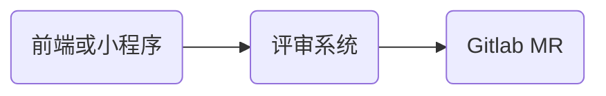

[toc]

> 说明：对项目经验进行总结，体现架构设计能力
> 快手、致远互联Devops项目，滴滴的风控项目、京东的促销系统、履约系统，交易系统
> Tags：项目经验、project、experience

1. 重复订单、工具开发金丝雀、幂等、全链路

# 快手devops、致远互联

问题：

1. 最难忘的项目是什么？
2. 项目中的难点是什么？有什么样的解决方案
3. 项目的技术架构是什么？

## 业务架构图：


阿里云效：


## 流程：

- 需求确定后研发创建特性分支进行开发，开发完成后提交代码。
- 提交后的代码后通知评审人进行代码评审，同时进行代码扫描和功能测试，评审无误后合并代码，进行流水线。
- 经过编译、验证、UAT测试，上线审核后，打包到镜像仓库，由k8s部署到容器，这样就完成了CI,CD整体流程。
- 系统：需求管理、KDEV质量管理（代码评审，代码扫描），KDEV流水线（CI，CD<云原生k8s，docker>），数据洞察

## 架构-快手：

DDD微服务架构（致远）、基于贫血模型的三层架构（快手、其他）、组件架构设计（分布式链路、监控）

- （快手）贫血模型三层架构（https://shimo.im/docs/gkQjPdQW3typRYRJ）

  

  领域模型：CR模型、检查点模型、仓库配置模型、CR单配置模型

  - **分层架构**：基于ksboot（springboot）的**微服务架构**，从上到下依次是：

  - 展示层（web、h5、小程序）、

  - **应用服务层**：提供**聚合服务**，包含评审-MR<kdev-MR(merge request)>服务、本地评审(local-CR)服务、CodeOwner等聚合型服务。

  - **基础服务层**：cr-info服务、cr-diff服务、cr-commit服务、cr-config服务、cr-checkpoint服务、cr-team等。

  - **支持组件层**：kcc缓存服务、kafka消息服务、celph文件服务、sso登录验证、klog日志链路跟踪服务、job任务服务、kconf动态配置服务等

  - **基础设施层**：计算资源、网络资源等，由ksp云平台提供。

    

- 终端显示层：
作用：这是各端模板渲染并执行显示的层，负责将数据和业务逻辑以用户友好的方式展示给用户。
主要技术：当前主要是Velocity渲染、JS渲染、JSP渲染、移动端展示等技术来实现界面展示。
- 开放接口层：
作用：将Service层的方法封装成开放接口，用于暴露服务供外部系统调用，并进行网关安全控制和流量控制等。
特性：可以直接封装Service方法暴露成RPC接口，或者通过Web封装成HTTP接口。对于使用Dubbo作为微服务框架的场景，通常单独使用一个模块来提供RPC接口。
- Web层（也称为Controller层）：
作用：
主要是对访问控制进行转发。
进行各类基本参数校验。
处理不复用的业务简单逻辑。
特性：Web层是用户请求进入系统的第一个层次，负责接收用户请求并调用相应的Service层逻辑进行处理。
- Service层：
作用：业务逻辑层，负责实现具体的业务逻辑功能。
特性：
相对具体的业务逻辑服务层。
依据业务逻辑来编排Manager层提供的原子接口。
- Manager层：
作用：通用业务处理层，对Service层通用能力的下沉和封装。
特性：
提供原子的服务接口供Service层调用。
对第三方平台封装的层，预处理返回结果及转化异常信息，适配上层接口。
封装与缓存和存储交互策略，中间件的接入等通用能力。
封装对第三方接口的调用，如支付服务、审核服务等。

## 架构-致远

- （致远）DDD微服务如何拆分（领域对象、分层架构）

- （致远）技术选型：ksboot+springcloud alibaba（openfeign、nacos、springcloud、sleuth、elk+zipkin）+k8s+docker  

  


- 请求通过基础层的api网关，将信息传入到用户接口层。传入的信息先通过assembler转换成dto对象，再传给facade。
- facade负责把信息传递给应用层，信息以命令的形式传递给application service（应用服务层）。应用服务层组合领域层中的Aggregate(聚合)和service。
- 领域层中的实体和值对象，配合聚合和service完成业务逻辑，并通过repository将实体和值对象存储到数据库中。领域层中的event会根据业务的发生，获取事件信息，通过应用层中的event里的订阅和发布，与其他服务进行通信。

### 高可用：

1. nginx负载

早期负载问题：流水线分为两部分，任务管理和任务执行解耦并分别部署。任务管理会对流水线进行CRUD和权限分配；任务执行才会真正的运行流水线CI,CD，并以消息的形式进行任务分派。前期不明显，后期构建任务增大后，执行端任务分配不合理，多个构建任务指向一台机器 ，会导致流水线卡死无法上线。为提高可用性，分两次改造，一是根据机器负载情况判断是否接收任务，保证线上可用。 同时加入公司的nginx网关，配置负载均衡策略。

2. 应用和服务的水平扩展
2. 电商--数据库主从读写分离，京东订单采用强一致性，都读取主库
2. 电商--订单分库操作  单实例几千w有问题   

### 性能：

1. 主动通知，避免轮询。（类似外卖点餐）

问题：代码合并时，前端轮询评审系统显示合并结果。由于合并的这个操作不是实时性的，过程需要人为介入，时间会比较长。前端5s一次，对系统压力比较大，而且不能及时展示合并结果。

方案：MR代码合并时gitlab会进行一系列检查：分支、冲突、权限，时间不确定，并以hook的方式通知应用。为保障及时性，改为websocket后端通知的方式，由后端执行完推送给前端。

问题：评审系统通过MQ通知流水线评审单的创建和合并等信息，快手电商、商业化等多个系统从流水线获取CR单的信息，对合并后的代码进行自验证和统计等，也是采用了5s轮询的方式，对流水线服务端的压力也比较大。

方案：建立一个对外消息推送中心，使流水线与外围系统通过消息推送中心保持长连接。这样流水线接到评审单创建信息和合并信息后，推送到消息中心，其他系统就能及时获取评审单信息进行操作。

问题：合并过程--正常重试，根据异常进行重试guava retry




2. 缓存的使用

评审单进行评审时，评审单信息缓存，由评审单得到gitlab信息（项目，分支，部分diff信息）缓存，扫描规则信息缓存，多个系统进行查询。 

> HSET user:123 id 123 name "Alice" age 30 email "alice@example.com" subscriptions "news,events,special_offers"

扩展：电商系统中促销模板信息的缓存，本地+redis多级缓存。10wQPS。注意缓存初始化，模拟前端访问进行初始化。透传、并发、雪崩，大key

3. 异步化：流水线构建比较慢，任务创建后先发送到消息队列进行缓冲，再由负载分发到后端执行。后端服务接收任务后再由线程池进行并发执行，由这部分一起控制任务执行效率。
3. 评审单检查项：代码扫描、关联测试、与gitlab交互，远程操作比较耗时，利用多线程CompatableFuture进行异步编排操作。 

### 业务问题：

1. 评审单重复，构建ID重复

   防重处理

   为了防止多次重复点击“订单提交按钮”。我们在**返回订单确认页时，在redis中生成一个随机的令牌**，过期时间为30min，**提交订单时会携带这个令牌**，我们将会在订单提交的处理页面核验此令牌。

2. oom技术案例：oom问题（kube）-> jvm--arthas、多线程改造
2. seata保证订单回滚  柔性事务。。
2. 延迟任务：比如未付款订单，超过一定时间后，系统自动取消订单并释放占有商品库存。

方案一：定时任务：**spring的schedule定时任务轮询数据库**

	1. 消耗系统内存、增加了数据库的压力、存在较大时间误差；
	1. 存在超时和检测时间段错开的情况(时效性问题)，最高等2倍的定时任务时间

方案二：**rabbitmq的消息TTL和死信Exchange结合**(推荐)

- 订单关了之后40分钟后库存检查订单存在还是取消。

- 下订单延迟队列，**不要设置消息过期，要设置为队列过期方式**。节省一个交换机，使用bean方式创建交换机。


### 稳定性：

1. 一体化监控：预防风险。系统资源、应用接口、三方中间件mysql，redis，文件系统

2. 建立规范：上线流程、灰度过程

3. 复盘：依赖系统未上线

4. 电商备战大促：

   - 慢sql优化
   - 应急预案：dubbo+动态配置，实现切流和开关降级
   - 猴子捣乱测试


### 通用组件

1. 灰度测试（金丝雀）、分布式链路追踪、监控系统。 发现团队问题，提出解决方案：提升研发效率和通用组件工具开发：

### 需求   

对产品需求ROI进行判断  -- BRD，PRD参与需求评审

流水线中CI阶段检查与上线评审流程设计：为保证上线的万无一失，CI阶段进行扫描检查、安全检查、三方包检查，上线评审中加入对检查结果验证。特色

# 滴滴

> 多个风控系统的设计
>
> https://zhuanlan.zhihu.com/p/107975044
>

判责系统

判罚系统

申诉系统 

## 滴滴风控系统

滴滴风控系统的分层架构可以从功能视角和技术视角两个层面进行描述：


## 功能视角分层

1. 数据输入层:
   作用：收集来自内部业务系统（如订单系统、用户系统、支付系统等）和外部数据源（如第三方信用数据、黑灰名单、IP信誉库等）的各类风险相关信息。
   数据类型：用户行为数据、交易数据、身份认证数据、设备指纹、地理位置信息、外部征信数据等。
2. 风险识别层:
   作用：对输入数据进行实时或批量分析，识别潜在风险。
   子层：
   规则引擎层：基于预定义的业务规则和策略，对输入数据进行初步筛选和过滤，快速响应常见和已知风险。
   模型计算层：利用机器学习、深度学习等算法构建的风险评估模型，对复杂、隐蔽的风险行为进行量化评估。
3. 决策管理层:
   作用：根据风险识别层输出的结果，决定是否干预交易流程，以及如何干预。
   子层：
   风险评分层：整合规则引擎和模型计算的结果，生成风险评分，用于风险等级划分和决策依据。
   策略执行层：基于风险评分和预设的风控策略，自动或人工介入交易，如提示警告、二次验证、限制操作、冻结账号等。
4. 监控反馈层:
   作用：实时监控风控系统的运行状态，跟踪风险事件处理情况，收集反馈数据以优化风控效果。
   子层：
   实时监控与报警：监控系统性能、业务指标、风险指标，设置阈值触发报警。
   效果评估与优化：定期分析风控效果，调整规则、模型参数，迭代优化风控策略。
5. 合规与数据保护层:
   作用：确保风控系统的运作符合法律法规要求，保护用户隐私数据安全。
   子层：
   合规管理：遵循GDPR、CCPA等法规要求，设计合规的数据使用流程和权限管理机制。
   数据安全：实施数据加密、脱敏、访问控制等技术措施，防止数据泄露和滥用。

## 技术视角分层

1. 数据接入层:
   作用：接收、整合各类风险数据源，提供统一的数据接口。
   技术组件：API Gateway、消息队列（如Kafka）、数据采集工具等。
2. 数据处理层:
   作用：对原始数据进行预处理、清洗、转换，为风险识别提供高质量数据。
   技术组件：大数据处理框架（如Spark、Flink）、数据仓库（如Hadoop、Snowflake）、数据湖（如Delta Lake）等。
3. 风险计算层:
   作用：执行风险识别逻辑，包括规则引擎计算和模型计算。
   技术组件：规则引擎（如Drools、EasyRules）、机器学习平台（如TensorFlow、PyTorch）、实时计算引擎（如Flink SQL、Beam）等。
4. 决策服务层:
   作用：基于风险计算结果，执行风控决策并通知相关系统。
   技术组件：决策引擎、服务网格（如Istio）、API网关、消息中间件（如RabbitMQ、RocketMQ）等。
5. 监控与管理层:
   作用：监控系统运行状态，管理和调整风控策略。
   技术组件：监控系统（如Prometheus、Grafana）、日志分析平台（如ELK Stack、Splunk）、策略管理后台、报警系统等。
6. 安全与合规层:
   作用：保障数据安全，符合法律法规要求，保护用户隐私。
   技术组件：数据加密工具、密钥管理系统、数据脱敏工具、访问控制系统、合规审计系统等。

综上所述，滴滴风控系统在功能视角下分为数据输入、风险识别、决策管理、监控反馈、合规与数据保护五层，在技术视角下则分为数据接入、数据处理、风险计算、决策服务、监控与管理、安全与合规六层。这些层级间相互协作，共同构建了一个立体、全面、高效的风控体系。

## 风控系统的难点

1. 海量数据实时处理:
   难点：短时间内处理如此庞大的订单数据，要求系统具备极高的数据吞吐能力和实时计算性能。
   解决方法：采用分布式、高并发的设计原则，构建基于云计算的弹性伸缩架构。使用高性能的消息队列（如Kafka）作为数据缓冲和传输通道，结合实时流处理引擎（如Flink、Spark Streaming）进行实时数据处理。通过水平扩展节点数量，增加计算资源，确保数据能够被迅速、有效地处理。

2. 复杂风险模式识别:
   难点：风险行为模式多样且不断演变，需要在海量数据中准确识别出欺诈、作弊、恶意行为等风险。
   解决方法：结合规则引擎与机器学习模型进行风险识别。规则引擎基于专家经验和业务逻辑设定阈值和规则，快速过滤明显异常；机器学习模型（如深度神经网络、GBDT等）基于历史数据训练，识别复杂、隐蔽的风险模式。定期更新模型参数，引入增量学习、在线学习等技术，保持模型的时效性。

3. 低延迟风险决策:
   难点：在用户几乎无感知的时间内完成风险评估并作出决策，避免影响用户体验。
   解决方法：优化风险评估算法，减少计算复杂度，使用缓存（如Redis）加速频繁查询。将部分风险判断前置到客户端进行，减轻服务器端压力。对于高风险交易，采取分级响应策略，先进行轻量级检查，必要时再进行深度评估。优化网络通信，采用CDN、边缘计算等技术减少数据传输延迟。

4. 大规模并发控制:
   难点：面对高峰时段的大量并发请求，确保系统稳定，避免资源争抢导致的服务降级或崩溃。
   解决方法：使用负载均衡（如Nginx、HAProxy）分散请求到多个服务器节点。合理设计数据库架构，利用读写分离、分片、分区等技术提高并发处理能力。对热点数据进行缓存，减少数据库压力。实施限流、熔断、降级等策略，保护系统在高负载下仍能提供基础服务。

5. 数据隐私与合规:
   难点：在处理大量用户数据时，必须严格遵守数据保护法规，如GDPR、CCPA等，确保用户隐私不受侵犯。
   解决方法：实施严格的数据生命周期管理，采用数据脱敏、差分隐私、同态加密等技术保护敏感信息。设立清晰的数据使用权限和审批流程，对数据流转进行细粒度审计。定期进行合规审查，确保系统设计和运营符合最新法规要求。

6. 基础设施稳定性与容灾:
   难点：确保底层基础设施的高可用性和灾难恢复能力，防止单一故障点导致服务中断。
   解决方法：采用云服务提供商的高可用服务（如AWS Auto Scaling、Azure Availability Zones），实现跨地域、跨数据中心的冗余部署。使用分布式存储系统（如Ceph、GlusterFS）保证数据冗余和一致性。定期进行故障演练，检验系统的容灾恢复能力。

  综上所述，滴滴风控系统在处理每天3000万订单时，需克服海量数据实时处理、复杂风险模式识别、低延迟风险决策、大规模并发控制、数据隐私与合规、基础设施稳定性与容灾等技术难点。通过采用先进的云计算技术、分布式架构、机器学习算法、数据隐私保护手段以及严格的运维管理策略，可以有效解决这些问题，确保风控系统的稳定、高效运行。

  

# 京东（架构设计和难点）

## 促销系统：

业务流程、流量大、并发大、可用性、性能、扩展性、伸缩性、安全性

https://www.infoq.cn/article/trading-system-evolution-of-the-jingdong-mall?utm_campaign=geektime_search&utm_content=geektime_search&utm_medium=geektime_search&utm_source=geektime_search&utm_term=geektime_search


商详页：

https://www.infoq.cn/article/suning-product-details-system-architecture-design?utm_campaign=geektime_search&utm_content=geektime_search&utm_medium=geektime_search&utm_source=geektime_search&utm_term=geektime_search


京东交易 

https://www.infoq.cn/article/trading-system-evolution-of-the-jingdong-mall?utm_campaign=geektime_search&utm_content=geektime_search&utm_medium=geektime_search&utm_source=geektime_search&utm_term=geektime_search


- 履约平台：时效模块计算、自提、运费   oom问题

- 大促性能优化和稳定性建设：

  - 性能优化案例：存储、多级缓存、

  - 稳定性建设：应急预案

    

# 有利网

- 撮合交易：撮合交易流程、架构设计、难点

扩展能力：

- 有大数据处理经验，包括hadoop/storm/spark/hbase/ELK等；在机器学习、深度学习、搜索、广告、推荐 等相关领域有工作经验的优先。
- 云相关：阿里或aws的证书


## 案例

### 卡单问题

Fork/join


## 重试框架


## 限流问题


### 灰度发布（微服务）

> https://time.geekbang.org/column/article/475111?screen=full

灰度发布分为两部分：一个是通过负载均衡，一种是通过动态开关。

金丝雀测试：

- 原理：CRRule 借助 Http Header 中的属性和 Nacos 服务节点的 metadata 完成测试流量的负载均衡。在这个过程里，它需要准确识别哪些请求是测试流量，并且把测试流量导向到正确的目标服务。

- 问题：

  - CRRule如何识别流量：当发出一个http请求，在header的key-value列表中包含了特定流量key：cr-version，那么就被识别成一个特殊流量，打到金丝雀服务器上。

  - CRRule如何对测试流量进行负载均衡：包含了新的代码改动的服务器就是金丝雀。在这台服务器的nacos服务器中对加入同样的key。如果nacos元数据中的key与测试流量中的key一致就被识别成一个测试流量，只能发送到金丝雀服务器上。

- 源码及实现：

  - CRRule: CRRule实现ReactorServiceInstanceLoadBalancer, getInstanceResponse, getRoundRobinInstance

  - 配置LB策略: CRConfiguration，声明一个CRRule

  - 注解加入配置：@LoadBalancerClient(Configuration=CRConfiguration)

  - 添加nacos源数据。

- 模块设计：规则模块、日志记录
  - 功能性需求和非功能性需求
  - 易用性、扩展性、灵活性

# 京东项目

## 多级缓存


## 性能优化


# p2p项目

## 撮合交易

> 有利网撮合交易

- 撮合交易流程


# 外卖系统

> 参照极客时间课程 

## 设计一

外卖系统中如何根据我的坐标获取到我附近的饭店，结合redis的Geo来实现，给出具体用redisson实现的代码外卖系统中如何根据我的坐标获取到我附近的饭店，结合redis的Geo来实现，给出具体用redisson实现的代码

以下是一个示例代码，演示了如何使用Redisson的GEO数据类型来实现根据用户坐标获取附近餐馆的功能：

``` java
import org.redisson.api.GeoUnit;
import org.redisson.api.RGeo;
import org.redisson.api.RedissonClient;
import org.springframework.beans.factory.annotation.Autowired;
import org.springframework.stereotype.Service;

import java.util.List;

@Service
public class RestaurantService {
    @Autowired
    private RedissonClient redisson;

    // 添加餐馆的位置信息
    public void addRestaurantLocation(String restaurantId, double longitude, double latitude) {
        RGeo<String> geo = redisson.getGeo("restaurant_locations");
        geo.add(longitude, latitude, restaurantId);
    }

    // 获取附近的餐馆
    public List<String> getNearbyRestaurants(double longitude, double latitude, double radius) {
        RGeo<String> geo = redisson.getGeo("restaurant_locations");
        return geo.search(longitude, latitude, radius, GeoUnit.KILOMETERS);
    }
}

```

在这个示例中，`addRestaurantLocation` 方法用于添加餐馆的位置信息到Redis的GEO数据结构中，`getNearbyRestaurants` 方法用于根据用户的位置坐标和搜索半径快速获取附近的餐馆列表。

在实际应用中，当用户打开外卖平台或者进行附近餐馆搜索时，调用 `getNearbyRestaurants` 方法即可获取用户附近的餐馆列表，然后将列表展示给用户进行选择订餐。

通过使用Redisson的GEO数据类型，外卖系统可以实现高效的附近餐馆搜索功能，从而提升用户体验和订餐效率。


# 系统操作流程

## 电商交易系统

### 扣减库存流程

在电商交易系统中，扣减库存是一个关键操作，通常涉及以下步骤：

1. 用户下单
用户在电商网站上选择商品并添加到购物车，然后提交订单。

2. 订单创建
后端服务接收到订单创建请求后，进行以下操作：
- **验证用户信息**：确保用户信息有效，如地址、支付信息等。
- **检查库存**：查询库存管理系统以确认商品的可用库存量。
- **创建订单记录**：在订单管理系统中创建一个新的订单记录。
- **生成订单ID**：为新订单生成一个唯一的标识符。

3. 库存扣减
在确认订单有效且库存充足后，后端服务将执行库存扣减操作：
- **调用库存管理系统API**：后端服务通过API调用库存管理系统。
- **扣减库存**：库存管理系统接收到扣减请求后，原子性地减少对应商品的库存数量。
- **确认库存扣减成功**：库存管理系统返回扣减结果给后端服务。

4. 订单状态更新
后端服务在库存扣减成功后，更新订单状态：
- **更新订单状态**：将订单状态更新为“已处理”或“已发货”。
- **通知用户**：通过邮件或短信通知用户订单状态的更新。

5. 支付处理
用户完成支付后，支付网关将支付结果通知给电商系统：
- **处理支付结果**：后端服务接收支付结果，并更新订单的支付状态。
- **订单确认**：如果支付成功，订单状态更新为“已支付”。

6. 物流处理
订单状态更新为“已发货”后，电商系统将订单信息发送给物流系统：
- **准备发货**：物流系统根据订单信息准备发货。
- **更新物流信息**：物流系统更新订单的物流状态。
- **通知用户**：通过邮件或短信通知用户物流信息。

7. 订单完成
用户收到商品后，订单状态更新为“已完成”。

防止超卖的措施
为了防止超卖，电商系统通常会采取以下措施：
- **库存预检查**：在用户将商品添加到购物车时，预先检查库存数量。
- **原子操作**：使用Redis的`DECR`或`DECRBY`命令来原子性地扣减库存。
- **分布式锁**：在分布式系统中使用分布式锁来确保同一时间只有一个进程可以修改库存。
- **限流**：限制对库存扣减接口的并发请求，避免瞬间大量请求导致的超卖。
通过上述步骤和措施，电商系统可以有效地处理订单并防止超卖情况的发生。在实施这些策略时，需要根据您的具体业务需求和系统架构来选择最合适的方法。

### 高并发系统中，扣减库存 
在高并发的系统中，为了提高性能和减少数据库的压力，通常会将库存信息缓存到内存中，比如使用Redis。扣减库存时，需要确保缓存和数据库中的库存数据保持一致。以下是扣减库存时更新缓存和数据库的步骤：

1. 读取缓存中的库存
在扣减库存之前，首先从缓存中读取当前的库存数量。
2. 执行扣减操作
在缓存中执行扣减操作，使用原子操作如DECR或DECRBY来减少库存数量。
3. 检查库存是否足够
在扣减操作后，检查缓存中的库存数量是否大于等于0。如果小于0，则表示库存不足。
4. 更新数据库中的库存
如果缓存中的库存数量足够，那么将新的库存数量写回数据库。这通常通过数据库事务来保证原子性。
5. 处理缓存和数据库不一致的情况
在高并发的情况下，可能会出现缓存和数据库不一致的情况。为了处理这种情况，可以采取以下措施：
    使用消息队列：将库存扣减操作放入消息队列中，然后由后台服务异步处理这些消息，确保最终一致性。
    定期同步：定期将缓存中的库存数据同步到数据库中，以减少不一致的时间窗口。
    读取修复：在读取缓存时，如果发现缓存中没有库存数据或者数据不一致，可以重新从数据库中读取并更新缓存。

6. 通知其他系统
如果库存扣减成功，可能需要通知其他系统，如订单系统、库存管理系统等。
7. 记录日志
记录库存扣减操作的日志，以便于后续的审计和问题排查。
8. 监控和告警
实时监控库存扣减操作，并设置告警机制。如果检测到库存数量异常，立即采取措施。

通过上述步骤，可以在高并发的系统中有效地扣减库存，并尽量减少缓存和数据库不一致的情况。在实施这些策略时，需要根据您的具体业务需求和系统架构来选择最合适的方法。

## 电商促销系统
## 外卖系统
## 出行系统
## 风控系统
## Devops


# 参考：

``` html
https://www.doc88.com/p-3189735556103.html
https://www.cnblogs.com/hiraeth/articles/8605426.html
https://developer.aliyun.com/article/60653
https://zhuanlan.zhihu.com/p/68881314
Java 无锁队列 Disruptor，内存队列的生产解决方案
https://blog.csdn.net/BBinChina/article/details/120169547
数字交易所内存撮合、无锁并发技术源码
https://blog.csdn.net/wuhualong1314/article/details/104398386
电商项目：
https://blog.csdn.net/weixin_42586723/article/details/119651204
https://blog.csdn.net/m0_67400972/article/details/123576535
```


# 案例&设计篇-待整理

>[https://developer.aliyun.com/article/637913?spm=a2c6h.14164896.0.0.7cdf6bb2qx4Opk](https://developer.aliyun.com/article/637913?spm=a2c6h.14164896.0.0.7cdf6bb2qx4Opk)
>秒杀系统设计+SpringBoot 商城实战
>包含项目中实际案例问 题+系统架构设计题目（typora）
1. devops系统原生设计 
1. 快手案例
[kdev-CR](https://shimo.im/docs/gkQjPdQW3typRYRJ)

3. 如何设计并实现一个高可用的订单系统？  *****
    [如何设计并实现一个高可用的订单系统？](https://shimo.im/docs/WdGpcDjyHW9PKrKX)

4. 分布式链路追踪系统 

https://juejin.cn/post/7205777393453891644

## 汽车之家电商系统架构演进与平台化架构实践

https://zhuanlan.zhihu.com/p/564560810

## 如何实现监控系统 

基于Spring Cloud Alibaba实现监控系统，可以利用其提供的微服务治理组件如Nacos、Sentinel、RocketMQ等来构建。以下是一种可能的架构设计、设计步骤以及实例代码示例。
架构设计

1. 数据采集层:
使用Spring Cloud Sleuth集成Zipkin或  Jaeger，实现全链路追踪，收集服务调用、HTTP请求、数据库操作等监控数据。
配置Spring Boot Actuator，暴露健康检查、度量指标等端点供监控系统获取。
2. 数据传输层:
利用RocketMQ作为消息中间件，将采集到的监控数据发送至监控中心主题。
3. 数据处理与存储层:
通过Nacos作为配置中心，管理监控系统的配置信息。
使用Prometheus作为时序数据库，存储监控数据，配合Grafana进行数据可视化展示。
若需要更强大的数据分析能力，可以考虑将数据同步至Elasticsearch，结合Kibana进行复杂查询和报表生成。
4. 监控展示与告警层:
使用Grafana创建仪表板，展示服务状态、调用链路、性能指标等监控视图。
配置Prometheus Alertmanager，结合Alertmanager Webhook与企业IM、邮件系统等集成，实现告警通知。

## Java 内存满怎么办，怎么排查？(arthas)*****

> threadlocalmap   https://blog.csdn.net/Not_Look_Back/article/details/123275572#1.1%20%E4%BD%95%E4%B8%BA%E5%86%85%E5%AD%98%E6%B3%84%E6%BC%8F%EF%BC%9F


* **top**命令查看内存使用情况

  

  

  

* java 进程占了 55%内存，用命令“**top -Hp pid**”查看具体线程占用系统资源的情况

  
  
  


  * 再通过“**jstack pid**” 查看具体线程的堆栈信息，可以发现该线程一直处于 TIMED_WAITING 状态，此时 CPU 使用率和负载并没有出现异常，我们可以**排除死锁或 I/O 阻塞**的异常问题了。

  


* 我们再通过 **jmap 查看堆内存**的使用情况，可以发现，**老年代的使用率**几乎快占满了，而且内存一直得不到释放。

  

  

* 通过以上的分析，可以确定是内存泄漏。下面我们找一下具体是什么对象一直无法回收，什么原因导致内存泄漏。

* 通过 **MAT 打开 dump**的内存日志文件，我们可以发现 MAT 已经提示了 byte 内存异常。（Byte 对象占用内存明显异常，说明代码中 Byte 对象存在内存泄漏）

  

  

* 进入到 Histogram 页面，可以查看到对象数量排序，Byte[]数组排在了第一位。选中对象后右击选择 with incomming reference 功能，可以查看到具体哪个对象引用了这个对象。

  

  

* 在这里我们就可以很明显地查看到是 ThreadLocal 这块的代码出现了问题。

* 


3. 如何设计一个秒杀系统？红包、12306、支付宝的设计


4. 架构设计 （设计模式）
5. 调优案例  *****
>整体思路：1. 各个模块；2. 问题：如何更优？；3. 原理->优化方案
>[调优案例](https://shimo.im/docs/cyQDPQW9YHhKKjtw)

6. 订单重复问题

   


## OOM 案例

[https://time.geekbang.org/column/article/372274](https://time.geekbang.org/column/article/372274)

## 重复支付问题

[https://www.zhihu.com/question/36459849/answer/2350105563](https://www.zhihu.com/question/36459849/answer/2350105563)

## 订单系统流程

[https://blog.csdn.net/ybygjy/article/details/50443526](https://blog.csdn.net/ybygjy/article/details/50443526)

## 电商交易系统核心技术

[https://blog.csdn.net/itomge/article/details/104338751?utm_medium=distribute.pc_relevant.none-task-blog-2~default~baidujs_title~default-0.pc_relevant_default&spm=1001.2101.3001.4242.1&utm_relevant_index=2](https://blog.csdn.net/itomge/article/details/104338751?utm_medium=distribute.pc_relevant.none-task-blog-2~default~baidujs_title~default-0.pc_relevant_default&spm=1001.2101.3001.4242.1&utm_relevant_index=2)

## 一个案例 [https://www.cnblogs.com/coder-yoyo/p/6224600.html](https://www.cnblogs.com/coder-yoyo/p/6224600.html)

>  [https://www.cnblogs.com/sumuncle/p/9507107.html](https://www.cnblogs.com/sumuncle/p/9507107.html)

## 工作中的案例   //todo

## 光大银行核心交易系统

## P2P交易系统
## 电商促销系统
## 风控系统：滴滴风控系统、中国银行信息卡风控系统

## 电商交易系统
## 电商订单系统
## 电商商品系统

## 搜索广告系统


## 京东一面：Redis 如何实现库存扣减操作？如何防止商品被超卖？

https://mp.weixin.qq.com/s/zYmttR63yKENl08duBx_Vw


